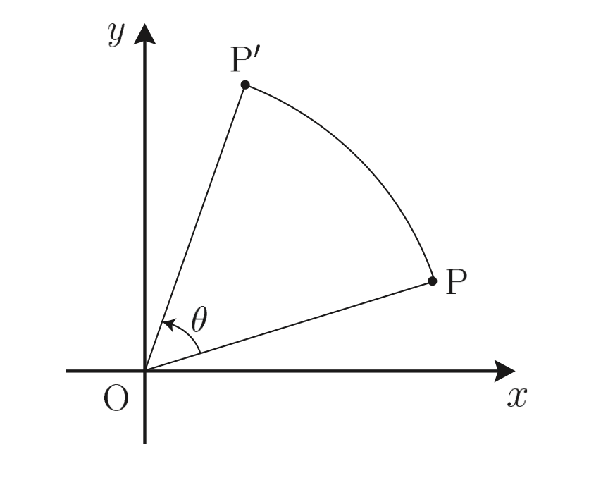
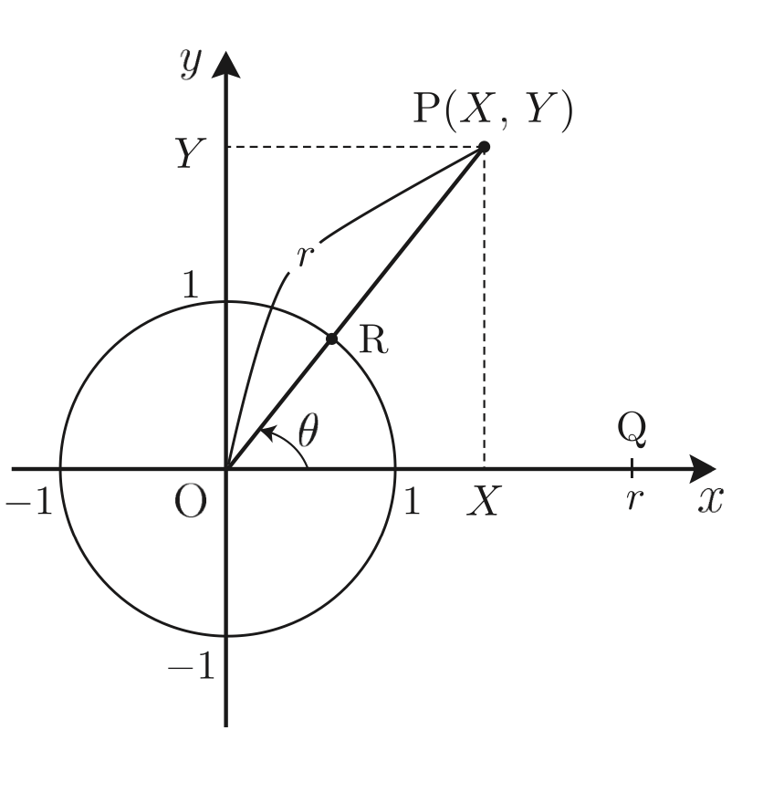
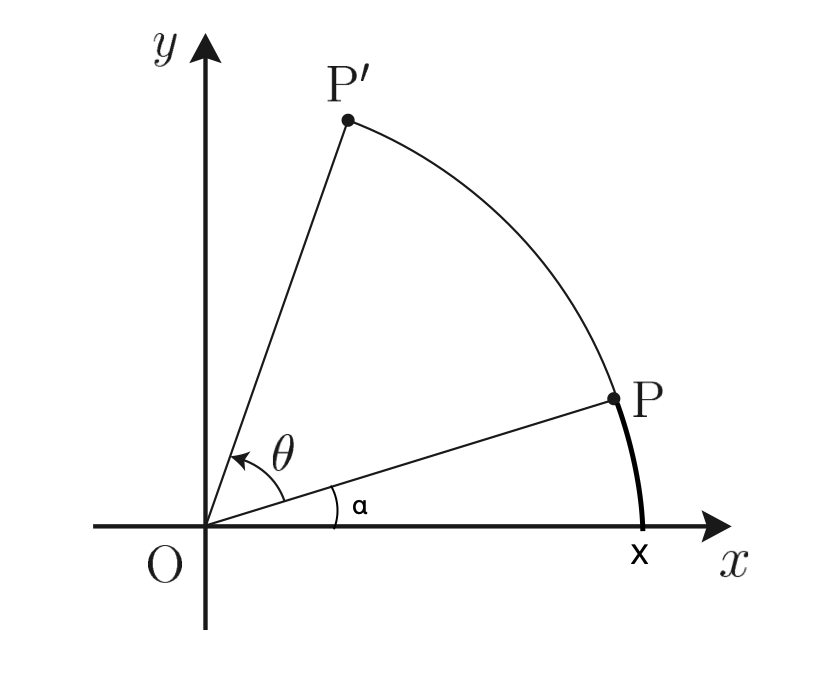
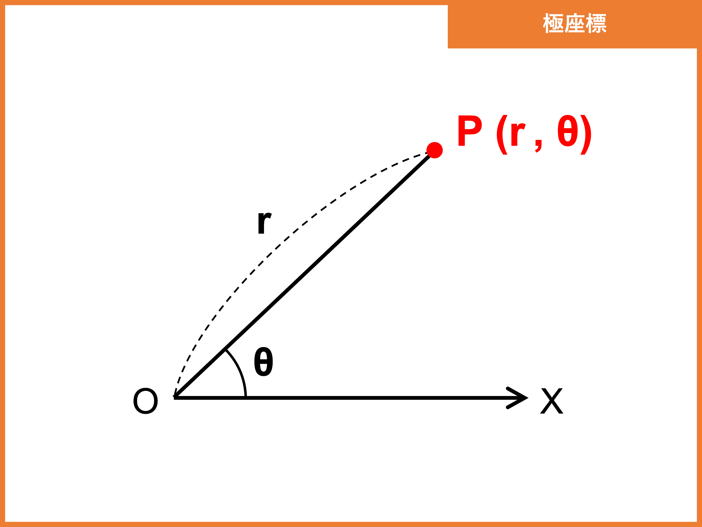

### 回転行列

 

上記画像の点 P の座標を$\begin{pmatrix}x \\ y \end{pmatrix}$とおき、原点 $O =\begin{pmatrix}0 \\ 0 \end{pmatrix}$ を中心に θ (0　≦ θ \< 360) だけ回転移動してできた点 P' の座標を求めたい

 

**考え方**

単位円上で考えてみる

点 $Q = \begin{pmatrix}r \\ 0\end{pmatrix}$ (r≧0) をとり、そこから原点 $O =\begin{pmatrix}0 \\ 0 \end{pmatrix}$ を中心に θ (0　≦ θ \< 360) だけ回転移動してできた点 P の座標を $\begin{pmatrix}X \\ Y \end{pmatrix}$ とおく

すると、
$
X = rcosθ,\hspace{5mm}
Y = rsinθ
$
で表すことができ、 $P = \begin{pmatrix} rcosθ \\ rsinθ\end{pmatrix}$ と求めることができる

上記 $ X = rcosθ,\hspace{5mm} Y = rsinθ$ は極座標から直交座標へ変換する際に便利な式になっている

 
 

改めて、求めたい問題を確認する

 

上記画像の点 P の座標を$\begin{pmatrix}x \\ y \end{pmatrix}$とおき、原点 $O =\begin{pmatrix}0 \\ 0 \end{pmatrix}$ を中心に θ (0　≦ θ \< 360) だけ回転移動してできた点 P' の座標を求めたい

 

以下のことを考える

- $ |OP'| = |OP| = r$ とおく

- OX を始線とし、 OX と OP のなす角を α と考えると

    $$
    P =
    \begin{pmatrix}
    rcosα \\
    rsinα \\
    \end{pmatrix}
    $$

     

    $$
    P' = 
    \begin{pmatrix}
    rcos(α + θ) \\
    rsin(α + θ) \\
    \end{pmatrix}
    $$

     

    cos(α + θ)、 sin(α + θ) は加法定理より、

    $$
    cos(α + θ) = cosαcosθ - sinαsinθ \\[10pt]
    sin(α + θ) = sinαcosθ + cosαsinθ \\
    $$

    これを P' の座標に代入すると、

    $$
    P' = 
    \begin{pmatrix}
    r(cosαcosθ - sinαsinθ) \\[15pt]
    r(sinαcosθ + cosαsinθ) \\
    \end{pmatrix} \\[15pt]

    =
    \begin{pmatrix}
    rcosαcosθ - rsinαsinθ \\[15pt]
    rsinαcosθ + rcosαsinθ \\
    \end{pmatrix}
    $$

    点 P の座標より
    $$
    x = rcosα \\
    y = rsinα \\
    $$

    よって、p'の座標は

    $$
    P' =
    \begin{pmatrix}
    xcosθ - ysinθ \\[15pt]
    ycosθ + xsinθ \\
    \end{pmatrix}
    $$

    と表すことができる

---

### 極座標と直交座標

今回はわかりやすさのため、2次元での座標について述べている

2次元での任意の点を $P = \begin{pmatrix}x \\ y\end{pmatrix}$ とおく

直交座標 (デカルト座標)
- 高校で習ったように、 xy 平面上の点Pの座標を (x, y) と表す方法
- 2次元だけではなく、他の次元でも普通に使われる

曲座標
- 以下の2つで xy 平面上の点Pの座標を(r,θ)で表す方法
    - r: 極 O という始点から点Pまでの距離
    - θ: 始線 (慣例では x 軸) と　直線 OP のなす角
- 直行座標のように、2次元だけに留まらず、3次元での座標も表すことができる(もう一つの角度のパラメータが必要になってくる)

 

イメージ

引用: [極座標とは？直交座標との表示変換、距離や面積の公式](https://univ-juken.com/kyokuzahyo)
