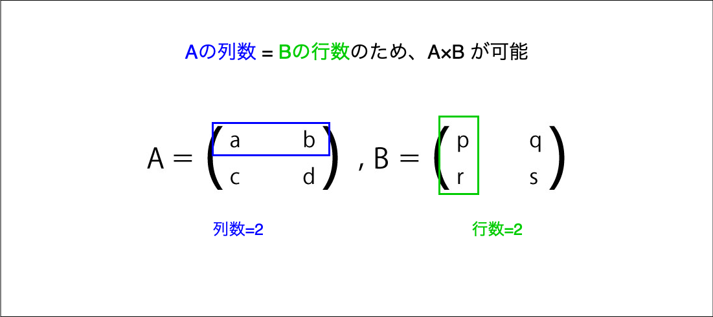

### 行列の基礎

行列は縦横に数を並べた構造を持っている

( ) 内の横に並んだ一筋を行(row)、縦に並んだ一筋を列(column)と呼ぶ


引用: [数学Cの行列とは？基礎、足し算引き算の解き方を解説](https://lab-brains.as-1.co.jp/enjoy-learn/2022/11/37648/)

上記の行列は 2つの行と2つの列で構成されているため、 2 * 2 の行列と呼ぶ

行列にAという名前を与えると、 A(2 * 3)と表すこともできる

<br>

ちなみに、A (m * n)は以下のような行列になる


引用: [２章 行列 p.2a-1](https://www.heisei-u.ac.jp/ba/fukui/pdf/mathtextA2a.pdf)


行列内のそれぞれの数は **行列の成分\(要素\)** という
- 上記の行列のうち、以下は2行3列の成分はを指す
    $$a_{23}$$
    
    もしくは以下のようにも書ける
    $$(A)_{23}$$

<br>

参考サイト

[数学Cの行列とは？基礎、足し算引き算の解き方を解説](https://lab-brains.as-1.co.jp/enjoy-learn/2022/11/37648/)

[２章 行列](https://www.heisei-u.ac.jp/ba/fukui/pdf/mathtextA2a.pdf)

---

### 行列の種類

**正方行列**

行と列の数が等しい行列

$$
\begin{pmatrix}
    a & b \\
    c & d \\
\end{pmatrix}
$$

<br>

$A_{mn}$の行列で m=n を正方行列と呼ぶ

<br>

**対角行列**

- 正方行列であり、その対角成分(要素)以外の成分が 0 である行列のこと

- なお、対角成分はどのような値でも構わない(0 でも)

    *対角成分(要素): 行列において、i行目、j列目の成分を(i, j)とした場合、i=jとなる成分


引用: [２章 行列 p.2a-2](https://www.heisei-u.ac.jp/ba/fukui/pdf/mathtextA2a.pdf)

<br>

以下のような行列が対角行列

$$
\begin{pmatrix}
 1 & 0 & 0 \\
 0 & 1 & 0 \\
 0 & 0 & 1
\end{pmatrix}
$$

<br>

以下でも対角行列

$$
\begin{pmatrix}
 2 & 0 & 0 \\
 0 & 0 & 0 \\
 0 & 0 & 5
\end{pmatrix}
$$

<br>

**単位行列**
- 対角行列であり、その対角成分が全て 1 の行列


引用: [２章 行列 p.2a-2](https://www.heisei-u.ac.jp/ba/fukui/pdf/mathtextA2a.pdf)

<br>
<br>

参考サイト

行列の種類について
- [２章 行列 _ 2.2 行列の種類](https://www.heisei-u.ac.jp/ba/fukui/pdf/mathtextA2a.pdf)

対角成分(要素)について
- [対角成分](https://cognicull.com/ja/qlafrbxw)

---

### 行列の計算 (足し算・引き算・定数倍)

**行列の足し算・引き算**

- 行と列の数が同じ行列の場合のみ、足し算・引き算できる
- 対応する成分どうしを足し算・引き算する

<br>

例: 2*2 の行列の足し算

$$
\begin{pmatrix}
     a_{11} & a_{12} \\
     a_{21} & a_{22}
\end{pmatrix}
+
\begin{pmatrix}
     b_{11} & b_{12} \\
     b_{21} & b_{22}
\end{pmatrix}

=
\begin{pmatrix}
     a_{11} + b_{11} & a_{12} + b_{12} \\
     a_{21} + b_{21} & a_{22} + b_{22}
\end{pmatrix}
$$

<br>

例: 2*2 の行列の引き算

$$
\begin{pmatrix}
 a_{11} & a_{12} \\
 a_{21} & a_{22}
\end{pmatrix}
-
\begin{pmatrix}
 b_{11} & b_{12} \\
 b_{21} & b_{22}
\end{pmatrix}
=
\begin{pmatrix}
 a_{11} - b_{11} & a_{12} - b_{12} \\
 a_{21} - b_{21} & a_{22} - b_{22}
\end{pmatrix}
$$

<br>

以下のような行と列の数が異なる行列同士の足し算・引き算はできない


引用: [数学Cの行列とは？基礎、足し算引き算の解き方を解説](https://lab-brains.as-1.co.jp/enjoy-learn/2022/11/37648/)

<br>

行列の定数倍
- 個々の要素を定数倍する

$$
x
\begin{pmatrix}
 a_{11} & a_{12} \\
 a_{21} & a_{22}
\end{pmatrix}
=
\begin{pmatrix}
 x \times a_{11} & x \times a_{12} \\
 x \times a_{21} & x \times a_{22}
\end{pmatrix}
$$

---

### 行列の計算 (掛け算)

**行列の掛け算**
- とある行列 A と B があるとする

    積 AB は、**行列 A の列数** と**行列 B の行数** が一致している場合のみ求めることができる



引用: [行列の積（掛け算）の求め方をわかりやすく解説します！](https://lab-brains.as-1.co.jp/enjoy-learn/2023/07/50258/)

<br>

上記、行列ABの積の求め方は以下の通り


<br>

以下のような行列同士の掛け算はできない

$$
\begin{pmatrix}
a_{11} & a_{12}\\
a_{21} & a_{22}\\
a_{31} & a_{32}\\
\end{pmatrix}
\times
\begin{pmatrix}
b_{11} & b_{12}
\end{pmatrix}
$$

<br>

行列 A と行列 B の掛け算の結果求められる行列を C とおくと、

```
行列Cの行数はAの行数、列数はBの列数に等しくなる
```

<br>

例: 1×3の行列と3×2の行列の掛け算の結果は1×2の行列になる

$$
\begin{pmatrix}
    2 & 4 & 6
\end{pmatrix}
\times
\begin{pmatrix}
    7 & 5\\
    3 & 4\\
    6 & 2
\end{pmatrix}
=
\begin{pmatrix}
    2 \times 7 + 4 \times 3 + 6 \times 6 &
    2 \times 5 + 4 \times 4 + 6 \times 2
\end{pmatrix}
=
\begin{pmatrix}
    62 & 38
\end{pmatrix}
$$

<br>

注意点

- 行列同士の掛け算には(一部を除いて)交換法則は成り立たない

```
*交換法則とは
正負の数の乗法では，加えられる数と加える数の順序を入れかえても積は変わらないという法則

A・B = B・A
```
<br>

例: 以下の行列A、Bにおいて、 AB ≠ BA が成り立たないことを確認する

$$
A = \begin{pmatrix}1 & 2 \\ 1 & 1\end{pmatrix}, B= \begin{pmatrix}1 & 1 \\ 2 & -1\end{pmatrix}
$$

<br>

$$
AB = 
\begin{pmatrix}
    1 \times 1 + 2 \times 2 & 1 \times 1 + 2 \times -1 \\
    1 \times 1 + 1 \times 2 & 1 \times 1 + 1 \times -1
\end{pmatrix}
=
\begin{pmatrix}
    5 & -1 \\
    3 & 0
\end{pmatrix}
$$

$$
BA = 
\begin{pmatrix}
    1 \times 1 + 1 \times 1 & 1 \times 2 + 1 \times 1 \\
    2 \times 1 + (-1) \times 1 & 2 \times 2 + (-1) \times 1
\end{pmatrix}
=
\begin{pmatrix}
    2 & 3 \\
    1 & 3
\end{pmatrix}
$$

---

### 行列と単位行列の積

一般の行列と単位行列の積に関して以下の関係が成り立つ

```
一般の行列をA、単位行列である行列をIとおくと、
IA = AI = A
```

<br>

確認

$$
A = 
\begin{pmatrix}
    1 & -1 & 3 \\
    1 & 2 & -1 \\
    2 & 1 & 0
\end{pmatrix}
$$

$$
I = 
\begin{pmatrix}
    1 & 0 & 0 \\
    0 & 1 & 0 \\
    0 & 0 & 1
\end{pmatrix}
$$

$$
IA =
\begin{pmatrix}
    1 \times 1 & -1 \times 1 & 3 \times 0 \\
    1 \times 1 & 2 \times 1 & -1 \times 1 \\
    2 \times 1 & 1 \times 1 & 0 \times 1
\end{pmatrix}
=
\begin{pmatrix}
    1 & -1 & 3 \\
    1 & 2 & -1 \\
    2 & 1 & 0
\end{pmatrix}
$$

$$
AI = 
\begin{pmatrix}
    1 \times 1 & 1 \times -1 & 1 \times 3 \\
    1 \times 1 & 1 \times 2 & 1 \times -1 \\
    1 \times 2 & 1 \times 1 & 1 \times 0
\end{pmatrix}
=
\begin{pmatrix}
    1 & -1 & 3 \\
    1 & 2 & -1 \\
    2 & 1 & 0
\end{pmatrix}
$$

<br>
<br>

参考サイト

[２章 行列 2.4 行列の性質と演算](https://www.heisei-u.ac.jp/ba/fukui/pdf/mathtextA2a.pdf)
