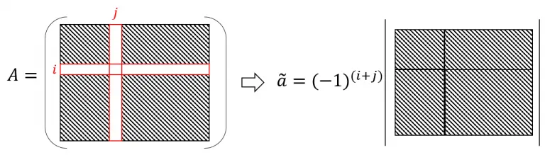
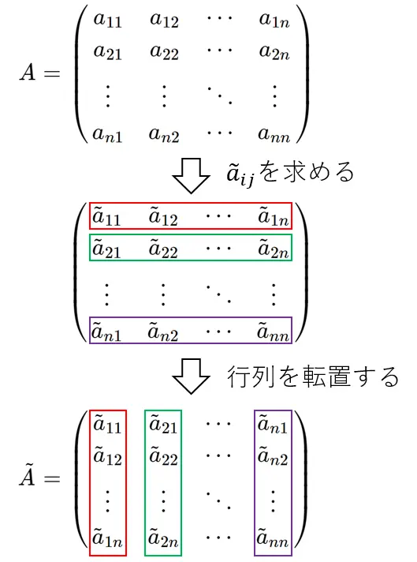
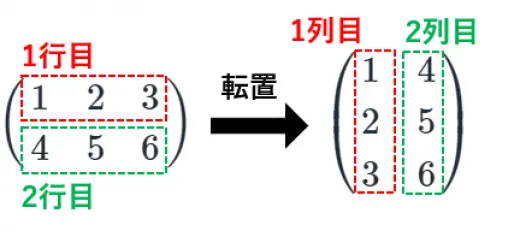
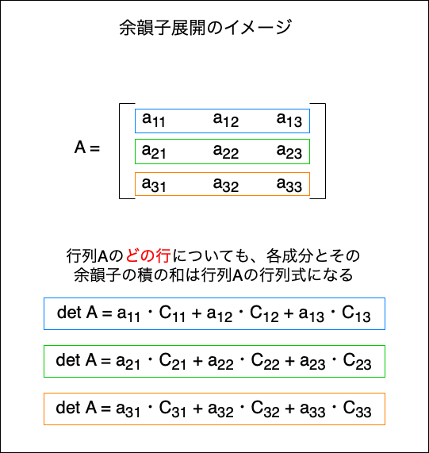
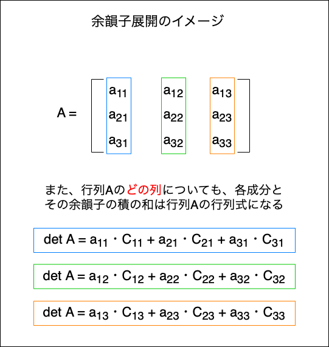
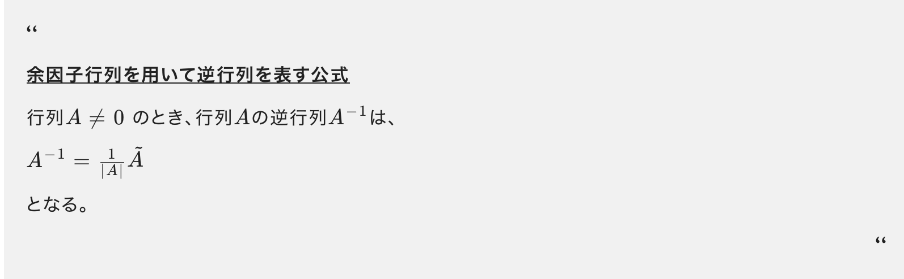

### 連立方程式と行列

連立方程式を行列で解く

1. 掃き出し法

    行列の**行基本変形**を行い, **簡約行列**を作り連立方程式を解く方法のこと

    *行基本変形とは → 行列に以下の3つの操作を行い簡約行列を作ること
    1. 行の交換
    2. 行の定数倍
    3. 他の行に定数倍

    上記操作を行ではなく、列に対して行う $\color{red}列基本変形$ という操作も存在する

     

    *簡約行列とは → 以下の4つの条件を満たす行列のこと

    1. 0 でない成分を持つ行の**主成分**は 1 である

        *主成分 → 各行で最初に出てくる0以外の成分のこと

    2. 成分がすべて 0 の行は, 0 でない成分を含む行よりも下にある

    3. 各行の主成分は, 下の行ほど右にある.

    4. 各行の主成分と同じ列の他の成分は全て0である

     

    例: 以下の連立方程式の解を求める
    $$
    \left\{
    \begin{array}{ll}
    2x + 3y + z = 4 \\
    4x + y - 3z = -2 \\
    -x +2y + 2z = 2
    \end{array}
    \right.
    $$

    上記連立方程式の拡大係数行列は以下のようになる

    $$
    \begin{pmatrix}
    2 & 3 & 1 & 4 \\
    4 & 1 & -3 & -2 \\
    -1 & 2 & 2 & 2
    \end{pmatrix}
    \begin{matrix}
        ... & (1)\\
        ... & (2)\\
        ... & (3)
    \end{matrix}
    $$

     

    - (3)に -1 を掛け、主成分を1にする
    - (1)と(3)を交換する 

    $
    \begin{pmatrix}
        1 & -2 & -2 & -2 \\
        4 & 1 & -3 & -2 \\
        2 & 3 & 1 & 4 \\
    \end{pmatrix}
    \begin{matrix}
        ... & (1)\\
        ... & (2)\\
        ... & (3)
    \end{matrix}
    $

     

    - (2) → (2) - 4×(1) を行い、(2)の一列目の成分を0にする
    -  (3) → (3) - 2×(1) を行い(3)の一列目の成分を0にする

    $
    \begin{pmatrix}
        1 & -2 & -2 & -2 \\
        0 & 9 & 5 & 6 \\
        0 & 7 & 5 & 8 \\
    \end{pmatrix}
    \begin{matrix}
        ... & (1)\\
        ... & (2)\\
        ... & (3)
    \end{matrix}
    $

     

    - (2) → (2) - (3) を行い(2)の三列目の成分を0にする

    $
    \begin{pmatrix}
        1 & -2 & -2 & -2 \\
        0 & 2 & 0 & -2 \\
        0 & 7 & 5 & 8 \\
    \end{pmatrix}
    \begin{matrix}
        ... & (1)\\
        ... & (2)\\
        ... & (3)
    \end{matrix}
    $

     

    - (2) → $\frac{1}{2} \times$ (2) を行い、(2)の主成分を1にする

    $
    \begin{pmatrix}
        1 & -2 & -2 & -2 \\
        0 & 1 & 0 & -1 \\
        0 & 7 & 5 & 8 \\
    \end{pmatrix}
    \begin{matrix}
        ... & (1)\\
        ... & (2)\\
        ... & (3)
    \end{matrix}
    $

     

    - (3) → (3) - 7 × (2) を行い、(3)の二列目の成分を0にする

    $
    \begin{pmatrix}
        1 & -2 & -2 & -2 \\
        0 & 1 & 0 & -1 \\
        0 & 0 & 5 & 15 \\
    \end{pmatrix}
    \begin{matrix}
        ... & (1)\\
        ... & (2)\\
        ... & (3)
    \end{matrix}
    $

     

    - (3) → $\frac{1}{5}$ × (3) を行い、(3)の主成分を1にする

    $
    \begin{pmatrix}
        1 & -2 & -2 & -2 \\
        0 & 1 & 0 & -1 \\
        0 & 0 & 1 & 3 \\
    \end{pmatrix}
    \begin{matrix}
        ... & (1)\\
        ... & (2)\\
        ... & (3)
    \end{matrix}
    $

     

    - (1) + { 2 × (2) } + {2 × (3)} を行い、(1)の二列目と三列目の成分を0にする

    $
    \begin{pmatrix}
        1 & 0 & 0 & 2 \\
        0 & 1 & 0 & -1 \\
        0 & 0 & 1 & 3 \\
    \end{pmatrix}
    \begin{matrix}
        ... & (1)\\
        ... & (2)\\
        ... & (3)
    \end{matrix}
    $

     

    上記の拡大係数行列はを連立方程式に戻すと

    $$
    \left\{
    \begin{array}{ll}
    x = 2 \\
    y = -1 \\
    z = 3
    \end{array}
    \right.
    $$

 

2. 逆行列を利用する方法

    連立方程式
    $$
    \left\{
    \begin{array}{ll}
    a_{1}x + a_{2}y = b_{1} \\
    a_{3}x + a_{4}y = b_{2}
    \end{array}
    \right.
    $$
    
    の[係数行列](#係数行列と係数拡大行列)を
    $
    A =
    \begin{pmatrix}
    a_{1} & a_{2} \\
    a_{3} & a_{4}
    \end{pmatrix}
    $
    
    変数の行列を
    $
    x = 
    \begin{pmatrix}
    x \\
    y
    \end{pmatrix}
    $

    右辺を
    $
    b =
    \begin{pmatrix}
    b_{1} \\
    b_{2}
    \end{pmatrix}
    $

    と表すと連立方程式は行列を用いて以下のように表すことができる

    $$
    Ax = b
    $$

     

    ここでAの[逆行列](#逆行列) $A^{-1}$ を両辺にかけると  

    $$
    A^{-1}Ax = A^{-1}b
    $$

    (*行列において特殊なケース以外で交換法則は成り立たないため、**掛ける順番に注意**)

     

    とある行列とその逆行列に間には以下の関係が成り立つ
    
    - $AA^{-1} = A^{-1}A = I$ (Iは単位行列)
    
    したがって、 $A^{-1}Ax = A^{-1}b$ は $Ix = A^{-1}b$ と変形することができる

     

    また、とある行列と単位行列には以下の関係が成り立つ
    - $AI = IA = A$ (Iは単位行列)

    よって $Ix = A^{-1}b$ は $x = A^{-1}b$ と変形することができる

     

    上記の式の計算結果は以下の形になり、連立方程式の解を求めることができる
    - Aは n × m の行列
    - xは n × 1 の行列
    - bは n × 1 の行列
    - $A^{-1}b$ は n × 1 の行列になる
    $$
    \begin{pmatrix}
    x \\
    y
    \end{pmatrix}
    =
    \begin{pmatrix}
    \circ \\
    \triangle
    \end{pmatrix}
    $$

     

    例: 以下の連立方程式の解を求める
    $$
    \left\{
    \begin{array}{ll}
    2x + 3y + z = 4 \\
    4x + y - 3z = -2 \\
    -x +2y + 2z = 2
    \end{array}
    \right.
    $$

     

    1. 連立方程式を、行列を用いて $Ax = b$ の形に変形する

    $$
    \begin{pmatrix}
    2 & 3 & 1 \\
    4 & 1 & -3 \\
    -1 & 2 & 2
    \end{pmatrix}
    \begin{pmatrix}
    x \\
    y \\
    z
    \end{pmatrix}
    =
    \begin{pmatrix}
    4 \\
    -2 \\
    2
    \end{pmatrix}
    $$

     

    2. 係数行列Aの逆行列を求めるために行列式を求める
        - 余韻子展開より
    $$
   \begin{array}{ll}
    det A = a_{31}C_{31} + a_{32}C_{32} + a_{33}C_{33} \\[10pt]
    C_{31} = (-1)^{3+1}
    \begin{vmatrix}
        3 & 1 \\
        1 & -3
    \end{vmatrix} \\[10pt]

    C_{32} = (-1)^{3+2}
    \begin{vmatrix}
        2 & 1 \\
        4 & -3
    \end{vmatrix} \\[10pt]

    C_{33} = (-1)^{3+3}
    \begin{vmatrix}
        2 & 3 \\
        4 & 1
    \end{vmatrix} \\[10pt]

    det A = -1 \times (-10) + 2 \times 10 + 2 \times (-10) \\[10pt]
    detA = 10 + 20 - 20 \\[10pt]
    よって, det A= 10
    \end{array} \\
    $$

     

    3. Aの余韻子行列を求める

    $$
    \begin{array}{cl}
        \begin{pmatrix}
            (-1)^{1+1} 
            \begin{vmatrix}
                1 & -3 \\
                2 & 2
            \end{vmatrix}
            &
            (-1)^{1+2}
            \begin{vmatrix}
                4 & -3 \\
                -1 & 2
            \end{vmatrix}
            &
            (-1)^{1+3}
            \begin{vmatrix}
                4 & 1 \\
                -1 & 2
            \end{vmatrix} \\[20pt]
            (-1)^{2+1}
            \begin{vmatrix}
                3 & 1 \\
                2 & 2
            \end{vmatrix}
            &
            (-1)^{2+2}
            \begin{vmatrix}
                2 & 1 \\
                -1 & 2
            \end{vmatrix}
            &
            (-1)^{2+3}
            \begin{vmatrix}
                2 & 3 \\
                -1 & 2
            \end{vmatrix} \\[20pt]
            (-1)^{3+1}
            \begin{vmatrix}
                3 & 1 \\
                1 & -3
            \end{vmatrix}
            &
            (-1)^{3+2}
            \begin{vmatrix}
                2 & 1 \\
                4 & -3
            \end{vmatrix}
            &
            (-1)^{3+3}
            \begin{vmatrix}
                2 & 3 \\
                4 & 1
            \end{vmatrix}
        \end{pmatrix}
        = 
        \begin{pmatrix}
            8 & -5 & 9 \\
            -4 & 5 & -7 \\
            -10 &10 & -10
        \end{pmatrix}
    \end{array}
    $$

    上記行列を転置して

    $$
    C = 
    \begin{pmatrix}
        8 & -4 & -10 \\
        -5 & 5 & 10 \\
        9 & -7 & -10
    \end{pmatrix}
    $$

     

    4. 求めた行列式と余韻子行列から逆行列を求める

    $$
    A^{-1} = \frac{1}{det A}C より \\[20pt]

    \begin{array}{cl}
        A^{-1} &= \frac{1}{10}
        \begin{pmatrix}
            8 & -4 & -10 \\
        -5 & 5 & 10 \\
        9 & -7 & -10
        \end{pmatrix} \\[10mm]
               &=
               \begin{pmatrix}
                \frac{4}{5} & -\frac{2}{5} & -1 \\[10pt]
                -\frac{1}{2} & \frac{1}{2} & 1 \\[10pt]
                \frac{9}{10} & -\frac{7}{10} & -1
               \end{pmatrix}
    \end{array}
    $$

     

    5. 逆行列を $Ax = b$ の両辺に掛けて　$x = A^{-1}b$ を解く

    $$
    \begin{array}{cl}
        x &= 
        \begin{pmatrix}
            \frac{4}{5} & -\frac{2}{5} & -1 \\[10pt]
                -\frac{1}{2} & \frac{1}{2} & 1 \\[10pt]
                \frac{9}{10} & -\frac{7}{10} & -1
        \end{pmatrix}
        \begin{pmatrix}
            4 \\
            -2 \\
            2
        \end{pmatrix} \\[15mm]
           &= 
           \begin{pmatrix}
            \frac{16}{5} + \frac{4}{5} - 2 \\[10pt]
            -2 - 1 + 2 \\[10pt]
            \frac{18}{5} + \frac{7}{5} - 2
           \end{pmatrix} \\[15mm]
           &=
           \begin{pmatrix}
            2 \\
            -1 \\
            3
           \end{pmatrix}
    \end{array}
    $$

    よって $x=-2, y=3, z=-1$ となる

---

### 係数行列と係数拡大行列

以下のような連立1方程式があるとき (a, bは実数)

$$
\left\{
\begin{array}{ll}
a_{11}x_{1} + a_{12}x_{2} + ... + a_{1n}x_{n} = b_{1} \\
a_{21}x_{1} + a_{22}x_{2} + ... +  a_{2n}x_{n} = b_{2} \\
\vdots \\
a_{m1}x_{1} + a_{m2}x_{2} + ... + a_{mn}x_{n} = b_{m}
\end{array}
\right.
$$

この連立方程式は行列を用いて以下のように表すことができる

$$
\begin{pmatrix}
a_{11} & a_{12} & ... & a_{1n} \\
a_{21} & a_{22} & ... & a_{2n} \\
\vdots \\
a_{m1} & a_{m2} & ... & a_{mn} \\
\end{pmatrix}
\begin{pmatrix}
x_{1} \\
x_{2} \\
\vdots \\
x_{m} \\
\end{pmatrix}
=
\begin{pmatrix}
b_{1} \\
b_{2} \\
\vdots \\
b_{m} \\
\end{pmatrix}
$$

 

上記の中で、左辺のm×nの行列を**係数行列**といい

左辺のm×nの行列と右辺のm×1の行列を並べた行列を拡大係数行列という

 
 

参考サイト

[【入門線形代数】係数行列と拡大係数行列-連立一次方程式-](https://university-note.com/coefficient-matrix/)

---

### 行基本変形とランク(rank)

TODO: ランクとは?

---

### 逆行列 (Inverse of a Matrix)

定義

引用: [逆行列の定義・逆行列を求める２通りの方法と例題](https://manabitimes.jp/math/1153)

 

ポイント
- 逆行列は正方行列のみに定義される
- 逆行列が存在するような行列(上記定義でいうA)を**正則行列**という
- [行列式](#行列式)を利用することで、対象の行列が逆行列を持つかどうかを判別できる

 

逆行列の求め方

- 掃き出し法で求める方法

    1. 対象の n 次の正方行列 A に、 n 次の単位行列 I を並べ **n×2n** 次の行列 (A,I) を作る

    2. 上記操作で出来た行列 (A, I) に行基本変形を行い (I, B) に変形する (Bは別のとある行列)

    3. 上記操作で求めた行列(I, B)のうち B が A の逆行列となる

     

    例: 
    $
    A = 
    \begin{pmatrix}
        1 & 0 & 2 \\
        -1 & 2 & 2 \\
        1 & 2 & 0
    \end{pmatrix}
    $
    の逆行列を求める

     

    1. 行列 A に 3次の単位行列 I を 並べ (A, I) を作る

    $$

    \left(
    \begin{array}{ccc|c}
    1 & 0 & 2 & 1 & 0 & 0 \\[10pt]
    -1 & 2 & 2 & 0 & 1 & 0 \\[10pt]
    1 & 2 & 0 & 0 & 0 & 1
    \end{array}
    \right)
    $$

     

    2. (A, I) に掃き出しを用いて、Aの部分をIに変形する = (I, B)の形に変形する

        *掃き出しでの計算結果は省略

    $$
    \left(
    \begin{array}{ccc|c}
    1 & 0 & 2 & 1 & 0 & 0 \\[10pt]
    -1 & 2 & 2 & 0 & 1 & 0 \\[10pt]
    1 & 2 & 0 & 0 & 0 & 1
    \end{array}
    \right) 
    = 
    \left(
    \begin{array}{ccc|c}
    1 & 0 & 0 & \frac{1}{3} & -\frac{1}{3} & \frac{1}{3} \\[10pt]
    0 & 1 & 0 & -\frac{1}{6} & \frac{1}{6} & \frac{1}{3} \\[10pt]
    0 & 0 & 1 & \frac{1}{3} & \frac{1}{6} & -\frac{1}{6} \\
    \end{array}
    \right)
    $$

     

    3. 掃き出し結果 (I, B) の B の行列が A の逆行列である

    $$
    A^{-1} =
    \begin{pmatrix}
        \frac{1}{3} & -\frac{1}{3} & \frac{1}{3} \\[10pt]
        -\frac{1}{6} & \frac{1}{6} & \frac{1}{3} \\[10pt]
        \frac{1}{3} & \frac{1}{6} & -\frac{1}{6} \\
    \end{pmatrix}
    $$

     
    
    確認: $AA^{-1} = A^{-1}A = I$ になるかどうか

     

    $$
    \begin{array}{cl}
        AA^{-1} 
        &=
        \begin{pmatrix}
            1 & 0 & 2 \\[10pt]
            -1 & 2 & 2 \\[10pt]
            1 & 2 & 0
        \end{pmatrix}
        \begin{pmatrix}
            \frac{1}{3} & -\frac{1}{3} & \frac{1}{3} \\[10pt]
            -\frac{1}{6} & \frac{1}{6} & \frac{1}{3} \\[10pt]
            \frac{1}{3} & \frac{1}{6} & -\frac{1}{6} 
        \end{pmatrix} 
        \\[15mm]
        &=
        \begin{pmatrix}
            \frac{1}{3} +\frac{2}{3} & -\frac{1}{3} + \frac{1}{3} & \frac{1}{3} - \frac{1}{3} \\[10pt]
            -\frac{1}{3} - \frac{1}{3} + \frac{2}{3} & \frac{1}{3} + \frac{1}{3} + \frac{1}{3} & -\frac{1}{3} + \frac{2}{3} - \frac{1}{3} \\[10pt]
            \frac{1}{3} - \frac{1}{3} & -\frac{1}{3} + \frac{1}{3} & \frac{1}{3} + \frac{2}{3}
        \end{pmatrix}
        \\[15mm]
        &=
        \begin{pmatrix}
            1 & 0 & 0 \\
            0 & 1 & 0 \\
            0 & 0 & 1
        \end{pmatrix} = I
    \end{array}
    $$

     

    $$
    \begin{array}{cl}
        A^{-1}A
        &= 
        \begin{pmatrix}
            \frac{1}{3} & -\frac{1}{3} & \frac{1}{3} \\[10pt]
            -\frac{1}{6} & \frac{1}{6} & \frac{1}{3} \\[10pt]
            \frac{1}{3} & \frac{1}{6} & -\frac{1}{6} 
        \end{pmatrix}
        \begin{pmatrix}
            1 & 0 & 2 \\[10pt]
            -1 & 2 & 2 \\[10pt]
            1 & 2 & 0
        \end{pmatrix}
        \\[15mm]
        &= 
        \begin{pmatrix}
            \frac{1}{3} + \frac{1}{3} + \frac{1}{3} & -\frac{2}{3} + \frac{2}{3} & \frac{2}{3} - \frac{2}{3} \\[10pt]
            -\frac{1}{6} - \frac{1}{6} + \frac{1}{3} & \frac{1}{3} + \frac{2}{3} & -\frac{1}{6} + \frac{1}{6} \\[10pt]
            \frac{1}{3} - \frac{1}{6} - \frac{1}{6} & \frac{1}{3} - \frac{1}{3} & \frac{2}{3} + \frac{1}{3}
        \end{pmatrix}
        \\[15mm]
        &=
        \begin{pmatrix}
            1 & 0 & 0 \\
            0 & 1 & 0 \\
            0 & 0 & 1
        \end{pmatrix} = I
    \end{array}
    $$

 
 

- 余韻子行列で求める方法
    - 余韻子行列と行列式から逆行列を求める方法は[こちら](#余韻子行列と逆行列)を参照

 
 

参考サイト

逆行列は正方行列のｍに定義されることの証明
- [3.16 逆行列](http://tau.doshisha.ac.jp/lectures/2007.linear-algebra-I/html.dir/node79.html)

逆行列の使い道
- [逆行列とは？誰でも理解できるようにわかりやすく解説](https://www.headboost.jp/inverse-matrix/)

---

### 行列式

ポイント
- 行列式は正方行列のみに定義される

求める方法
1. たすきがけで求める方法
    *3次行列までしか使えない方法
    
    TODO: たすきがけで行列式を求める方法を書く

2. 余韻子展開で求める方法
    具体的な計算方法は[こちら](#余韻子展開)を参照

---

### 余韻子と余韻子行列

\[概要\]

余韻子とは (cofactor)
- 余韻子行列の成分
- とある行列Aの余韻子行列を求める際には、その行列A各成分の余韻子を求める必要がある

余韻子行列とは (cofactor matrix)
- とある行列の**行列式や逆行列**を求める際に役立つ行列のこと

ポイント
- 余韻子、余韻子行列は**正方行列のみ**に定義される

 

\[余韻子の定義\]
- 余韻子は Cofactor から $C_{ij}$ あるいは $\triangle_{ij}$ と表記される
- n次の正方行列Aの(i, j)成分の余韻子は以下の式で求められる
    - 行列Aからi行とj列を取り除いた行列を $A_{ij}$ とおく
$$
C_{ij} = (-1)^{i+j}|A_{ij}|
$$

($|A_{ij}|$ は行列式)

引用: [余因子・余因子行列の求め方を例題で解説](https://avilen.co.jp/personal/knowledge-article/cofactor/)

 
 

\[余韻子行列の定義\]

- n次の正方行列Aの全ての余韻子を全て全て求め行列にしたあと[転置](#転置)したものを余韻子行列と呼ぶ
- 余韻子行列は Co Factor Matrix から $C$ と表される

1. まずは対象の行列の全ての成分の余韻子 $C_{ij}$ を求めて行列として並べる

$$
 \begin{pmatrix}
    C_{11} & C_{12} & \dots & C_{1n} \\
    C_{21} & C_{21} & \dots & C_{2n}\\
    \vdots \\
    C_{n1} & C_{n2} & \dots & C_{nn}
\end{pmatrix}
$$

2. 次に上記操作で取得した行列を転置することで余韻子行列 C を求めることができる

$$
C =
\begin{pmatrix}
    C_{11} & C_{21} & \dots & C_{n2} \\
    C_{12} & C_{21} & \dots & C_{n2}\\
    \vdots \\
    C_{1n} & C_{2n} & \dots & C_{nn}
\end{pmatrix}
$$

引用: [余因子・余因子行列の求め方を例題で解説](https://avilen.co.jp/personal/knowledge-article/cofactor/)

 
 

\[練習問題\]

(1)
$
A = 
\begin{pmatrix}
1 & 3 \\
-1 & 2
\end{pmatrix}
$
の余韻子行列を求めよ

1. 各成分の余韻子を求める
    $$
    C_{11} = (-1)^{1+1} \times 2 \\
    C_{12} = (-1)^{1+2} \times (-1) \\
    C_{21} = (-1)^{2+1} \times 3 \\
    C_{22} = (-1)^{2+2} \times 1
    $$

2. 求めた余韻子を行列に並べる
    $$
    \begin{pmatrix}
        2 & 1 \\
        -3 & 1
    \end{pmatrix}
    $$

3. 上記操作で出来た行列を転置する
    $$
    C = 
    \begin{pmatrix}
        2 & -3 \\
        1 & 1 \\
    \end{pmatrix}
    $$

 

(2)
$
A = 
\begin{pmatrix}
2 & 1 & 3 \\
1 & -2 & -2 \\
2 & -1 & -1
\end{pmatrix}
$
の余韻子行列を求めよ

1. 各成分の余韻子を求める
    $$
    \begin{array}{cl}
        C_{11} &= (-1)^{1+1} \times 
        \begin{vmatrix}
            -2 & -2 \\
            -1 & -1
        \end{vmatrix} \\
        &= 2 -2 \\
        &= 0
    \end{array}
    \\[10pt]
    
    \begin{array}{cl}
        C_{12} &= (-1)^{1+2} \times
        \begin{vmatrix}
            1 & -2 \\
            2 & -1
        \end{vmatrix} \\
        &= -1 \times (-1 + 4) \\
        &= -3
    \end{array}
    \\[10pt]
    
    \begin{array}{cl}    
        C_{13} &= (-1)^{1+3} \times
        \begin{vmatrix}
            1 & -2 \\
            2 & -1
        \end{vmatrix} \\
        &= 1 \times (-1 + 4) \\
        &= 3
    \end{array}
    \\[10pt]
    
    \begin{array}{cl}
        C_{21} &= (-1)^{2+1} \times
        \begin{vmatrix}
            1 & 3 \\
            -1 & -1
        \end{vmatrix} \\
        &= -1 \times (-1 + 3) \\
        &= -2
    \end{array}
    \\[10pt]

    \begin{array}{cl}
        C_{22} &= (-1)^{2+2} \times
        \begin{vmatrix}
            2 & 3 \\
            2 & -1
        \end{vmatrix} \\
        &= 1 \times (-2 - 6) \\
        &= -8
    \end{array}
    \\[10pt]

    \begin{array}{cl}
        C_{23} &= (-1)^{2+3} \times
        \begin{vmatrix}
            2 & 1 \\
            2 & -1
        \end{vmatrix} \\
        &= -1 \times (-2 - 2) \\
        &= 4
    \end{array}
    \\[10pt]

    \begin{array}{cl}
        C_{31} &= (-1)^{3+1} \times
        \begin{vmatrix}
            1 & 3 \\
            -2 & -2
        \end{vmatrix} \\
        &= 1 \times (-2 + 6) \\
        &= 4
    \end{array}
    \\[10pt]

    \begin{array}{cl}
        C_{32} &= (-1)^{3+2} \times
        \begin{vmatrix}
            2 & 3 \\
            1 & -2
        \end{vmatrix} \\
        &= -1 \times (-4 - 3) \\
        &= 7
    \end{array}
    \\[10pt]

    \begin{array}{cl}
        C_{33} &= (-1)^{3+3} \times
        \begin{vmatrix}
            2 & 1 \\
            1 & -2
        \end{vmatrix} \\
        &= 1 \times (-4 - 1) \\
        &= -5
    \end{array}
    \\[10pt]
    $$

2. 余韻子を行列に並べる
    $$
    \begin{pmatrix}
        0 & -3 & 3 \\
        -2 & 7 & -5 \\
        4 & 7 & -5
    \end{pmatrix}
    $$

3. 上記行列を転置し、余韻子行列Cを求める
    $$
    C = 
    \begin{pmatrix}
        0 & -2 & 4 \\
        -3 & 7 & 7 \\
        3 & -5 & -5
    \end{pmatrix}
    $$

 
 

参考サイト
[余因子・余因子行列の求め方を例題で解説](https://avilen.co.jp/personal/knowledge-article/cofactor/)

---

### 転置

\[転置の定義\]

- 行列に対して「行」と「列」を入れ替えた行列を転置行列と呼ぶ
- とある行列 $A$ を転置した行列を $A^\intercal$ と表す

引用: [転置行列の意味・重要な7つの性質と証明](https://manabitimes.jp/math/1046)

 

転置行列の重要な性質

1. 転置行列を転置すると元の行列が得られる
    $$
    (A^\intercal)^\intercal = A
    $$

2. 転置行列の行列式と、元の行列の行列式は等しい
    $$
    det A = det A^\intercal
    $$

3. 転置行列とその元の行列の固有値が等しい

4. 転置行列とその元の行列のランクは等しい

5. とある行列 A、B の積 AB について以下が成り立つ
    - 積の転置は順番を交換して転置の積
    $$
    (AB)^\intercal = B^\intercal A^\intercal
    $$

6. とある行列 A が正則行列(=逆行列が存在する行列)の時、以下が成り立つ
    - 転置の逆行列は逆行列の転置
    $$
    (A^\intercal)^{-1} = (A^{-1})^\intercal
    $$

 
 

参考サイト

[転置行列の意味・重要な7つの性質と証明](https://manabitimes.jp/math/1046)

---

### 余韻子展開

とある行列Aの成分とその余韻子の積から行列Aの行列式を求めることができる

 

\[行列式の定義\]

行列 $A$ の成分 $a_{ij}$ の余韻子を $C_{ij}$ とおくと、
行列 A の $\color{red}それぞれの行$ について以下の式が成り立つ ( $det A$ は行列Aの行列式)

$$
det A = a_{i1}C_{i1} + \dots + a_{in}C_{in}
$$

また、行列Aの $color{red}それぞれの列$ についても次の式が成り立つ。

$$
det A = a_{1j}C_{1j} + \dots + a_{nj}C_{nj}
$$

 

\[イメージ\]

 

\[練習問題\]

(1)
$
A = 
\begin{pmatrix}
    1 & 2 \\
    3 & 4
\end{pmatrix}
$
の行列式を余韻子展開を利用して求めよ

1. A の１行列の成分の余韻子を求める
$$
\begin{array}{cl}
C_{11} &= (-1)^{1+1} \times 4 \\
       &=  4
\end{array}\\[10pt]

\begin{array}{cl}
C_{12} &= (-1)^{1+2} \times 3 \\
       &= -3
\end{array}\\[10pt]
$$

2. 各成分とその余韻子の積の和を求める

$$
\begin{array}{cl}
det A &= 1 \times 4 + 2 \times (-3) \\
      &= -2
\end{array}
$$

3. たすきがけの方法で検算してみる

$$
\begin{array}{cl}
det A &= 1 \times 4 - (2 \times 3) \\
      &= -2
\end{array}
$$

 

(2)
$
A = 
\begin{pmatrix}
    1 & 2 & 3 \\
    1 & 1 & -1 \\
    4 & 1 & 5
\end{pmatrix}
$
の行列式を余韻子展開を利用して求めよ

1. A の $\color{red}1列目$ の成分の余韻子を求める 
    - 理由: 2行目に1が並んでのちの計算が楽そうだから 

    $$
    \begin{array}{cl}
        C_{11} &= (-1)^{1+1} 
        \begin{vmatrix}
            1 & -1 \\
            1 & 5
        \end{vmatrix} \\
        &= 1 \times (5 + 1) \\
        &= 6 
    \end{array}\\[10pt]

    \begin{array}{cl}
        C_{21} &= (-1)^{2+1} 
        \begin{vmatrix}
            2 & 3 \\
            1 & 5
        \end{vmatrix} \\
        &= -1 \times (10 - 3) \\
        &= -7
    \end{array}\\[10pt]

    \begin{array}{cl}
        C_{31} &= (-1)^{3+1}
        \begin{vmatrix}
            2 & 3 \\
            1 & -1
        \end{vmatrix} \\
        &= 1 \times (-2 -3) \\
        &= -5
    \end{array}\\[10pt]
    $$

2. 各成分とその余韻子の積の和を求める

    $$
    \begin{array}{cl}
        det A &= 1 \times 6 + 1 \times (-7) + 4 \times (-5) \\
              &= 6 - 7 - 20 \\
              &= -21 
    \end{array}
    $$

    *たすきがけでの検算はめんどくさいので省略するが、上記で求めた行列式はあっている
 
 

参考サイト

[余因子と余因子展開](https://oguemon.com/nextjs/study/linear-algebra/cofactor-expansion/)

---

### 余韻子行列と逆行列

\[逆行列を求める方法\]

*$\tilde{A}$ を $C$ 、 $|A|$ を $det A$ で読み替えてもいい

引用: [余因子行列を用いた逆行列の求め方を例題で解説](https://avilen.co.jp/personal/knowledge-article/inverse-matrix-by-cofactor-matrix/)

 

\[練習問題\]

行列
$
A =
\begin{pmatrix}
    2 & 0 & 1 \\
    1 & 2 & 2 \\
    4 & 0 & 1
\end{pmatrix}
$
の逆行列 $A^{-1}$ を求めよ

1. 行列式 $|A| = det A$ を余韻子展開を用いて求めると

    - 1行目の成分とその余韻子の積の和で求めてみる

    $$
    \begin{array}{cl}
        C_{11} &= (-1)^{1+1} \times 
        \begin{vmatrix}
            2 & 2 \\
            0 & 1
        \end{vmatrix} \\
            &= 1 \times (2 - 0) \\
            &= 2
    \end{array} \\[10pt]

    \begin{array}{cl}
        C_{21} &= (-1)^{2+1} \times 
        \begin{vmatrix}
            0 & 1 \\
            0 & 1
        \end{vmatrix} \\
            &= -1 \times 0 \\
            &= 0
    \end{array} \\[10pt]

    \begin{array}{cl}
        C_{31} &= (-1)^{3+1} \times 
        \begin{vmatrix}
            0 & 1 \\
            2 & 2
        \end{vmatrix} \\
            &= 1 \times (0 - 2) \\
            &= -2
    \end{array} \\[10pt]

    \begin{array}{cl}
    det A &= 2 \times 2 + 1 \times 0 + 4 \times (-2) \\
        &= 4 + 0 -8 \\
        &= -4
    \end{array}
    $$

2. 行列Aの余韻子行列を求める
    - 残りの余韻子を求めて、行列に並べる
    $$
    \begin{array}{cl}
        C_{12} &=  (-1)^{1+2}
        \begin{vmatrix}
            1 & 2 \\
            4 & 1
        \end{vmatrix} \\
               &= -1 \times (1 - 8) \\
               &= 7
    \end{array}　\\[10pt]

    \begin{array}{cl}
        C_{13} &= (-1)^{1+3}
        \begin{vmatrix}
            1 & 2 \\
            4 & 0
        \end{vmatrix} \\
               &= 1 \times (0 - 8) \\
               &= -8
    \end{array} \\[10pt]

    \begin{array}{cl}
        C_{22} &= (-1)^{2+2}
        \begin{vmatrix}
            2 & 1 \\
            4 & 1
        \end{vmatrix} \\
               &= 1 \times (2 - 4) \\
               &= -2
    \end{array} \\[10pt]

    \begin{array}{cl}
        C_{23} &= (-1)^{2+3}
        \begin{vmatrix}
            2 & 0 \\
            4 & 0
        \end{vmatrix} \\
               &= -1 \times 0 \\
               &= 0
    \end{array} \\[10pt]

    \begin{array}{cl}
        C_{32} &= (-1)^{3+2}
        \begin{vmatrix}
            2 & 1 \\
            1 & 2
        \end{vmatrix} \\
               &= -1 \times (4 - 1) \\
               &= -3
    \end{array} \\[10pt]

    \begin{array}{cl}
        C_{33} &= (-1)^{3+3}
        \begin{vmatrix}
            2 & 0 \\
            1 & 2
        \end{vmatrix} \\
               &= 1 \times (4 - 0) \\
               &= 4
    \end{array} \\[10pt]

    \begin{pmatrix}
        2 & 7 & -8 \\
        0 & -2 & 0 \\
        -2 & -3 & 4
    \end{pmatrix}
    $$

     

    - 上記で求めた行列を転置し、余韻子行列 C を求める
    $$
    C = 
    \begin{pmatrix}
        2 & 0 & -2 \\
        7 & -2 & -3 \\
        -8 & 0 & 4
    \end{pmatrix}
    $$

3. 求めた行列式と余韻子行列から逆行列を求める

    $$
    A^{-1} = \frac{1}{det A} C より\\[20pt]

    \begin{array}{cl}
        A^{-1} &= \frac{1}{-4} 
        \begin{pmatrix}
            2 & 0 & -2 \\
            7 & -2 & -3 \\
            -8 & 0 & 4
        \end{pmatrix} \\[30pt]
               &=
               \begin{pmatrix}
                -\frac{1}{2} & 0 & \frac{1}{2} \\[5pt]
                -\frac{7}{4} & \frac{1}{2} & \frac{3}{4} \\[5pt]
                2 & 0 & -1
               \end{pmatrix}
    \end{array}
    $$