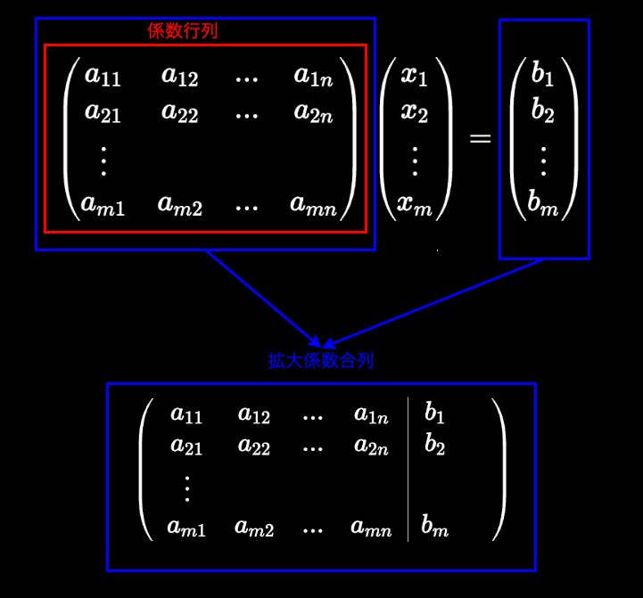
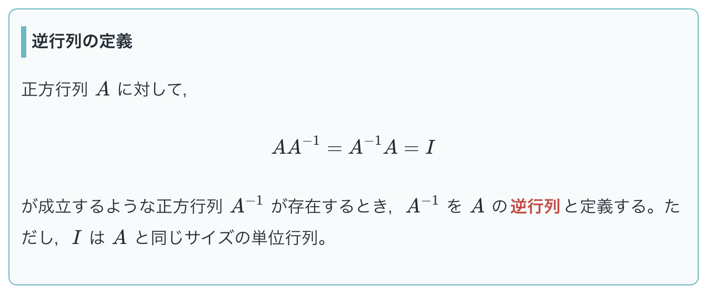

### 連立方程式と行列

連立方程式を行列で解く

1. 掃き出し法

    行列の**行基本変形**を行い, **簡約行列**を作り連立方程式を解く方法のこと

    *行基本変形とは → 行列に以下の3つの操作を行い簡約行列を作ること
    1. 行の交換
    2. 行の定数倍
    3. 他の行に定数倍

    上記操作を行ではなく、列に対して行う $\color{red}列基本変形$ という操作も存在する

     

    *簡約行列とは → 以下の4つの条件を満たす行列のこと

    1. 0 でない成分を持つ行の**主成分**は 1 である

        *主成分 → 各行で最初に出てくる0以外の成分のこと

    2. 成分がすべて 0 の行は, 0 でない成分を含む行よりも下にある

    3. 各行の主成分は, 下の行ほど右にある.

    4. 各行の主成分と同じ列の他の成分は全て0である

     

    例: 以下の連立方程式の解を求める
    $$
    \left\{
    \begin{array}{ll}
    2x + 3y + z = 4 \\
    4x + y - 3z = -2 \\
    -x +2y + 2z = 2
    \end{array}
    \right.
    $$

    上記連立方程式の拡大係数行列は以下のようになる

    $$
    \begin{pmatrix}
    2 & 3 & 1 & 4 \\
    4 & 1 & -3 & -2 \\
    -1 & 2 & 2 & 2
    \end{pmatrix}
    \begin{matrix}
        ... & (1)\\
        ... & (2)\\
        ... & (3)
    \end{matrix}
    $$

     

    - (3)に -1 を掛け、主成分を1にする
    - (1)と(3)を交換する 

    $
    \begin{pmatrix}
        1 & -2 & -2 & -2 \\
        4 & 1 & -3 & -2 \\
        2 & 3 & 1 & 4 \\
    \end{pmatrix}
    \begin{matrix}
        ... & (1)\\
        ... & (2)\\
        ... & (3)
    \end{matrix}
    $

     

    - (2) → (2) - 4×(1) を行い、(2)の一列目の成分を0にする
    -  (3) → (3) - 2×(1) を行い(3)の一列目の成分を0にする

    $
    \begin{pmatrix}
        1 & -2 & -2 & -2 \\
        0 & 9 & 5 & 6 \\
        0 & 7 & 5 & 8 \\
    \end{pmatrix}
    \begin{matrix}
        ... & (1)\\
        ... & (2)\\
        ... & (3)
    \end{matrix}
    $

     

    - (2) → (2) - (3) を行い(2)の三列目の成分を0にする

    $
    \begin{pmatrix}
        1 & -2 & -2 & -2 \\
        0 & 2 & 0 & -2 \\
        0 & 7 & 5 & 8 \\
    \end{pmatrix}
    \begin{matrix}
        ... & (1)\\
        ... & (2)\\
        ... & (3)
    \end{matrix}
    $

     

    - (2) → $\frac{1}{2} \times$ (2) を行い、(2)の主成分を1にする

    $
    \begin{pmatrix}
        1 & -2 & -2 & -2 \\
        0 & 1 & 0 & -1 \\
        0 & 7 & 5 & 8 \\
    \end{pmatrix}
    \begin{matrix}
        ... & (1)\\
        ... & (2)\\
        ... & (3)
    \end{matrix}
    $

     

    - (3) → (3) - 7 × (2) を行い、(3)の二列目の成分を0にする

    $
    \begin{pmatrix}
        1 & -2 & -2 & -2 \\
        0 & 1 & 0 & -1 \\
        0 & 0 & 5 & 15 \\
    \end{pmatrix}
    \begin{matrix}
        ... & (1)\\
        ... & (2)\\
        ... & (3)
    \end{matrix}
    $

     

    - (3) → $\frac{1}{5}$ × (3) を行い、(3)の主成分を1にする

    $
    \begin{pmatrix}
        1 & -2 & -2 & -2 \\
        0 & 1 & 0 & -1 \\
        0 & 0 & 1 & 3 \\
    \end{pmatrix}
    \begin{matrix}
        ... & (1)\\
        ... & (2)\\
        ... & (3)
    \end{matrix}
    $

     

    - (1) + { 2 × (2) } + {2 × (3)} を行い、(1)の二列目と三列目の成分を0にする

    $
    \begin{pmatrix}
        1 & 0 & 0 & 2 \\
        0 & 1 & 0 & -1 \\
        0 & 0 & 1 & 3 \\
    \end{pmatrix}
    \begin{matrix}
        ... & (1)\\
        ... & (2)\\
        ... & (3)
    \end{matrix}
    $

     

    上記の拡大係数行列はを連立方程式に戻すと

    $$
    \left\{
    \begin{array}{ll}
    x = 2 \\
    y = -1 \\
    z = 3
    \end{array}
    \right.
    $$

 

2. 逆行列を利用する方法

    連立方程式
    $$
    \left\{
    \begin{array}{ll}
    a_{1}x + a_{2}y = b_{1} \\
    a_{3}x + a_{4}y = b_{2}
    \end{array}
    \right.
    $$
    
    の[係数行列](#係数行列と係数拡大行列)を
    $
    A =
    \begin{pmatrix}
    a_{1} & a_{2} \\
    a_{3} & a_{4}
    \end{pmatrix}
    $
    
    変数の行列を
    $
    x = 
    \begin{pmatrix}
    x \\
    y
    \end{pmatrix}
    $

    右辺を
    $
    b =
    \begin{pmatrix}
    b_{1} \\
    b_{2}
    \end{pmatrix}
    $

    と表すと連立方程式は行列を用いて以下のように表すことができる

    $$
    Ax = b
    $$

     

    ここでAの[逆行列](#逆行列) $A^{-1}$ を両辺にかけると  

    $$
    A^{-1}Ax = A^{-1}b
    $$

    (*行列において特殊なケース以外で交換法則は成り立たないため、**掛ける順番に注意**)

     

    とある行列とその逆行列に間には以下の関係が成り立つ
    
    - $AA^{-1} = A^{-1}A = I$ (Iは単位行列)
    
    したがって、 $A^{-1}Ax = A^{-1}b$ は $Ix = A^{-1}b$ と変形することができる

     

    また、とある行列と単位行列には以下の関係が成り立つ
    - $AI = IA = A$ (Iは単位行列)

    よって $Ix = A^{-1}b$ は $x = A^{-1}b$ と変形することができる

     

    上記の式の計算結果は以下の形になり、連立方程式の解を求めることができる

    $$
    \begin{pmatrix}
    x \\
    y
    \end{pmatrix}
    =
    \begin{pmatrix}
    \circ \\
    \triangle
    \end{pmatrix}
    $$

     

    例: 以下の連立方程式の解を求める
    $$
    \left\{
    \begin{array}{ll}
    2x + 3y + z = 4 \\
    4x + y - 3z = -2 \\
    -x +2y + 2z = 2
    \end{array}
    \right.
    $$

     

    - 連立方程式を、行列を用いて $Ax = b$ の形に変形する

    $$
    \begin{pmatrix}
    2 & 3 & 1 \\
    4 & 1 & -3 \\
    1 & 2 & 2
    \end{pmatrix}
    \begin{pmatrix}
    x \\
    y \\
    z
    \end{pmatrix}
    =
    \begin{pmatrix}
    4 \\
    -2 \\
    2
    \end{pmatrix}
    $$

     

    係数行列の逆行列を求める

    係数行列をAとおくと、Aの行列式は
    $$
   \begin{align}
    det A &= 
    \frac{1}{
        \{ (2 \times 1 \times 2) - (2 \times (-3) \times 2) \} +
        \{ (3 \times (-3) \times 1) - (3 \times 4 \times 2) \} + 
        \{ (1 \times 4 \times 2) - (1 \times 1 \times 1) \}
        } \notag \\[20pt]
    &= \frac{1}{2 - 12 - 9 -24 + 8 - 1} \notag \\[20pt]
    &= -\frac{1}{36}
    \end{align}
    $$

    よって、
    $$
    \begin{align}
        A^{-1} = -\frac{1}{36}
        \begin{pmatrix}

        \end{pmatrix}
    \end{align}
    $$

---

### 係数行列と係数拡大行列

以下のような連立1方程式があるとき (a, bは実数)

$$
\left\{
\begin{array}{ll}
a_{11}x_{1} + a_{12}x_{2} + ... + a_{1n}x_{n} = b_{1} \\
a_{21}x_{1} + a_{22}x_{2} + ... +  a_{2n}x_{n} = b_{2} \\
\vdots \\
a_{m1}x_{1} + a_{m2}x_{2} + ... + a_{mn}x_{n} = b_{m}
\end{array}
\right.
$$

この連立方程式は行列を用いて以下のように表すことができる

$$
\begin{pmatrix}
a_{11} & a_{12} & ... & a_{1n} \\
a_{21} & a_{22} & ... & a_{2n} \\
\vdots \\
a_{m1} & a_{m2} & ... & a_{mn} \\
\end{pmatrix}
\begin{pmatrix}
x_{1} \\
x_{2} \\
\vdots \\
x_{m} \\
\end{pmatrix}
=
\begin{pmatrix}
b_{1} \\
b_{2} \\
\vdots \\
b_{m} \\
\end{pmatrix}
$$

 

上記の中で、左辺のm×nの行列を**係数行列**といい

左辺のm×nの行列と右辺のm×1の行列を並べた行列を拡大係数行列という

 
 

参考サイト

[【入門線形代数】係数行列と拡大係数行列-連立一次方程式-](https://university-note.com/coefficient-matrix/)

---

### 行基本変形とランク(rank)

---

### 逆行列 (Inverse of a Matrix)

定義

引用: [逆行列の定義・逆行列を求める２通りの方法と例題](https://manabitimes.jp/math/1153)

 

ポイント
- 逆行列は正方行列のみに定義される
- 逆行列が存在するような行列(上記定義でいうA)を**正則行列**という
- [行列式](#行列式)を利用することで、対象の行列が逆行列を持つかどうかを判別できる

 

逆行列の求め方

- 掃き出し法で求める方法

    1. 対象の n 次の正方行列 A に、 n 次の単位行列 I を並べ **n×2n** 次の行列 (A,I) を作る

    2. 上記操作で出来た行列 (A, I) に行基本変形を行い (I, B) に変形する (Bは別のとある行列)

    3. 上記操作で求めた行列(I, B)のうち B が A の逆行列となる

     

    例: 
    $
    A = 
    \begin{pmatrix}
        1 & 0 & 2 \\
        -1 & 2 & 2 \\
        1 & 2 & 0
    \end{pmatrix}
    $
    の逆行列を求める

     

    1. 行列 A に 3次の単位行列 I を 並べ (A, I) を作る

    $$

    \left(
    \begin{array}{ccc|c}
    1 & 0 & 2 & 1 & 0 & 0 \\[10pt]
    -1 & 2 & 2 & 0 & 1 & 0 \\[10pt]
    1 & 2 & 0 & 0 & 0 & 1
    \end{array}
    \right)
    $$

     

    2. (A, I) に掃き出しを用いて、Aの部分をIに変形する = (I, B)の形に変形する

        *掃き出しでの計算結果は省略

    $$
    \left(
    \begin{array}{ccc|c}
    1 & 0 & 2 & 1 & 0 & 0 \\[10pt]
    -1 & 2 & 2 & 0 & 1 & 0 \\[10pt]
    1 & 2 & 0 & 0 & 0 & 1
    \end{array}
    \right) 
    = 
    \left(
    \begin{array}{ccc|c}
    1 & 0 & 0 & \frac{1}{3} & -\frac{1}{3} & \frac{1}{3} \\[10pt]
    0 & 1 & 0 & -\frac{1}{6} & \frac{1}{6} & \frac{1}{3} \\[10pt]
    0 & 0 & 1 & \frac{1}{3} & \frac{1}{6} & -\frac{1}{6} \\
    \end{array}
    \right)
    $$

     

    3. 掃き出し結果 (I, B) の B の行列が A の逆行列である

    $$
    A^{-1} =
    \begin{pmatrix}
        \frac{1}{3} & -\frac{1}{3} & \frac{1}{3} \\[10pt]
        -\frac{1}{6} & \frac{1}{6} & \frac{1}{3} \\[10pt]
        \frac{1}{3} & \frac{1}{6} & -\frac{1}{6} \\
    \end{pmatrix}
    $$

     
    
    確認: $AA^{-1} = A^{-1}A = I$ になるかどうか

     

    $$
    \begin{array}{cl}
        AA^{-1} 
        &=
        \begin{pmatrix}
            1 & 0 & 2 \\[10pt]
            -1 & 2 & 2 \\[10pt]
            1 & 2 & 0
        \end{pmatrix}
        \begin{pmatrix}
            \frac{1}{3} & -\frac{1}{3} & \frac{1}{3} \\[10pt]
            -\frac{1}{6} & \frac{1}{6} & \frac{1}{3} \\[10pt]
            \frac{1}{3} & \frac{1}{6} & -\frac{1}{6} 
        \end{pmatrix} 
        \\[15mm]
        &=
        \begin{pmatrix}
            \frac{1}{3} +\frac{2}{3} & -\frac{1}{3} + \frac{1}{3} & \frac{1}{3} - \frac{1}{3} \\[10pt]
            -\frac{1}{3} - \frac{1}{3} + \frac{2}{3} & \frac{1}{3} + \frac{1}{3} + \frac{1}{3} & -\frac{1}{3} + \frac{2}{3} - \frac{1}{3} \\[10pt]
            \frac{1}{3} - \frac{1}{3} & -\frac{1}{3} + \frac{1}{3} & \frac{1}{3} + \frac{2}{3}
        \end{pmatrix}
        \\[15mm]
        &=
        \begin{pmatrix}
            1 & 0 & 0 \\
            0 & 1 & 0 \\
            0 & 0 & 1
        \end{pmatrix} = I
    \end{array}
    $$

     

    $$
    \begin{array}{cl}
        A^{-1}A
        &= 
        \begin{pmatrix}
            \frac{1}{3} & -\frac{1}{3} & \frac{1}{3} \\[10pt]
            -\frac{1}{6} & \frac{1}{6} & \frac{1}{3} \\[10pt]
            \frac{1}{3} & \frac{1}{6} & -\frac{1}{6} 
        \end{pmatrix}
        \begin{pmatrix}
            1 & 0 & 2 \\[10pt]
            -1 & 2 & 2 \\[10pt]
            1 & 2 & 0
        \end{pmatrix}
        \\[15mm]
        &= 
        \begin{pmatrix}
            \frac{1}{3} + \frac{1}{3} + \frac{1}{3} & -\frac{2}{3} + \frac{2}{3} & \frac{2}{3} - \frac{2}{3} \\[10pt]
            -\frac{1}{6} - \frac{1}{6} + \frac{1}{3} & \frac{1}{3} + \frac{2}{3} & -\frac{1}{6} + \frac{1}{6} \\[10pt]
            \frac{1}{3} - \frac{1}{6} - \frac{1}{6} & \frac{1}{3} - \frac{1}{3} & \frac{2}{3} + \frac{1}{3}
        \end{pmatrix}
        \\[15mm]
        &=
        \begin{pmatrix}
            1 & 0 & 0 \\
            0 & 1 & 0 \\
            0 & 0 & 1
        \end{pmatrix} = I
    \end{array}
    $$

 
 

- 余韻子行列で求める方法

 
 

参考サイト

逆行列は正方行列のｍに定義されることの証明
- [3.16 逆行列](http://tau.doshisha.ac.jp/lectures/2007.linear-algebra-I/html.dir/node79.html)

逆行列の使い道
- [逆行列とは？誰でも理解できるようにわかりやすく解説](https://www.headboost.jp/inverse-matrix/)

---

### 行列式

ポイント
- 行列式は正方行列のみに定義される
