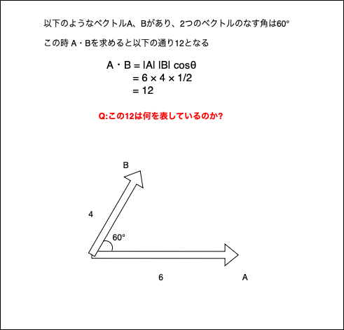
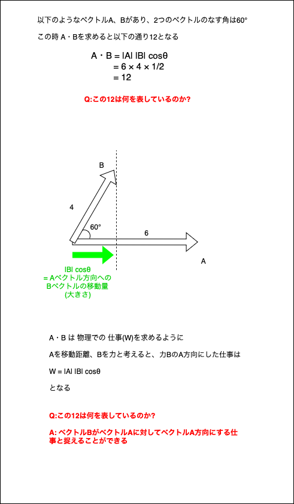

### ベクトルの基本

コンピュータグラフィックスの領域ではベクトルは重要な概念らしい

n 次元のベクトル V は以下のように表すことができる

$$
V = (v_{1}, v_{2}, v_{3}, ... ,v_{n})
$$

*各値 $v_{n}$ を ベクトルVの成分と呼ぶ

<br>

高校数学まではベクトルの成分は横に並べて書いてきたが、一般的には**縦に要素を並べて書く**

$$
V = 
\begin{pmatrix}
    v_{1} \\
    v_{2} \\
    v_{3} \\
    . \\
    . \\
    . \\
    v_{n}
\end{pmatrix}
$$

上記のようなベクトルを$\color{red}列ベクトル$ 、高校の時に書いていた成分を横に並べるベクトルを$\color{red}行ベクトル$と呼ぶ

普通単に「ベクトル」というとき、それは 大抵 $\color{red}列ベクトル$ を表す

行ベクトルと列ベクトルは**向きと大きさを表す**ために使うのであれば違いはない。しかし、**行列として扱う**時に違いが出てくる

<br>

ベクトルの転置
- 行ベクトルを列ベクトルへ、あるいはその逆の変換をすること

- 列ベクトルAを転置しものを、記号 「⊤」を使って$A^⊤$と表す

$$
A = 
\begin{pmatrix}
    v_{1}\\
    v_{2}\\
    v_{3}\\
    .\\
    .\\
    .\\
    v_{n}\\
\end{pmatrix}
$$
$$
A^⊤ = (v_{1}, v_{2}, v_{3}, ... ,v_{n})
$$

<br>
<br>

参考サイト

[ベクトルと行列の基礎](https://gamescience.jp/text/PDF/Vector.pdf)

[列ベクトルと行ベクトルの定義と違い](https://mathlandscape.com/column-row-vector)

---

### ベクトルの計算(足し算・引き算)

2つのベクトルA、Bの和 A + B は以下のように計算する

- 対応する成分どうしを足し算する

$$
A =
\begin{pmatrix}
 a_{1} \\
 a_{2} \\
 a_{3}
\end{pmatrix}
$$

$$
B =
\begin{pmatrix}
 b_{1} \\
 b_{2} \\
 b_{3}
\end{pmatrix}
$$

$$
A + B =
\begin{pmatrix}
 a_{1} + b_{1} \\
 a_{2} + b_{2}\\
 a_{3} + b_{3}
\end{pmatrix}
$$

<br>

引き算も同様に
- 対応する成分どうしを引き算する

$$
A - B =
\begin{pmatrix}
 a_{1} - b_{1} \\
 a_{2} - b_{2}\\
 a_{3} - b_{3}
\end{pmatrix}
$$

---

### ベクトルの内積

ベクトルの内積には2つの計算方法がある

1\. ベクトルの成分を用いた求め方

以下のベクトルA、Bがあるとする

$
A = 
\begin{pmatrix}
    a_{x}\\
    a_{y}
\end{pmatrix}
$
$
B = 
\begin{pmatrix}
    b_{x}\\
    b_{y}
\end{pmatrix}
$

ベクトルA、Bの内積は以下のように計算することができる

$$
\color{red}
A・B = a_{x}b_{x} + a_{y}b_{y}
$$


<br>
<br>

2\. ベクトルの大きさとなす角を用いた求め方

ベクトルA、Bがあるとする

また、AとBのベクトルのなす角をθとおくと、

ベクトルA、Bの内積は以下のように計算することができる

$$
\color{red}
A・B = |A||B|cosθ
$$

<br>

**ベクトルの内積のポイント**

1. ベクトルの内積の結果はスカラーになる

<br>

2. *ベクトルの内積が意味していることは、
    ```
    ２つのベクトルが、お互いにどれだけ助け合っているか、邪魔し合っているかを表す量

    物理で言うと、AベクトルがBベクトル方向ににBベクトルとともに行った仕事
    また、BベクトルがAベクトル方向にAベクトルと共に行った仕事
    ```




<br>

3. 3D グラフィックスの世界では内積は二つのベクトルがなす角度を求める上で非常に重要な考えである

2つのベクトルの成分がわかっていれば、内積を使ってそのベクトル同士のなす角度を求めることができる

<br>

練習問題: 以下のベクトルA、Bのなす角を求めよ

$
A =
\begin{pmatrix}
    1 \\
    -2 \\
\end{pmatrix}
$
$
B =
\begin{pmatrix}
    -3 \\
    6 \\
\end{pmatrix}
$

<br>

ちなみに、ベクトルA、ベクトルBそれぞれの大きさは

$
|A| = \sqrt{1^2 + (-2)^2} \\
    = \sqrt{5}
$

$
|B| = \sqrt{(-3)^2 + (6)^2} \\
    = \sqrt{45}\\
    = 3\sqrt{5}
$
    
ベクトルAとベクトルBのなす角は

$$
A・B = |A||B|cosθ \\
    = \sqrt{5} \times 3\sqrt{5} cosθ
$$

ベクトルの成分を使った内積は

$$
A・B = 1 \times (-3) + (-2) \times 6 \\
= -3 + (-12) \\
= -15
$$

<br>

よって、以下の式が導ける

$$
\sqrt{5} \times 3\sqrt{5} cosθ = -15 \\
cosθ = \frac{-15}{\sqrt{5} \times 3\sqrt{5}} \\
cosθ = -1
$$

よって、$\color{red}θ = 180°$ が求められた

<br>
<br>

参考サイト

ベクトルの内積の意味をとてもわかりやすく説明しているもの
- [ベクトルの内積とは？意味や性質も徹底解説！](https://youtu.be/QeqlrCdxWAs?si=SD5pyPqh2lnCDcSv)
- [内積とは何か？【高校数学】ベクトル＃１８](https://youtu.be/2aoyhQzmnAI?si=Pf0bBxRefHjEhqCO)

ベクトルの内積について
- [ベクトルと行列の基礎](https://gamescience.jp/text/PDF/Vector.pdf)

ベクトルの内積が3Dで重要なわけ
- [ベクトルの内積を使って角度を求める仕組み](https://mclover.hateblo.jp/entry/20230313/1678690458)

---

### ベクトルの外積
