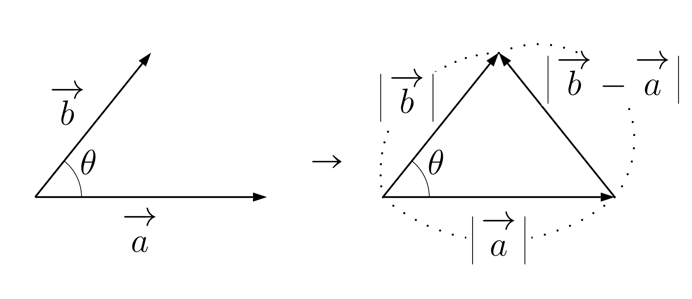
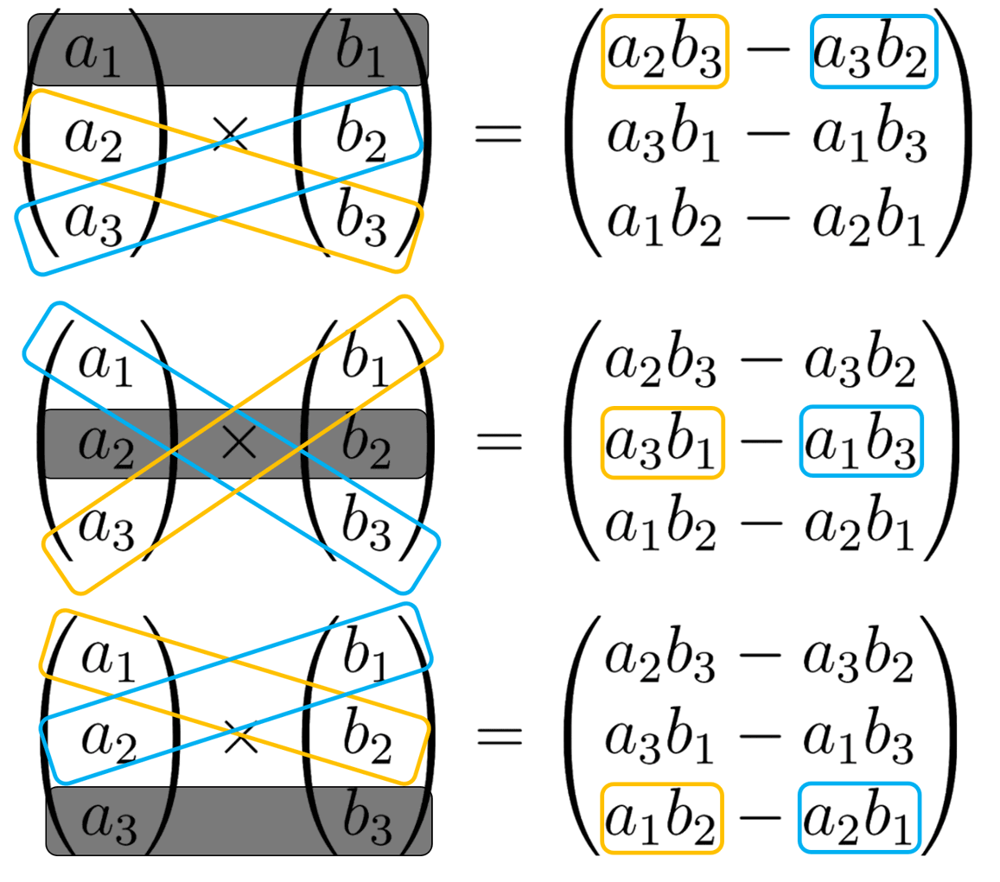
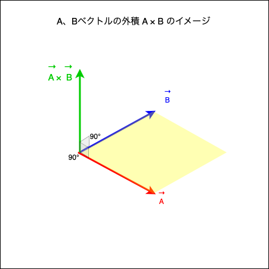
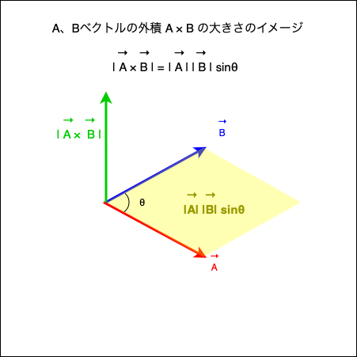
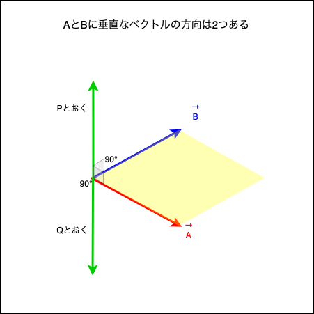
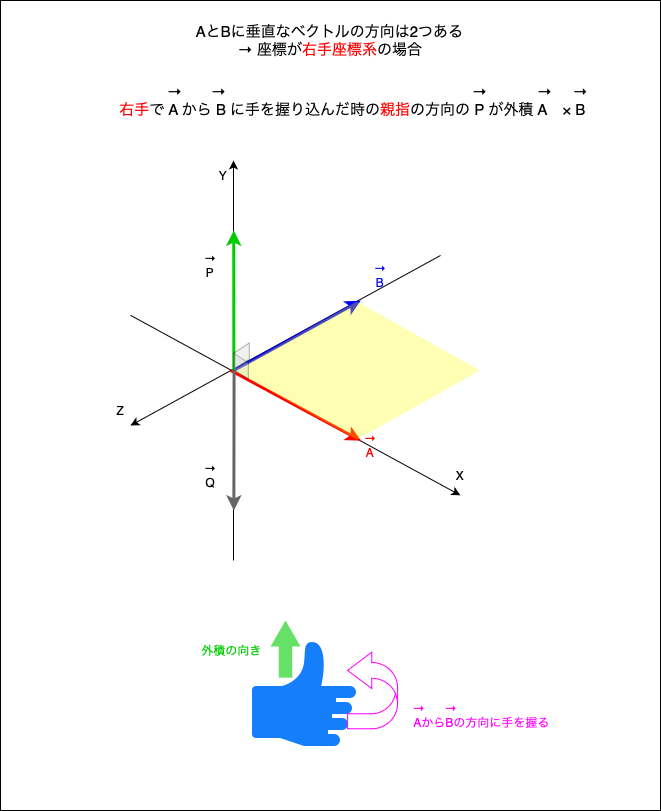
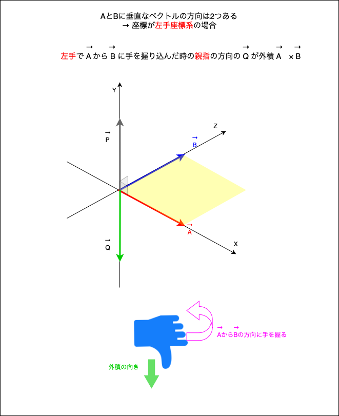
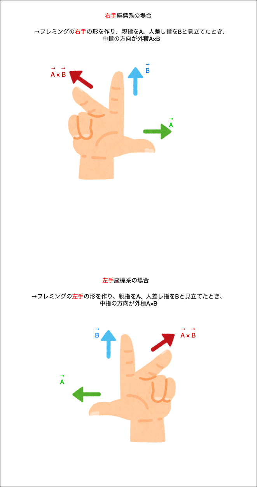
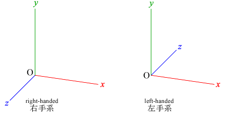
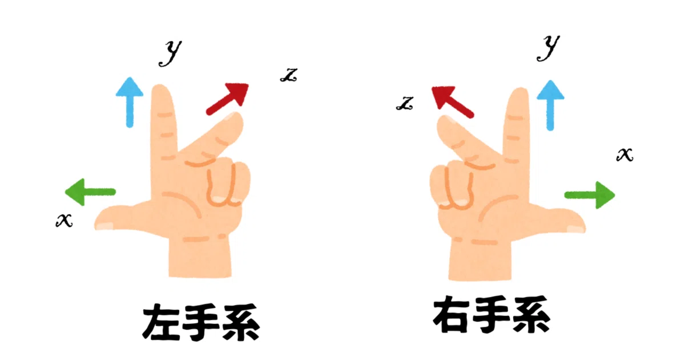

### ベクトルの基本

コンピュータグラフィックスの領域ではベクトルは重要な概念らしい

n 次元のベクトル V は以下のように表すことができる

$$
V = (v_{1}, v_{2}, v_{3}, ... ,v_{n})
$$

*各値 $v_{n}$ を ベクトルVの成分と呼ぶ

<br>

高校数学まではベクトルの成分は横に並べて書いてきたが、一般的には**縦に要素を並べて書く**

$$
V = 
\begin{pmatrix}
    v_{1} \\
    v_{2} \\
    v_{3} \\
    . \\
    . \\
    . \\
    v_{n}
\end{pmatrix}
$$

上記のようなベクトルを$\color{red}列ベクトル$ 、高校の時に書いていた成分を横に並べるベクトルを$\color{red}行ベクトル$と呼ぶ

普通単に「ベクトル」というとき、それは 大抵 $\color{red}列ベクトル$ を表す

行ベクトルと列ベクトルは**向きと大きさを表す**ために使うのであれば違いはない。しかし、**行列として扱う**時に違いが出てくる

<br>

ベクトルの転置
- 行ベクトルを列ベクトルへ、あるいはその逆の変換をすること

- 列ベクトルAを転置しものを、記号 「⊤」を使って$A^⊤$と表す

$$
A = 
\begin{pmatrix}
    v_{1}\\
    v_{2}\\
    v_{3}\\
    .\\
    .\\
    .\\
    v_{n}\\
\end{pmatrix}
$$
$$
A^⊤ = (v_{1}, v_{2}, v_{3}, ... ,v_{n})
$$

<br>
<br>

参考サイト

[ベクトルと行列の基礎](https://gamescience.jp/text/PDF/Vector.pdf)

[列ベクトルと行ベクトルの定義と違い](https://mathlandscape.com/column-row-vector)

---

### ベクトルの計算(足し算・引き算)

2つのベクトルA、Bの和 A + B は以下のように計算する

- 対応する成分どうしを足し算する

$$
A =
\begin{pmatrix}
 a_{1} \\
 a_{2} \\
 a_{3}
\end{pmatrix}
$$

$$
B =
\begin{pmatrix}
 b_{1} \\
 b_{2} \\
 b_{3}
\end{pmatrix}
$$

$$
A + B =
\begin{pmatrix}
 a_{1} + b_{1} \\
 a_{2} + b_{2}\\
 a_{3} + b_{3}
\end{pmatrix}
$$

<br>

引き算も同様に
- 対応する成分どうしを引き算する

$$
A - B =
\begin{pmatrix}
 a_{1} - b_{1} \\
 a_{2} - b_{2}\\
 a_{3} - b_{3}
\end{pmatrix}
$$

---

### ベクトルの内積 (dot product)

ベクトルの内積には2つの定義の仕方がある

*定義: 決め事、ルール

- 1つはベクトルの成分計算を用いた代数的定義
- もう1つはベクトルの大きさとそのなす角を用いた幾何学的定義

*どちら一方の定義を用いれば、もう片方の定義を計算で導き出すことができる = 性質として導き出すことができる

<br>

#### 1. ベクトルの成分を用いた代数的定義

以下のベクトルA、Bがあるとする

$
A = 
\begin{pmatrix}
    a_{x}\\
    a_{y}
\end{pmatrix}
$
$
B = 
\begin{pmatrix}
    b_{x}\\
    b_{y}
\end{pmatrix}
$

ベクトルA、Bの内積は以下のように求めることができる

$$
\color{red}
A・B = a_{x}b_{x} + a_{y}b_{y}
$$

*なお、内積の表記は外積の表記と区別するために×ではなく・で表す

<br>

#### 2. ベクトルの大きさとなす角を用いた幾何学的定義

ベクトルA、Bがあるとする

また、AとBのベクトルのなす角をθとおくと、

ベクトルA、Bの内積は以下のように求めることができる

$$
\color{red}
A・B = |A||B|cosθ
$$

<br>
<br>

多くのテキストなどでは定義2の幾何学的定義を内積の定義として採用し、計算で定義1を性質として導き出している

[こちら](https://hiraocafe.com/note/vector-inner-product.html)のサイトのように $\vec{a}, \vec{b}, \vec{b} - \vec{a}$ で作られる三角形に余弦定理を利用して $\vec{a}・\vec{b} = |\vec{a}| |\vec{b}| cosθ$ から $\vec{a}・\vec{b} = a_{x}b_{x} + a_{y}b_{y}$ を導き出している



引用: [ベクトルの内積](https://hiraocafe.com/note/vector-inner-product.html)


<br>

#### ベクトルの内積のポイント

1. ベクトルの内積の結果はスカラーになる

<br>

2. *ベクトルの内積が意味していることは、
    ```
    ２つのベクトルが、お互いにどれだけ助け合っているか、邪魔し合っているかを表す量

    物理で言うと、AベクトルがBベクトル方向にBベクトルとともに行った仕事
    また、BベクトルがAベクトル方向にAベクトルと共に行った仕事
    ```


<br>

3. 3D グラフィックスの世界では内積は二つのベクトルがなす角度を求める上で非常に重要な考えである

    2つのベクトルの成分がわかっていれば、内積を使ってそのベクトル同士のなす角度を求めることができる

    <br>

    \[練習問題\]: 以下のベクトルA、Bのなす角を求めよ

    $
    A =
    \begin{pmatrix}
        1 \\
        -2 \\
    \end{pmatrix}
    $
    $
    B =
    \begin{pmatrix}
        -3 \\
        6 \\
    \end{pmatrix}
    $

    <br>

    ちなみに、ベクトルA、ベクトルBそれぞれの大きさは

    $
    |A| = \sqrt{1^2 + (-2)^2} \\
        = \sqrt{5}
    $

    $
    |B| = \sqrt{(-3)^2 + (6)^2} \\
        = \sqrt{45}\\
        = 3\sqrt{5}
    $
        
    ベクトルAとベクトルBのなす角は

    $$
    A・B = |A||B|cosθ \\
        = \sqrt{5} \times 3\sqrt{5} cosθ
    $$

    ベクトルの成分を使った内積は

    $$
    A・B = 1 \times (-3) + (-2) \times 6 \\
    = -3 + (-12) \\
    = -15
    $$

    <br>

    よって、以下の式が導ける

    $$
    \sqrt{5} \times 3\sqrt{5} cosθ = -15 \\
    cosθ = \frac{-15}{\sqrt{5} \times 3\sqrt{5}} \\
    cosθ = -1
    $$

    よって、$\color{red}θ = 180°$ が求められた

<br>
<br>

参考サイト

ベクトルの内積の意味をとてもわかりやすく説明しているもの
- [ベクトルの内積とは？意味や性質も徹底解説！](https://youtu.be/QeqlrCdxWAs?si=SD5pyPqh2lnCDcSv)
- [内積とは何か？【高校数学】ベクトル＃１８](https://youtu.be/2aoyhQzmnAI?si=Pf0bBxRefHjEhqCO)

ベクトルの内積について
- [ベクトルと行列の基礎](https://gamescience.jp/text/PDF/Vector.pdf)

ベクトルの内積が3Dで重要なわけ
- [ベクトルの内積を使って角度を求める仕組み](https://mclover.hateblo.jp/entry/20230313/1678690458)

ベクトルの内積の定義のアプローチが2つあることについて
- [ベクトルの内積](https://hiraocafe.com/note/vector-inner-product.html)
- [ベクトルの内積と外積の意味と嬉しさ](https://manabitimes.jp/math/678#1)

---

### ベクトルの外積 (cross product)

$\color{red}外積は3次元のベクトルについてのみ定義される$

ベクトルの外積も2つの定義の仕方がある
- 1つはベクトルの成分計算を用いた代数的定義
- もう1つはベクトルの大きさとそのなす角を用いた幾何学的定義

*どちら一方の定義を用いれば、もう片方の定義を計算で導き出すことができる = 性質として導き出すことができる

<br>

#### 1. ベクトルの成分を用いた代数的定義

$$
A =
\begin{pmatrix}
    a_{1}\\
    a_{2}\\
    a_{3}\\
\end{pmatrix}
,
B =
\begin{pmatrix}
    b_{1}\\
    b_{2}\\
    b_{3}\\
\end{pmatrix}
$$

とおくと、上記2つのベクトルの外積 A × B は以下のように求めることができる

$$
A \times B =
\begin{pmatrix}
    a_{2} \times b_{3} - a_{3} \times b_{2}\\
    a_{3} \times b_{1} - a_{1} \times b_{3}\\
    a_{1} \times b_{2} - a_{2} \times b_{1}\\
\end{pmatrix}
$$

覚え方


引用: [【入門線形代数】ベクトルの外積-ベクトル空間-](https://university-note.com/crossproduct/)

<br>

#### 2. ベクトルの大きさとなす角を用いた幾何学的定義

3次元ベクトルA、Bがあり、それらのベクトルのなす角がθ(0 ≤ θ ≤ 180) のとき、以下の3点を満たす

- 外積 A × B は A、B ベクトルがある平面に垂直

    

    <br>
    
- 外積 A × B の大きさ |A × B| は、2つのベクトルA, B によって作られる平行四辺形の面積に等しい

    ベクトルA、Bの内積 A × B の大きさ | A × B | は以下のように計算することができる

    $$
    A \times B = |A| |B| sinθ
    $$
    
    

    <br>

- 外積 A × B の向きは以下のようになる

    - 座標が$\color{red}右手座標系のとき$、ベクトル A から B に$\color{red}右ねじを回した向き$になる

    - 座標が$\color{red}左手座標系のとき$、ベクトル A から B に$\color{red}左ねじを回した向き$になる

    [右手座標系/左手座標系についてはこちらを参照](#右手座標系左手座標系とは)
    
    <br>

    **\*A × B の向きに注意**

    → A、Bベクトルに垂直なベクトルは図のように2方向ある
    

    

    <br>

    上記画像にて、外積 A × B は P か Q のどちらかである

    -> 座標系によって P か Q が外積 A × B となる

    
    

    <br>

    *ちなみに外積の向きについて、フレミングの右手/左手の形での中指の方向で説明するテキスト/webサイトもある

    

<br>
<br>


<br>

#### ベクトルの外積のポイント

1\. 外積の表記は
$
A・B
$
ではなく
$
A \times B
$

2\. ベクトルの外積は内積と異なり、結果はスカラーではなく新たなベクトルになる

3\. ベクトルの外積は、2つのベクトルのベクトルに直交する(=垂直な)ベクトルを求めている

4\. ベクトル外積の結果はベクトルであるため、向きと大きさがある。向きは右手座標系か左手座標系で異なる

<br>
<br>

参考サイト

外積の向きに関する説明
- [外積の計算のマイナス項の意味　直感的理解を目指して](http://moiiyo.blog118.fc2.com/blog-entry-55.html)
- [外積の意味](http://proofcafe.org/k27c8/math/math/vector_analysis/page/meaning_of_outer_product/)

代数学的定義から幾何学定義を性質(定理)として導き出し方を説明しているもの
- [外積って何?](https://www.surweb.jp/sur/faq/pdf/outerproduct.pdf)

---

### 右手座標系、左手座標系とは

３次元座標の x, y, z 軸の取り方のこと

<br>

大きな違いとしては、
- 右手系のz軸は手前方向が正
- 左手系はz軸が奥方向が正



引用: [3次元CG](https://fujiwaratko.sakura.ne.jp/infosci/modeling1.html)

<br>

これは、手の親指をx軸、人差し指をy軸、中指をz軸に見立てると、座標系が右手に該当するか左手に該当するのでそれぞれ右手系/左手系と呼ばれている



引用: [グラフィックス・ソフトの座標系の右手系・左手系と回転方向](https://note.com/hokesi/n/n3b0e38f5c614)

<br>

ちなみに、WebGLでは**右手座標系**が採用されている

---

### 外積の学習中に抱いた疑問

Q1: なぜ右手座標系では外積の向きは右ねじの方向なのか? (=左手座標系では外積の向きは左ねじの方向なのか?)

A1: $\color{red}外積の向きは右/左ねじになるというよりも、右手/左手座標系のとき右/左ねじの方向を向くベクトルを外積としたから$

<br>

Q2: なぜPとQの両方とも外積としなかったのか?


A2: $\color{red}P と Q の両方を外積としなかったというよりも、定義 1 (or 2) を満たすものを外積としたから$