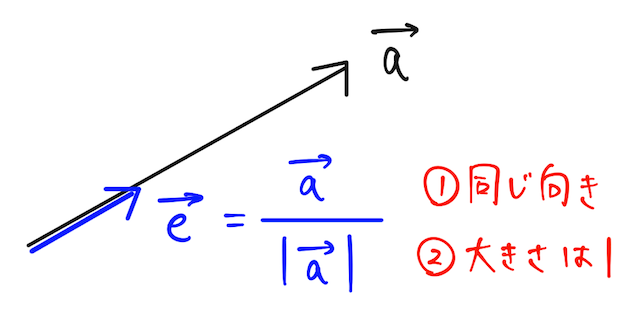
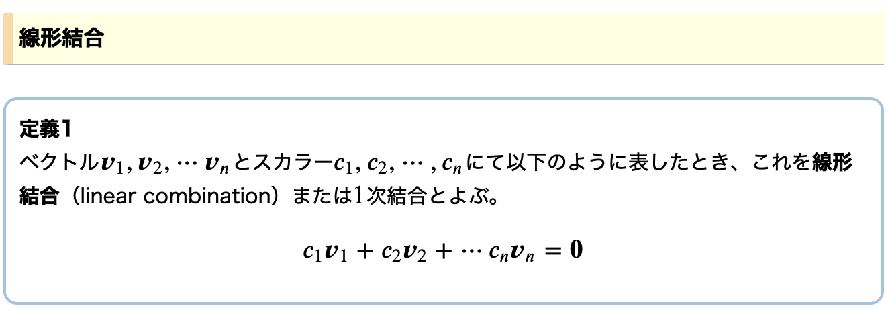
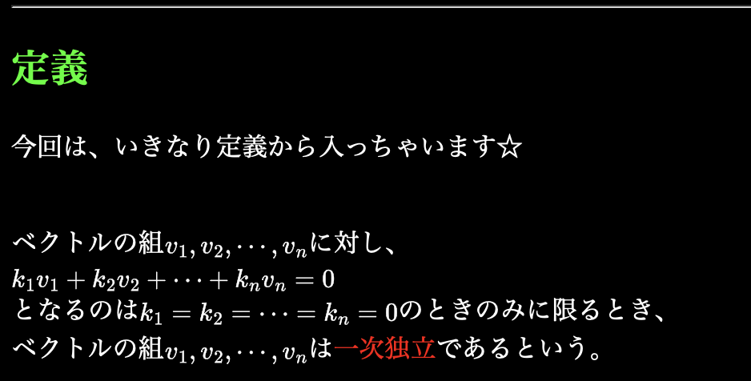
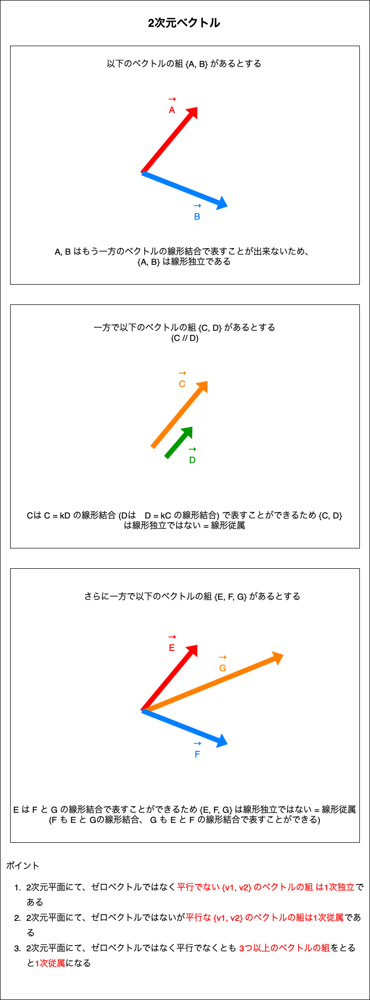
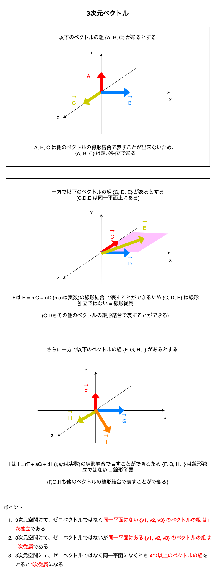

### 単位ベクトル

- 大きさ(長さ)が1のベクトルのこと
- 単位ベクトルの方向に関する定義はない

単位ベクトルの求め方
- とあるベクトルAがあるとする
    $$
    A =
    \begin{pmatrix}
    a_{x} \\
    a_{y} \\
    \end{pmatrix}
    $$

    このベクトルAと同じ方向の単位ベクトルを$\frac{A}{|A|}$と表す

    $$
    |A| = \sqrt{(a_{x})^2+(a_{y})^2}
    $$

    $$
    \frac{A}{|A|} =
    \begin{pmatrix}
    \frac{a_{x}}{\sqrt{(a_{x})^2+(a_{y})^2}} \\[15pt]
    \frac{a_{y}}{\sqrt{(a_{x})^2+(a_{y})^2}} \\
    \end{pmatrix}
    $$

    イメージ
    

    引用: [単位ベクトル](https://okke.app/words/p/Dmb8pl09aR43r)

---

### 線形結合 (1次結合)

Linear Combination

引用: [線形代数 – 線形結合・線形独立・線形従属](https://sciencefun.sakura.ne.jp/archives/11520)

 

具体的にどういう意味か?  
→ とあるベクトル $\vec{a}$ を 他のベクトル $\vec{v_{1}}$ や $\vec{v_{2}}$ のスカラー倍や和で表すことができるということ

 

注意
- $\vec{a} = k \vec{v_{1}}$ も線形結合であり、

    $\vec{a}$ は $\vec{v_{1}}$ の線形結合(1次結合)という

 

ポイント

- 1次元ベクトル $k \vec{v_{1}} = k \begin{pmatrix} x \\ y \end{pmatrix}$ は原点を通り、座標(x, y) を通る一直線を表すことができる

- 2次元ベクトル $\vec{v_{1}}$ と $\vec{v_{2}}$ が[1次独立](#線形独立と線形従属)の時、 $k_{1} \vec{v_{1}} + k_{2} \vec{v_{2}}$ はその平面のどんなベクトルでも表すことができる

- 3次元ベクトル $\vec{v_{1}}$ と $\vec{v_{2}}$ と $\vec{v_{3}}$ が[1次独立](#線形独立と線形従属)の時、 $k_{1} \vec{v_{1}} + k_{2} \vec{v_{2} + k_{3} \vec{v_{3}}}$ はその空間のどんなベクトルでも表すことができる

 

参考サイト

[一次結合（線型結合）とは何か？アニメーションで一目で理解](https://www.headboost.jp/what-is-linear-combination/)

[一次結合の意味するもの](http://proofcafe.org/k27c8/math/math/liner_algebraI/page/meaning_of_liner_combination/)

---

### スパン

---

### 線形独立と線形従属

線形独立(1次独立)の定義

引用: [一次独立](http://proofcafe.org/k27c8/math/math/liner_algebraI/page/liner_independence/)

 

具体的な意味
- とあるベクトルの組 $\vec{v_{1}}, \vec{v_{2}}, ... , \vec{v_{n}}$ でゼロベクトルを作るため ($k_{1}\vec{v_{1}} + ... + k_{n}\vec{v_{n}} = 0$) には、係数(k) を全て0にするしかない = そのベクトルの組は線形独立

- ベクトルの組 $\vec{v_{1}}, \vec{v_{2}}, ... , \vec{v_{n}}$ のうち、どれか1つでも他のベクトルの線形結合によって表される場合、 $\vec{v_{1}}, \vec{v_{2}}, ... , \vec{v_{n}}$ は線形独立ではない = (線形従属)

    例:

    $$k_{1}\vec{v_{1}} + k_{2}\vec{v_{2}} +... + k_{n}\vec{v_{n}} = 0$$

    で　$k_{1} ≠ 0$ の時

    $$\vec{v_{1}} = -\frac{k_{2}}{k_{1}}\vec{v_{2}} -\frac{k_{3}}{k_{1}}\vec{v_{3}} ... -\frac{k_{n}}{k_{1}}\vec{v_{n}}$$
    
    と表すことができ、これは $\vec{v_{1}}$ を他のベクトルの線形結合で表せるという意味

 

イメージ

 

練習問題

1. $\vec{v_{1}} = \begin{pmatrix} 8 \\ 37 \\ 33 \end{pmatrix}$, $\vec{v_{2}} = \begin{pmatrix} 15 \\ 17 \\ 100 \end{pmatrix}$, $\vec{v_{3}} = \begin{pmatrix} 4 \\ 4 \\ 1 \end{pmatrix}$ は線形独立か線形従属か?

     

    \[考え方\]

    $$k_{1} \vec{v_{1}} + k_{2} \vec{v_{2}} + k_{3} \vec{v_{3}} = 0$$
    が $k_{1} = k_{2} = k_{3} = 0$ の時のみに成り立つことが証明できれば $v_{1}, v_{2}, v_{3}$ は線形独立であり、そうでなければ線形従属と言えそう

     

    1. $\vec{v_{1}}, \vec{v_{2}}, \vec{v_{3}}$ を行列に直す

        $$
        \begin{pmatrix}
        8 & 15 & 4 \\
        37 & 17 & 4 \\
        33 & 100 & 1 
        \end{pmatrix}
        $$

2. $\vec{v_{1}} = $, $\vec{v_{2}} = $, $\vec{v_{3}} = $ は線形独立か線形従属か?

 
 

参考サイト

補足部分の説明がとても線形独立/従属についてイメージしやすい
- [線形独立性とは？ 線形従属性とは？](https://risalc.info/src/linearly-independent-dependent.html)

線形従属の説明にあった $\vec{v_{1}} = -\frac{k_{2}}{k_{1}} ... -\frac{k_{n}}{k_{1}}$ を説明するサイト
- [線形代数 – 線形結合・線形独立・線形従属](https://sciencefun.sakura.ne.jp/archives/11520)

線形独立/従属で役に立った他のサイト
- [線形独立と線形従属をわかりやすく解説](https://takun-physics.net/13598/)
- [うさぎでもわかる線形代数　第06羽　1次独立・1次従属](https://www.momoyama-usagi.com/entry/math-linear-algebra06#2)

---

### 線形空間 (ベクトル空間)

---

### 基底

2次元平面において、任意の点Pに対して $\vec{OP} = m \vec{a} + n \vec{b}$ となる(m, n)の組がただ一通りに決まる時、 {$\vec{a}, \vec{b}$} は**基底**と呼ばれる

特に各軸方向への単位ベクトルを**標準基底**と呼ぶ

---

### 線形変換 (1次変換)

---
