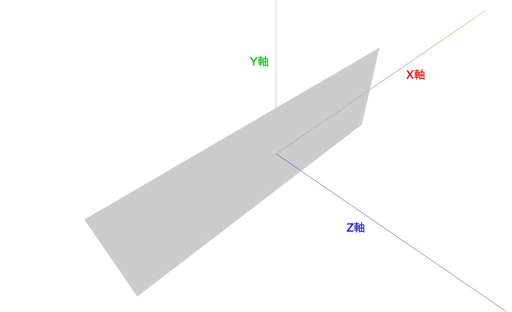

### AxesHelper

Sceneの軸を可視化するためのヘルパー機能

- THREE.AxesHelper をインスタンス化する
    - 引数: 軸の線の長さ
- AxesHelper インスタンスを Scene に追加する

```js
const axes = new THREE.AxesHelper(100); // 長さ 100 の x,y,z 軸を表示する
scene.add(axes);
```



---

### Mesh の回転

オブジェクトの回転は以下の2通り

- Meshインスタンス.rotation.set( x軸の回転角, y軸の回転角, z軸の回転角 );

- Meshインスタンス.rotation.x / y / z =  x / y / z 軸の回転角;

*回転角」などの単位は、「ラジアン」 (π = 180°)

<br>


X軸を中心に90°回転させる
```js
mesh.rotation.set(-0.5 * Math.PI, 0, 0);
// or
mesh.rotation.x = -0.5 * Math.PI;
```


<br>

Y軸を中心に90°回転させる
```js
mesh.rotation.set(0, -0.5 * Math.PI, 0);
// or
mesh.rotation.y = -0.5 * Math.PI;
```


<br>

Z軸を中心に90°回転させる
```js
mesh.rotation.set(0, 0, -0.5 * Math.PI);
// or
mesh.rotation.z = -0.5 * Math.PI;
```


<br>
<br>

参考サイト

[Three.js 物体の回転（rotation)](https://gupuru.hatenablog.jp/entry/2013/11/27/214929)

---

### Planeメッシュの謎

例: 以下のような平面オブジェクトがある


<br>

疑問: x軸を中心に90°回転させると消える

```js
planeMesh.rotation.x = 0.5 * Math.PI;
```


<br>

理由: **Planeはデフォルトだと表しか表示されないから**

以下のように90°回転した時に裏面がカメラ側になるため、消えた（表示されなかった）のが原因


<br>
<br>

参考サイト

[Planeが消えてしまう。](https://teratail.com/questions/184362)