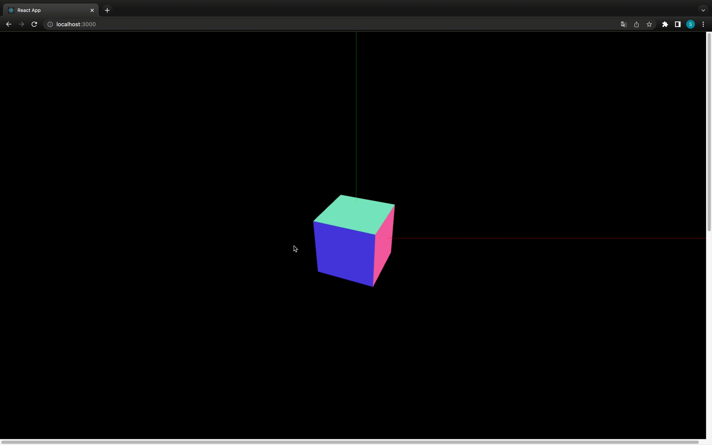
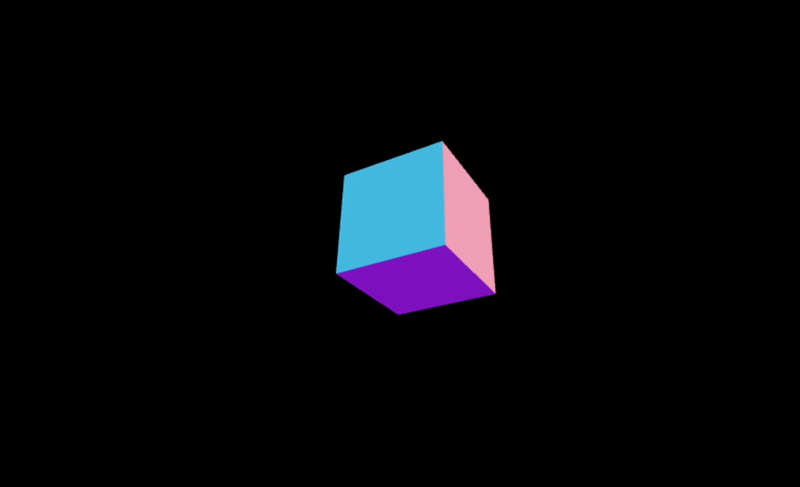

### 目標

以下のような 3D シーンを作成する



引用: [Reactで3Dコンテンツを実装する - three.js入門](https://qiita.com/sho-19202325/items/027e4c8899053d39be5f)

---

### 実装

1. React プロジェクトの作成

2. three.js のインストール

```bash
npm i --save three
```

typescript で実装する場合、以下のパッケージもインストールする必要がある

```bash
npm i --save @types/three
```

3. Canvas 要素を持つコンポーネントを作成

    - 大まかなコード概要

```js
import { useEffect, useRef } from "react";
import * as THREE from "three";

const ThreeD = () => {
  // canvas要素への参照
  const canvasRef = useRef<HTMLCanvasElement>(null);

  // 初期処理: 3D関連の準備
  useEffect(() => {
    // シーン、カメラ、レンダラーの作成など
  }, []);

  return (<><canvas ref={canvasRef}></canvas></>);
};
```

<br>

4. useEffect に処理を書く

```js
useEffect(() => {
    if (canvasRef.current === null) return;

    // シーンの作成
    const scene = new THREE.Scene();

    // カメラの作成
    const camera = new THREE.PerspectiveCamera(
      70,
      window.innerWidth / window.innerHeight,
      0.1,
      1000
    );
    camera.position.z = 1;

    // 3Dオブジェクトの作成
    const geo = new THREE.BoxGeometry(0.2, 0.2, 0.2);
    const material = new THREE.MeshNormalMaterial();
    const obj = new THREE.Mesh(geo, material);
    scene.add(obj);

    // レンダラーの作成
    const renderer = new THREE.WebGLRenderer({
      canvas: canvasRef.current,
      antialias: true,
    });
    renderer.setSize(window.innerWidth, window.innerHeight);
    renderer.setAnimationLoop(animation);

    function animation(time: number) {
      obj.rotation.x = time / 2000;
      obj.rotation.y = time / 1000;
      renderer.render(scene, camera);
    }
}, []);
```

<br>

結果



<br>

*実行時に three モジュールが見つからないというエラーが発生した場合は以下のコマンドで three をインストールし直すと解決することがある

```bash
npm install --legacy-peer-deps three
```

<br>
<br>

参考サイト

React で Three.js を使う方法について
- [Reactで3Dコンテンツを実装する - three.js入門](https://qiita.com/sho-19202325/items/027e4c8899053d39be5f)

three モジュールが見つからない場合の解決策
- [[ERROR] Could not resolve "three" #10](https://github.com/adrianhajdin/project_3D_developer_portfolio/issues/10)

---

### renderer.setAnimationLoop() とは

setAnimationLoop() は window.requestAnimationFrame() を three.js で扱うための組み込み関数らしい

window.requestAnimationFrame() は1フレーム(60分の1秒)ごとに引数に指定されたコールバック関数を呼び出す

コールバック関数が受け取る引数は、 window.requestAnimationFrame() がコールバックの呼び出しを開始した時点の時刻

<br>

参考サイト

setAnimationLoop() について
- [Reactで3Dコンテンツを実装する - three.js入門](https://qiita.com/sho-19202325/items/027e4c8899053d39be5f)

window.requestAnimationFrame() について
- [Window.requestAnimationFrame()](https://developer.mozilla.org/ja/docs/Web/API/Window/requestAnimationFrame#)