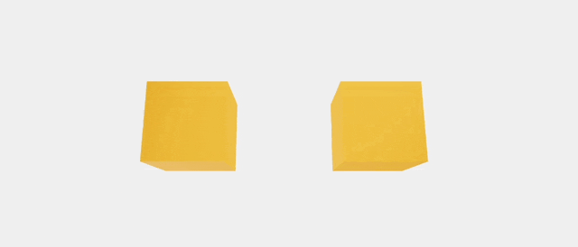

### react-three-fiber

- ReactでThree.jsを扱うためのラッパーライブラリ

- Three.jsの諸要素(scene, light, mesh, geometry, material など)をJSXコンポーネントとして扱える

- シーンの構築だけでなく、画面のリサイズに対応する処理も最初から入っているので便利

- 今回は Next.js で three-react-fiber を利用してみる

---

### 作成するもの

- ボックスオブジェクトにマウスホバーすると色が変化する

- ボックスオブジェクトをクリックするとサイズが変化する



---

### 事前準備

1. Next プロジェクトの作成

2. three.js , 型定義ファイル, react-three-fiber をインストールする

```bash
npm install three @types/three
npm @react-three/fiber
```

---

### 実装

*Next.js で react-three-fiber を利用する場合、 そのコンポーネントはクライアントコンポーネントでないといけない

<br>

1. ボックスオブジェクトを追加する
    - Canvas タグ内に mesh タグを追加する
    - mesh タグ内に geometry, material タグを追加する

```js
// Page.tsx
"use client";

import { Canvas } from "@react-three/fiber";

// ボックスオブジェクトの jsx を生成する関数
const Box = () => {
return (
    // meshタグの中にgeometryタグ、materialタグを配置する
    <mesh>
    // サイズが高さ、幅、奥行きが全て1のボックスを配置
    <boxGeometry args={[1, 1, 1]}></boxGeometry>
    <meshStandardMaterial color={"orange"}></meshStandardMaterial>
    </mesh>
);
};
  
export default function Home() {
  return (
    <div className="app">
      <Canvas>
        <Box></Box>
      </Canvas>
    </div>
  );
}
```

結果: 小さな黒い箱がレンダリングされる (黒いのはライトが当たっていないから)


<br>

2. ライトを追加する
    - Canvas タグ内に light タグを追加する

```js
<Canvas>
    <ambientLight intensity={Math.PI / 2} />
    <spotLight
    position={[10, 10, 10]}
    angle={0.15}
    penumbra={1}
    decay={0}
    intensity={Math.PI}
    />
    <pointLight position={[-10, -10, -10]} decay={0} intensity={Math.PI} />

    <Box />
</Canvas>
```


<br>

3. ボックスオブジェクトにイベントを登録する

```js
// Page.tsx
"use client";

import { useState } from "react";

const Box = () => {
    const [hovered, hover] = useState(false);
    const [clicked, click] = useState(false);

    return (
        <mesh
            onClick={() => click(!clicked)} // clicked の状態を変更
            onPointerOver={() => hover(true)}
            onPointerOut={() => hover(false)}
            scale={clicked ? 1.5 : 1} // clicked の状態によってスケールの値を変更
        >
       
        <boxGeometry args={[1, 1, 1]}></boxGeometry>
        <meshStandardMaterial color={hovered ? "hotpink" : "orange"}></meshStandardMaterial>
        </mesh>
    );
};
```


<br>

4. ボックスオブジェクトに回転させるアニメーションを追加する
    - useFrame で renderer.setAnimationLoop のようにアニメーションを設定する

    - *ポイント: useRef でメッシュオブジェクトの参照を保持しておく

```js
// Page.tsx
"use client";

import * as THREE from "three"; // 型参照のために追加
import { useState, useRef } from "react";
import { Canvas, useFrame } from "@react-three/fiber";

const Box = () => {
    const [hovered, hover] = useState(false);
    const [clicked, click] = useState(false);

    const meshRef = useRef<THREE.Mesh>(null!); // ポイント

    // mesh オブジェクトをx軸を中心に回転させる
    useFrame((state, delta) => (ref.current.rotation.x += 0.01));

    return (
        <mesh
            ref={meshRef} // ポイント: mesh要素への参照を保持
            onClick={() => click(!clicked)}
            onPointerOver={() => hover(true)}
            onPointerOut={() => hover(false)}
            scale={clicked ? 1.5 : 1}
        >
       
        <boxGeometry args={[1, 1, 1]}></boxGeometry>
        <meshStandardMaterial color={hovered ? "hotpink" : "orange"}></meshStandardMaterial>
        </mesh>
    );
};
```


<br>

5. ボックスオブジェクトをもう一つ追加する
    - そのまま追加すると2つのボックスが同じ位置に重なってしまうため、**ボックスオブジェクトにポジションプロパティを追加する**

```js
"use client";
import * as THREE from "three";
import { useRef, useState } from "react";
import { Canvas, useFrame, ThreeElements } from "@react-three/fiber";

const Box = (position: [ThreeElements["mesh"]]) => {
    // useState などは省略
    return (
    <mesh
        {...position}
        // その他のプロパティは省略
    >
      <boxGeometry args={[1, 1, 1]} />
      <meshStandardMaterial color={hovered ? "hotpink" : "orange"} />
    </mesh>
  );
}

export default function Page() {
  return (
    <Canvas>
      // ライトタグは省略
      <Box position={[-1.2, 0, 0]} />
      <Box position={[1.2, 0, 0]} />
    </Canvas>
  );
}
```


<br>
<br>

参考サイト

- [Introduction](https://docs.pmnd.rs/react-three-fiber/getting-started/introduction)
