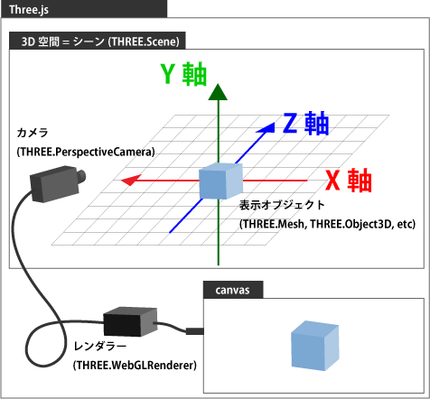
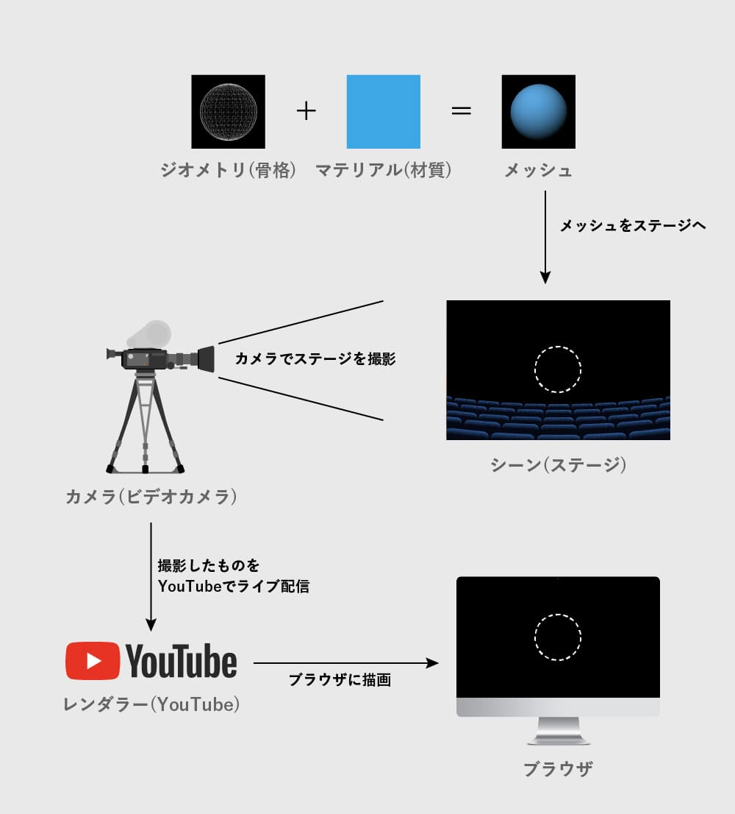
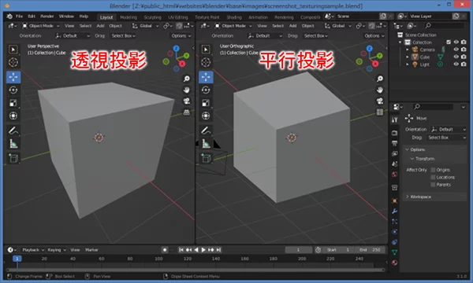
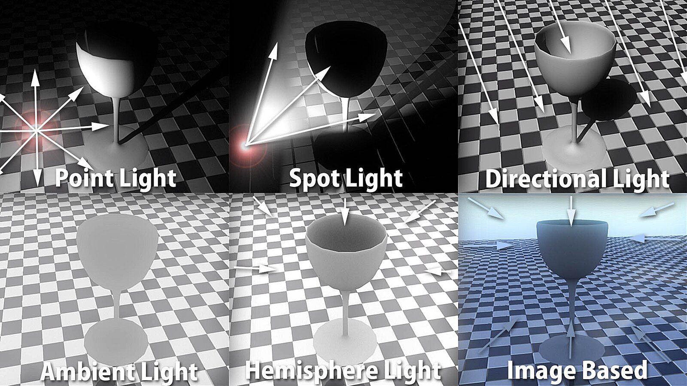
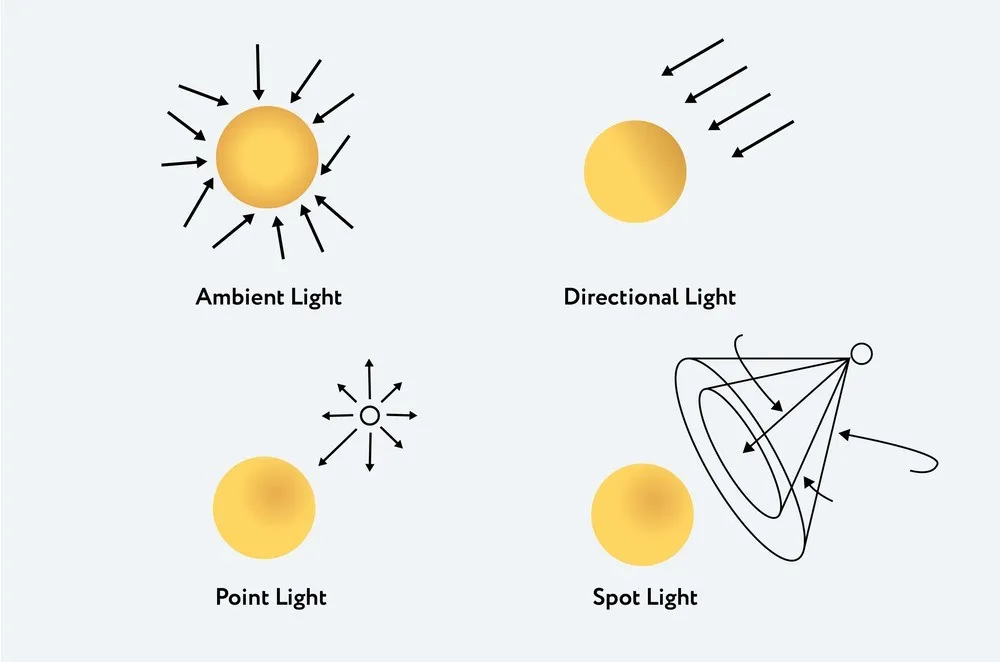
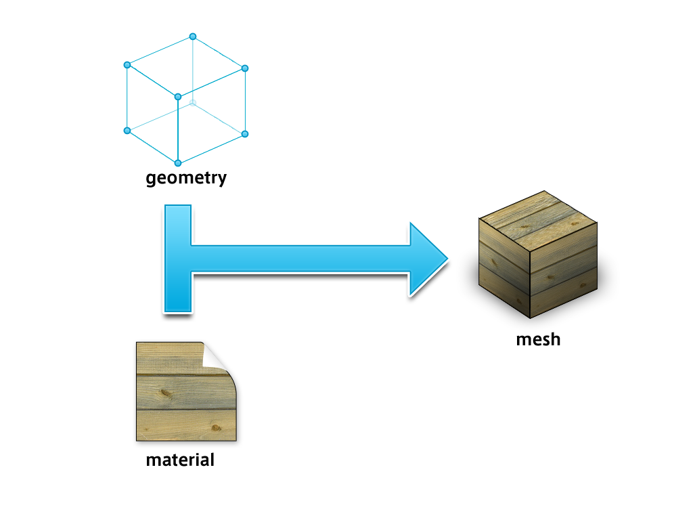

### three.js とは

Webブラウザ上で3Dグラフィックスを描画するためのライブラリ

---

### 重要な考え方

実際に three.js を利用して 3D オブジェクトを web ページに表示するには、以下の操作が必要になってくる
- シーン(場、背景)を準備する
- カメラを設定する
- ライトを設定してシーンに配置する
- オブジェクト（被写体）を設定してシーンに配置する
- レンダラーにシーンとカメラを渡し、カメラが写すシーンを描画する



引用: [最新版で学ぶThree.js入門 手軽にWebGLを扱える3Dライブラリ](https://ics.media/entry/14771/)

<br>



引用: [【Three.js基礎】概念の理解と立方体の実装](https://kakechimaru.com/threejs_cube/)

---

### Scene とは

sceneオブジェクトは表示したいすべての物体(オブジェクト)と利用したい全ての光源(ライト)、カメラを保持して変更を監視するコンテナオブジェクト

- new THREE.Scene() で Scene オブジェクトを作成する
- add() でオブジェクトやライトをシーンに追加する
- 他にも remove でシーンから被写体やライトの削除、 getObjectByName で名前を指定してシーンに配置されたオブジェクトを取得できたりする

```js
// シーンオブジェクトの作成
const scene = new THREE.Scene();

// ライトをシーンに追加
scene.add(lightObj);
```

<br>

参考サイト

[https://gmo-miyazaki-creators.com/coding/three-js-01/](https://gmo-miyazaki-creators.com/coding/three-js-01/)

---

### Camera とは

シーン内の 3D 空間を撮影するオブジェクト。視点の制御に必要

**2種類のカメラ**

- THREE.PerspectiveCamera
    - 透視投影(遠近感のある投影をしてくれる)カメラ
    - 同じ大きさの物体は遠くに位置するものが小さく、近くに位置するものが大きく描かれる

- THREE.OrthographicCamera
    - 平行投影カメラ
    - 遠くに位置するものも近くに位置するものも同じ大きさで描かれる



<br>

PerspectiveCamera の使い方
- TRHEE.PerspectiveCamera() でインスタンス化する
- 引数
    - fov (Field of View): 視野角(カメラが映し出せる範囲)のこと。
    - aspect: 描画される出力領域の横幅と縦幅の比
    - near: カメラのどのくらい近くからThree.jsが描画を開始するかを指定する
    - far: カメラからどのくらい遠くまで見えるかを指定する

```js
const camera = new TRHEE.PerspectiveCamera(fov, aspect, near, far);
```

<br>

OrthographicCamera の使い方
- TRHEE.OrthographicCamera() でインスタンス化する
- 引数
    - left: 描画される領域の左境界
    - right: 描画される領域の右境界
    - top: 描画される上限
    - bottom: 描画される下限
    - near: カメラの位置を基準にこの点より向こうがシーンに描画される (PerspectiveCamera と同じ)
    - far: カメラの位置を基準にこの点までがシーンに描画される (PerspectiveCamera と同じ)

```js
const camera = new TRHEE.OrthographicCamera(left, right, top, bottom, near, far);
```

<br>

カメラの向きを設定する
- cameraインスタンス.position.x / y / z でカメラの向きを調整し、 cameraインスタンス.lookAt() で scene の座標原点を向かせることができる
```js
camera.position.x = -30;
camera.position.y = 40;
camera.position.z = 30;
camera.lookAt(scene.position);
```

<br>
<br>

参考サイト

透視投影と平行投影について: [Blender入門](https://blender3d.biz/basis_viewmodeandviewpoint.html#投影方法とはN65602)

[https://gmo-miyazaki-creators.com/coding/three-js-01/](https://gmo-miyazaki-creators.com/coding/three-js-01/)

---

### Light とは

シーン内に配置される光源。

ライトオブジェクト作成後は sceneインスタンス.add()でシーンに追加する

**ライトの種類**
- AmbientLight: 3D空間全体に均等に光を当てるライト
- DirectionalLight: 特定の方向に平行に放射される光。光源は無限に離れているとする。太陽の光が多く例に出される
- PointLight: 単一点からあらゆる方向から放射される光源。裸電球をイメージするとわかりやすい。 *光の当たったオブジェクトの影はできない
- SpotLight: 単一の点から一方向に放出され、円錐に沿って放出される光源。その名の通りスポットライトや懐中電灯をイメージするとわかりやすい。 *オブジェクトの影を落としたい場合はこれを使うケースが多い



引用: [File:SixLights.jpg](https://commons.wikimedia.org/wiki/File:SixLights.jpg)

<br>



引用: [Enlightening 3D Worlds: Mastering Lighting Techniques in Three.js](https://medium.com/@althafkhanbecse/title-enlightening-3d-worlds-mastering-lighting-techniques-in-three-js-c860caa8cdcf)

<br>
<br>

参考サイト

[【three.js入門・第1回】three.jsの基本的な要素](https://gmo-miyazaki-creators.com/coding/three-js-01/)

各ライトの違いについて: [Three.js ライト機能まとめ](https://ics.media/tutorial-three/light_variation/)

[【Three.js基礎】概念の理解と立方体の実装](https://kakechimaru.com/threejs_cube/)

---

### 被写体オブジェクト

メッシュと呼ばれる

メッシュはジオメトリ(形状)とマテリアル(表面材質)を定義して作成する

Benderなどで作成することも可能



引用: [three.jsの基本セットアップ](https://www.codegrid.net/articles/2021-threejs-1/)

<br>

メッシュの作成およびシーンへの追加方法

```js
// 球体のジオメトリ作成
const geometry = new THREE.SphereGeometry(300, 30, 30);

// 赤のマテリアル作成
const material = new THREE.MeshStandardMaterial({color: 0xFF0000});

// 上記ジオメトリ、マテリアルを元にメッシュを作成
const mesh = new THREE.Mesh(geometry, material);

// 作成したメッシュをシーンに追加
scene.add(mesh);
```

---

### レンダラーとは

カメラが撮影している 3D のシーンを canvas に描画するための機能

レンダラーの作成
- コンストラクターには引数として、HTMLに配置したcanvas要素を指定する
- renderer.setPixelRatio(pixelRatio) でレンダラーのピクセル比をデバイスのピクセル比にする
- renderer.setSize(width, height) でレンダラーのサイズ (描画域の大きさ)を指定する

```js
// レンダラーの作成
const renderer = new THREE.WebGLRenderer({
  canvas: document.querySelector('#canvas')
});

// ウィンドウのアスペクト比とレンダラーのピクセル比を同じに設定
renderer.setPixelRatio(window.devicePixelRatio);

// 描画域とウィンドウのサイズを同じに設定
renderer.setSize(window.innerWidth, window.innerHeight)
```

<br>

renderメソッドに scene インスタンスと camera インスタンスを渡すことで、canvas 要素にカメラが捉えている scene を描画することができる

```js
// レンダリング
renderer.render(scene, camera);
```