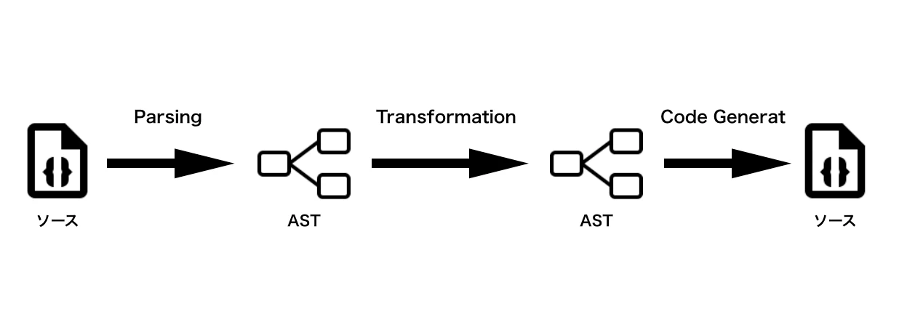

### babelとは

- JavaScriptのトランスパイラー

---

### どんなことをしているのか

- 以下の処理でトランスパイルを実現しているみたい  
    jsファイルを解析　-> ASTに変換 -> ASTの変換処理 -> 再度jsファイルに変換

- そのために以下のモジュールを使っているらしい
    - @babel/parser
    - @babel/traverse
    - @babel/generator

    

[Source: Babel Plugin を作りながら AST と Babel を学ぶ](https://qiita.com/__sakito__/items/b1ef54fd6fb05c11e142)
