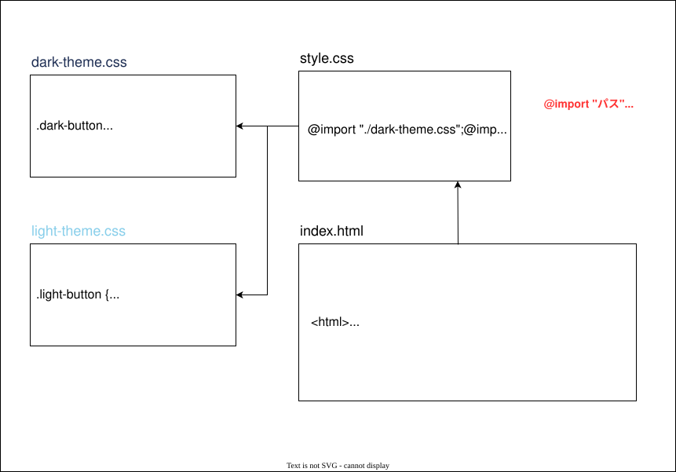

### @import キーワード

- CSS ファイルから別の CSS を読み込む機能
    
    

 
 

参考サイト

[CSSの@importを使って別のCSSファイルを読み込む方法を徹底解説!!](https://www.sejuku.net/blog/83216#index_id1)

[@import](https://developer.mozilla.org/ja/docs/Web/CSS/Reference/At-rules/@import#css_ルールをインポート)