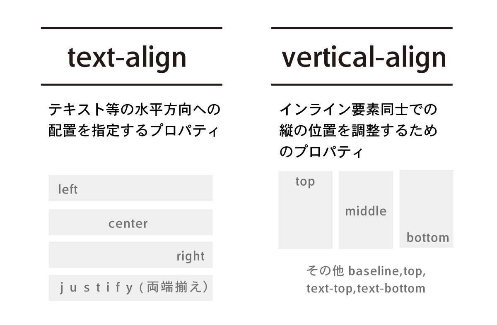

### text-alignとvertical-align

- text-alignはコンテンツの水平方向の配置の基準を指定するプロパティ
*text-alignはblock/inline-blockの要素、テーブルのセルのみに有効

- vertical-alignはコンテンツの垂直方向の配置の基準を指定するプロパティ  
*vertical-alignはinline/inline-blockの要素、テーブルのセルのみに有効

[Source: ブロック要素やインライン要素の違いと中央配置をする簡単な方法](https://webdesign-pg.com/center-layout)