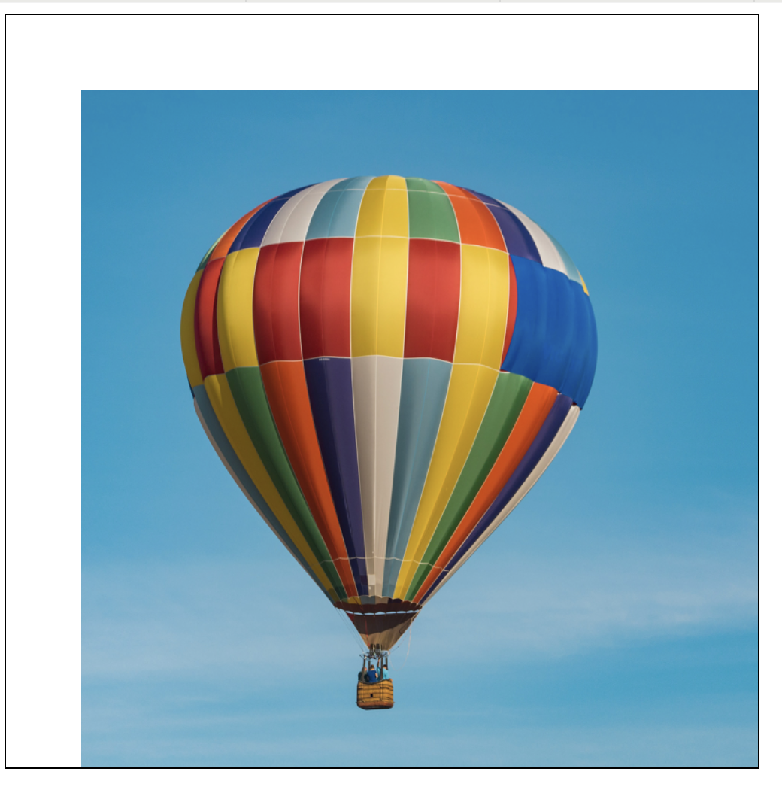
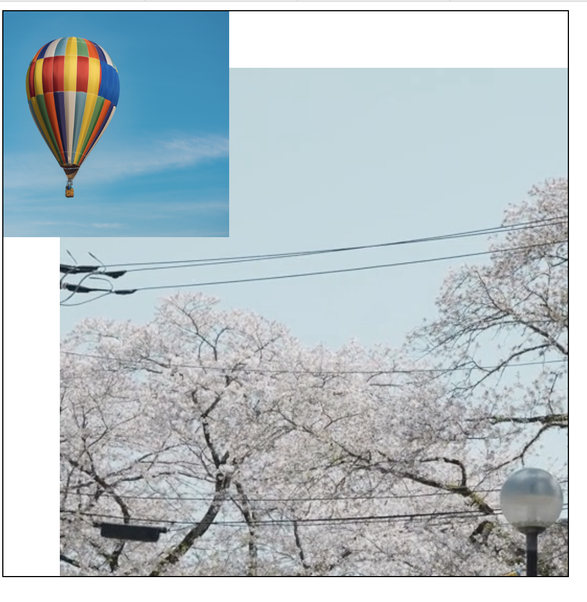

### backgroundの使い方

- backgroundは以下のショートハンドラ
    - background-color
        - 背景の色(defaultはtransparent)
    - background-image
        - 背景に設定する画像
    - background-repeat
        - 背景画像の繰り返し方向
    - background-position
        - 背景画像の位置
    - background-size
        - 背景画像のサイズ
    - background-attachment
        - 背景画像のスクロールの有無

    *backgroudn-sizeだけは、background-positionの後ろに/で続けて指定する必要がある

```css
.container {
    background: url(~~) top/contain; /* backgroud-position/background-size*/
}

/* このようにも書ける */
.container {
    background-image: url(~~);
    background-position: top;
    background-size: contain;
}
``` 

---

### background-size

pxや%で指定する場合以下のようなパターンがある

- 1つの値だけで指定する場合
    - 幅を指定していることになる
    - 高さは auto 要素の高さになる

```css
.container {
    background-image: url(~);
    /* 背景画像の幅は20px 高さはcontainerの高さ */
    background-size: 20px;

    /* 背景画像の幅はcontainerの幅の10% 高さはcontainerの高さ */
    background-size: 10%;
}
```

- 2つの値で指定する方法
    - 1つ目の値が背景の幅
    - 2つ目の値が背景の高さ

```css
.container {
    background-image: url(~);
    /* 背景画像の幅は20px 高さは50px */
    background-size: 20px 50px;

    /* 背景画像の幅はcontainerの10% 高さはcontainerの30% */
    background-size: 10% 30%;
}
```

---

### background-position

[【CSS】background-positionで背景画像の表示位置を調整する方法を解説](https://zero-plus.io/media/fix-background-position/)

<br>

様々な指定方法がある

-  top / right / left / bottom / center で指定する
    - 対象要素の　上端/右端/左端/下端/中心 に沿って配置することができる

    - top or bottom　と right or left を組み合わせることで 上下左右のすみに沿って画像を配置することもできる

<br>

- px で指定する (background-position: 値1 値2; の形で指定する)
    - 1つ目の値は左端から何 px 離れているかを意味する
    - 2つ目の値は上端から何 px 離れているかを意味する

```css
.container {
    border: 1px black solid;
    height: 500px;
    width: 500px;

    /* 背景画像の設定 */
    background-image: url("../asset/気球.jpg");
    background-repeat: no-repeat;
    background-size: cover;

    /* 対象要素の左端から50px、 上端から50px 離れたところに背景画像を配置する */
    background-position: 50px 50px;

    /* 左端から50px離れ　かつ  上端に背景画像を配置する */
    backgroud-position: 50px top;
}
```



<br>

- % で指定する (background-position: 値1 値2; の形で指定する)
    - 1つ目の値は左端からの位置に関して
        - (コンテナーの幅 - 画像の幅) * % の位置に配置される
    - 2つ目の値は上端からの距離に関して
        - (コンテナーの幅 - 画像の幅) * % の位置に配置される

```css
.container {
    height: 500px;
    width: 500px;

    background-image: url("気球.jpg");
    background-repeat: no-repeat;
    background-size: 200px 200px;

    /* 背景画像の位置は containerのサイズ - background-imageのサイズ * % で算出される */

    /* 幅に500px - 200px = 300px より、　container 左端からのから 300px * 10% = 30px の位置に配置される */
    /* 500px - 200px - 300p より、
    container の上端から 300px * 10% = 30px の位置に配置れる */
    background-position: 10% 10%;
}
```
<br>
<br>

<font color="red">値1つだけを指定すると</font>

top、bottomの垂直位置を指定するキーワードを１つだけ指定した場合、横の位置が自動的に中央に配置され、left、rightの水平位置を指定するキーワードを１つだけ指定した場合、縦の位置が自動的に中央に配置されます。centerを１つだけ指定した場合は、縦横とも中央に配置されます。

```css
.container {
    /* 横の位置が指定されたので、縦の位置が自動で中央になる */
    background-position: left;

    /* 縦の位置が指定されたので、横の位置が自動で中央になる */
    background-position: bottom;

    /* pxでの1つ目の値は左端から何px離れているかを表す */
    /* 横の位置が指定されたので、縦の位置が自動で中央になる */
    background-position: 20px;

    /* %も1つ目の値は  */
    background-position: bottom;

}
```

---

### 注意事項

- backgroundで指定すると、指定していない項目があっても、その項目には初期値で指定したことになる

```css
.container {
    background-color: blue;
    background: url(~~); 
    /* 
    * ↑ここで
    * background-color: transparent;
    * (default)に上書きされる
    */
}
```

解決方法  
先にショートハンドラプロパティを書き、それに関するプロパティは後ろに書いて上書きしてく or ショートハンドラの中で忘れずに設定する
```css
.container {
    background: url(~~); 
    background-color: blue;
}

/* or */

.container {
    background: url(~~) blue; 
}
```

---

### 背景を重ねる

background に複数の背景を設定することもできる

```
background-~~:一つ目の背景についての設定, 2つ目の背景についての設定; 

のようにカンマ区切りで設定する
```

```css
.container {
    background-image: url('気球の画像のパス'), url('桜の画像のパス');


    background-repeat:no-repeat, no-repeat;
    background-size:200px 200px, cover;
    background-position: 0 0, 50px 50px;
}
```


