### background-position

- 要素内での画像の表示位置を決めるプロパティ
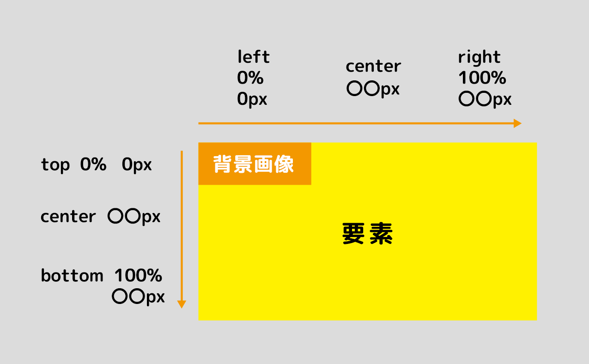

[Source: 【CSS】背景色・背景画像をマスター！backgroundの使い方](https://jajaaan.co.jp/web-production/frontend/css-background/)


### background-size

役立つ解説ページ -> [【CSS】背景色・背景画像をマスター！backgroundの使い方](https://jajaaan.co.jp/web-production/frontend/css-background/)

- %指定した場合: その要素の~%の大きさで表示される
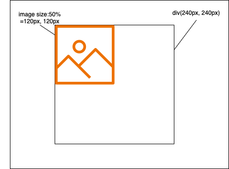

<br>

- cover: 画像のアスペクト比を保ちつつ、要素全体に画像を表示する  
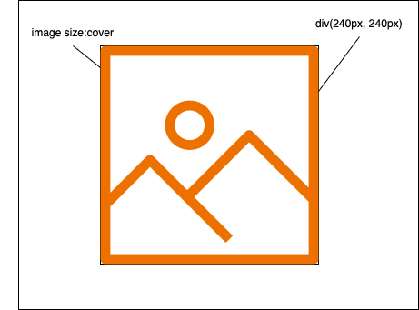

    *画像を表示する要素のアスペクト比が、元の画像と異なる場合、画像が見切れることがある
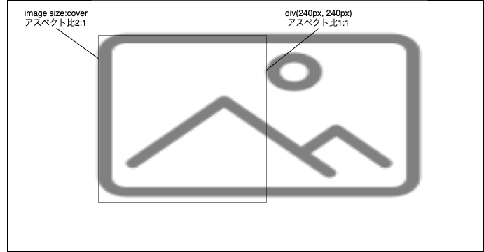

<br>

- contain: 画像のアスペクト比を保ちつつ、画像の全体を要素内に表示する  
*要素のアスペクト比が画像のアスペクト比と同じじゃないと、要素内のエリアが余る
    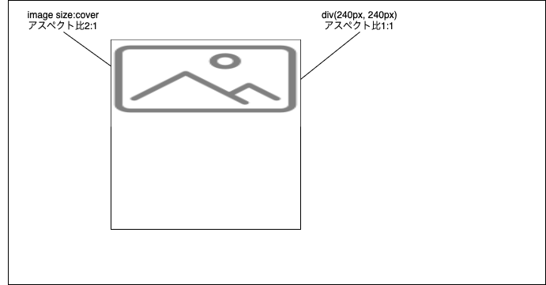

    *要素のアスペクト比 = 画像のアスペクト比  
    の場合、containとcoverは同じ見え方をする

- auto: 元の画像サイズのまま表示する
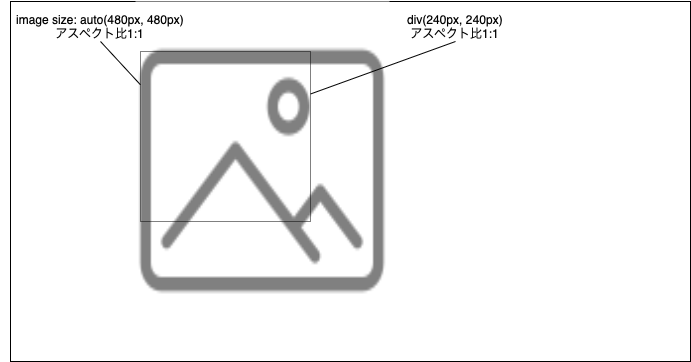

---

### background-size: 100%　と coverの違い

- 100%を指定すると、その要素の中に画像の全体を表示するため、画像のアスペクト比が崩れる可能性がある  
= 意図した表示にならないことがある
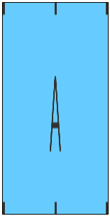 

- coverを指定すると、画像のアスペクト比を保ちつつ要素全体に表示する  
= 画像が見切れる可能性がある
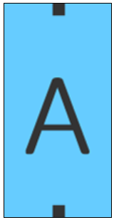

[Source: CSS の background-size での cover、contain、auto の違い](https://www.keicode.com/script/css-background-size.php)

---

### background-attachment

- 背景画像を固定できるプロパティ

```css
selector {
    background-attachment: <プロパティ>
}
```

- scroll: デフォルト値。　画面のスクロールに合わせて要素と共に移動する。要素の内容がスクロールする場合はスクロールされない。
    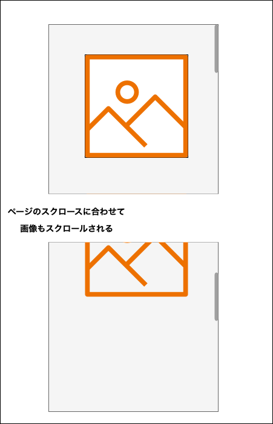

    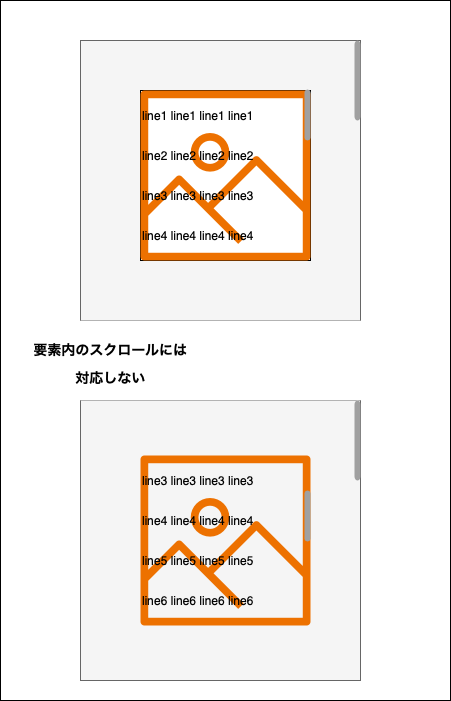

<br>

- local:　画面のスクロールにも、要素内容のスクロールにもあわせて画像がスクロールされる。  
    

    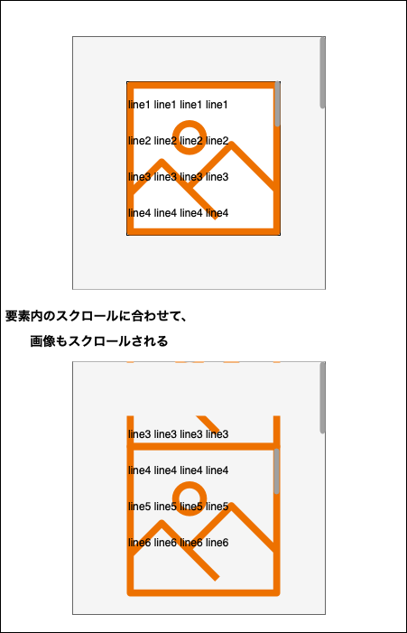

<br>

- fixed: 画面のスクロールにも、要素内のスクロールにも反応せず、画像は要素内に固定される。
    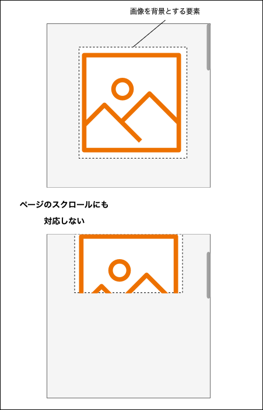

    