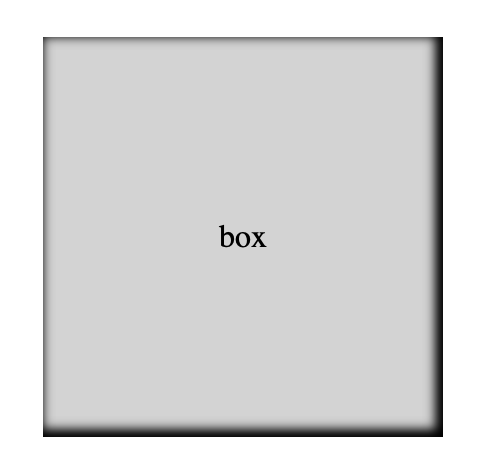

### box-shadowとは要素に影をつけるプロパティ

- 基本的には右と下に影をつける

```css
box-shadow: [右方向のずれ] [下方向のずれ] [ボカシの大きさ] [影の広がり具合] [影の色];
```
*右方向のずれに負数を入れると左側に影をつけることができる  
*下方向のずれに負数を入れると上方向に影をつけることができる


[Source: box-shadowだけじゃない！CSSでできる色々な影の表現と意外に知らない落とし穴](https://ics.media/entry/200406/)

---

### 影を全方向に広げる

- 右方向のずれと下方向のずれに0(px/rm/rem)を設定する
```css
.box {
    height: 200px;
    width: 200px;
    box-shadow: 0 0 10px 5px;
}
```


---

### insetキーワード

- insetを使うと、要素の内側に影をつけることができる

```css
.box {
    box-shadow: inset 0 0 10px 5px;
}
```


<br>

- insetで指定した影に右/下方向のずれも設定した場合
    - 右方向のずれ: 左から内側への影がつく  
    *負数を設定すると右から内側への影がつく

    - 下方向のずれ: 上から内側への影がつく  
    *負数を設定すると下から内側への影がつく

```css
.box {
    box-shadow: inset 2px 2px 5px 2px;
}
```


<br>

```css
.box {
    box-shadow: inset -2px -2px 5px 2px;
}
```


