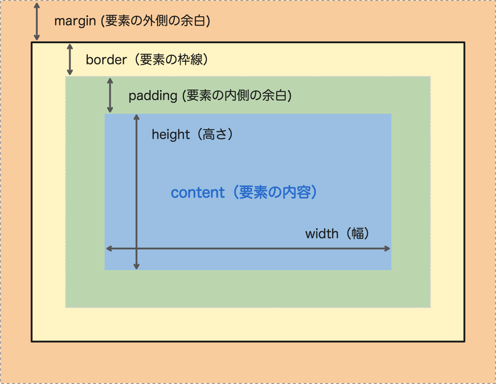

<link href="./styles/box-model.css" rel="stylesheet"></link>

### cssのdisplayプロパティの値

- ブロックボックス: ブロックレベルの要素
    - 幅は親要素の幅に合わさる

- インラインボックス: インラインレベルの要素
    - 幅は自身のコンテンツに応じて決まる
    - width と height のプロパティは適用されない

---

### ボックスの構成



[source: 今更聞けない！エンジニアのための CSS の基礎講座 〜ボックスモデル編〜](https://nulab.com/ja/blog/nulab/css-basics-for-engineer-boxmodel/)

---

### box-sizingプロパティについて

- box-sizin: content-box
    - デフォルト値
    - with/heightはcontent部分のみが対象

- box-sizing: border-box
    - with/heigtはborder + padding + contentｗを指す

例
```css
.box1 {
    background-color: pink;
    padding: 20px;
    height: 100px;
    width: 200px;
}

.box2 {
    background-color: skyblue;
    box-sizing: border-box;
    padding: 20px;
    height: 100px;
    width: 200px;
}
```

<div class="box1">box1</div>
<div class="box2">box2</div>

*box1の全体のheigtは100px + paddingの20px = 120px  
widthは200px + paddingの20px = 220px  

*box2の全体のheightは200px  
widthも200px  

*box2のcontent部分のheight,widthは  
200px - padding,borderのサイズ  
になるので、height:80px, width: 180pxになることに注意