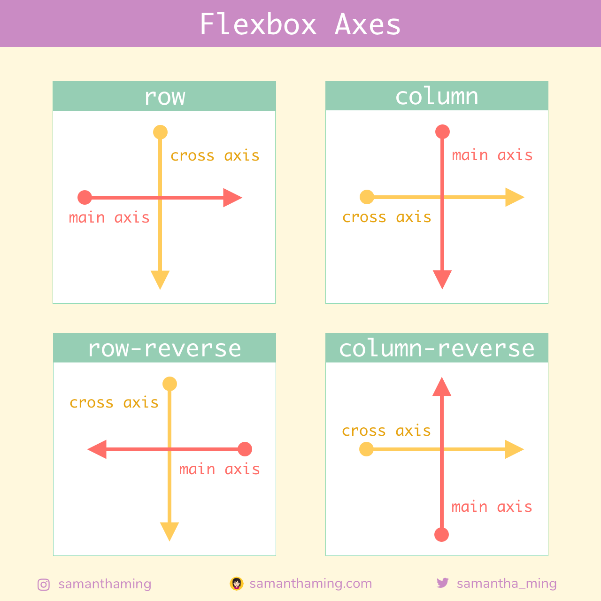
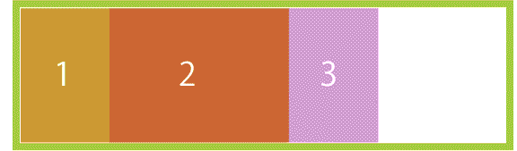
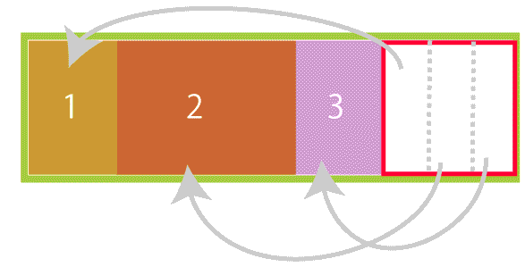
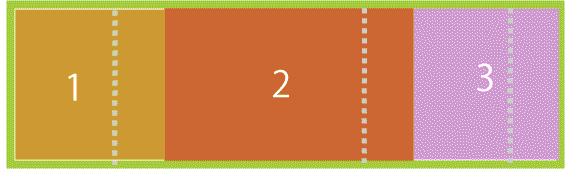
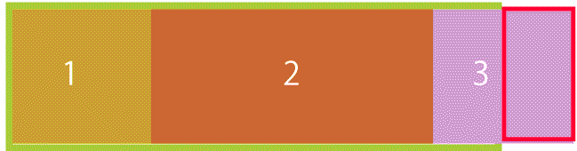
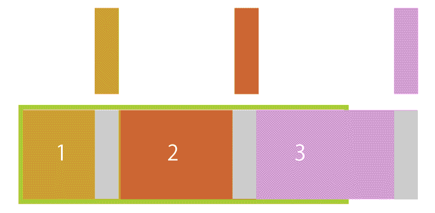
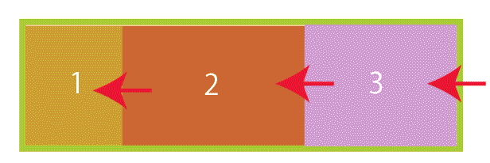
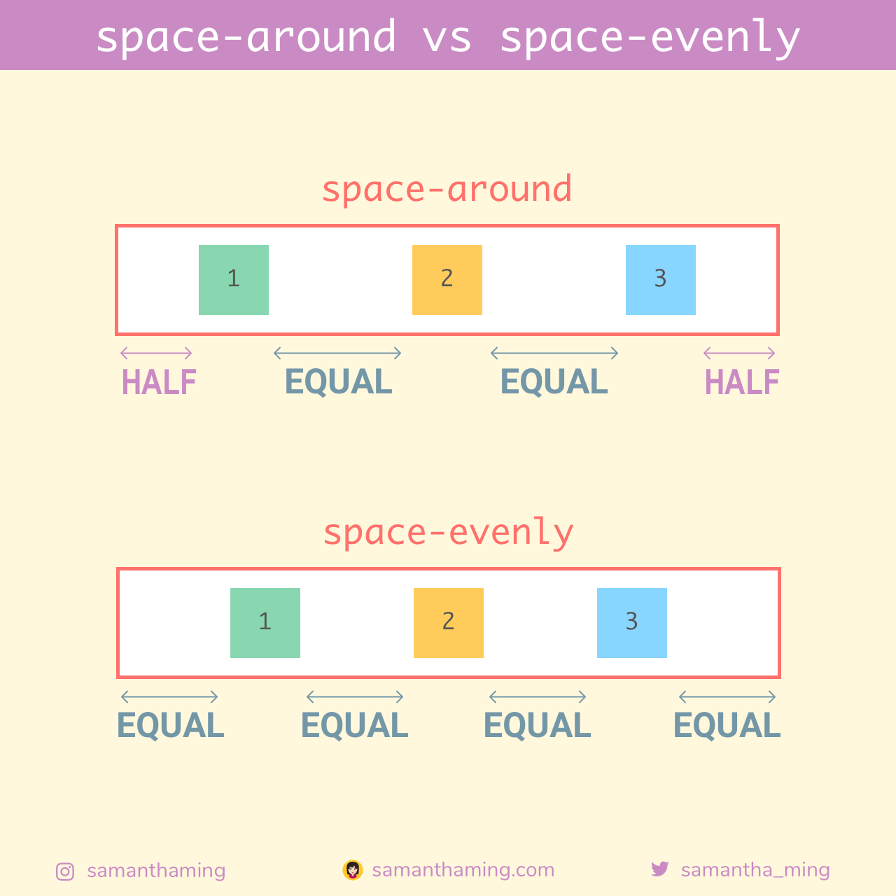

<link href="./styles/flexbox.css" rel="stylesheet"></link>


### Flexboxとは

- 決められた範囲（要素）内で子要素を横向きに幅も高さも自由にレイアウトできる

-  Flexboxは直接の子のみ影響を与える

- メイン軸とクロス軸の2軸がある



[source: 独学の人でも大丈夫！CSS Flexboxの使い方を基礎から学べるチュートリアル](https://coliss.com/articles/build-websites/operation/css/learn-flexbox-in-30-days.html)

---

### 使い方

- 要素を横一列に並べる

```html
<div class="container">
    <div class="items">item1</div>
    <div class="items">item2</div>
    <div class="items">item3</div>
</div>
```

```css
.container {
    displa: flex; /*親要素にdisplay: flexを適用する*/
}
```

<div class="container">
    <div class="items">item1</div>
    <div class="items">item2</div>
    <div class="items">item3</div>
</div>

*しかし余白(グレー)が余る  
flexboxはこの余白を自由に配分することができるらしい

---

### 伸長比と縮小比

- 余白ができる場合  
各子要素の幅を伸長して、親要素の幅に合わせることができる (余った余白を各子要素の幅に分配できるイメージ)

以下画像は[source: Flexboxの書き方入門（1） Webページレイアウト編【図解たっぷり】](https://skillhub.jp/blogs/221)から引用



余った余白を均等に分割して、かく要素の幅に分配  
*どの要素をどのくらい伸長するか指定もできる


結果、子要素が親要素の幅に収まる


このように、flex item(子要素)をどのくらい伸長するのかを **伸長比(flex-grow)** と呼ぶ

<br>

- 子要素がflexboxの幅よりも長くなる場合
各コンテンツの幅を縮小して、親要素の幅に合わせることができる



各子要素の幅を縮小


結果、子要素が親要素の幅に収まる


このようにflex item(子要素)をどのくらい縮小するのかを **縮小比(flex-shrink)** と呼ぶ

---

### flex-basisとは

- 子要素(flex item)の幅(flex-directionがcolumnの場合には高さ)を指定するプロパティ

---

### 子要素の幅の指定方法

```css
.container {
    display: flex;    
}
.item1 {
    flex-grow: 2; /* 数値で指定する */
}
.item2 {
    flex-shrink: 1; /* 数値で指定する */
}
.item3 {
    flex-basis: 200px; 
}
```
*flex-basisをautoにすると,その要素の元々の幅になる

<div class="container">
    <div class="container_item1">item1</div>
    <div class="container_item2">item2</div>
    <div class="container_item3">item3</div>
</div>

要素の大きさを均等にしたければflex-growを同じ数値にする
```css
.container {
    dispay: flex;
}
.items {
    flex-grow: 1;
}
```

<div class="container">
    <div class="container_items">item1</div>
    <div class="container_items">item2</div>
    <div class="container_items">item3</div>
</div>

---

### 並べる方向を指定する

- flex-direction

```css
.container {
    display:flex;
    /* (デフォルト)横並び(左から右に並べる) */
    flex-direction: row;
    /* 横並び(右から左に並べる) */
    flex-direction: row-reverse;
    /* 縦並び(上から下に並べる) */
    flex-direction: column;
    /* 縦並び(下から上に並べる) */
    flex-direction: column-reverse;
}
```

---

### 単一行で並べるか複数行で並べるかの指定

- flex-wrap

```css
.container {
    display:flex;
    /* (デフォルト)単一行に配置しアイテムは幅に収まるように縮小される */
    flex-wrap: nowrap;
    /* 要素収まらない時は複数行で配置、左から右へ、上から下へ、の順番に並べる */
    flex-wrap: wrap;
    /* 要素収まらない時は複数行で配置、左から右へ、下から上へ、の順番に並べる */
    flex-wrap: wrap-reverse;
}
```

- flex-wrap: wrap;
<div class="container2">
    <div class="container2_items">item1</div>
    <div class="container2_items">item2</div>
    <div class="container2_items">item3</div>
    <div class="container2_items">item4</div>
    <div class="container2_items">item5</div>
    <div class="container2_items">item6</div>
    <div class="container2_items">item7</div>
    <div class="container2_items">item8</div>
    <div class="container2_items">item9</div>
</div>

- flex-wrap: wrap-reverse
<div class="container3">
    <div class="container2_items">item1</div>
    <div class="container2_items">item2</div>
    <div class="container2_items">item3</div>
    <div class="container2_items">item4</div>
    <div class="container2_items">item5</div>
    <div class="container2_items">item6</div>
    <div class="container2_items">item7</div>
    <div class="container2_items">item8</div>
    <div class="container2_items">item9</div>
</div>

---

### 子要素　(flex item)の揃え位置を指定する

- justify-content

```css
.conatiner {
    /* flex itemをflex containerのスタート位置から合わせる */
    justify-content: flex-start;
    /* flex temをflex containerの最後の位置から合わせる */
    justify-content: flex-end;
    /* flex itemを中央揃え */
    justify-content: center;
    /* 先頭と後尾は端に、残りは等間隔に配置 */
    justify-content: space-between;
    /* すべてのアイテムを等間隔に配置(最初と最後のアイテムの端にに半分の大きさの間隔を置き、残りのアイテムの周りには同じ大きさの間隔を置く) */
    justify-content: space-around;
    /* すべてのアイテムを等間隔に配置(各アイテムの周りに同じ大きさの間隔を置く) */
    justify-content: space-evenly;
}
```


- justify-content: flex-end
<div class="flex-end container">
    <div class="justified-items">item1</div>
    <div class="justified-items">item2</div>
    <div class="justified-items">item3</div>
    <div class="justified-items">item4</div>
</div>

<br>

- justify-content: center
<div class="center container">
    <div class="justified-items">item1</div>
    <div class="justified-items">item2</div>
    <div class="justified-items">item3</div>
    <div class="justified-items">item4</div>
</div>

<br>

- justify-content: space-between
<div class="space-between container">
    <div class="justified-items">item1</div>
    <div class="justified-items">item2</div>
    <div class="justified-items">item3</div>
    <div class="justified-items">item4</div>
</div>

<br>

- justify-content: space-around
<div class="space-around container">
    <div class="justified-items">item1</div>
    <div class="justified-items">item2</div>
    <div class="justified-items">item3</div>
    <div class="justified-items">item4</div>
</div>

<br>

- justify-content: space-evenly
<div class="space-evenly container">
    <div class="justified-items">item1</div>
    <div class="justified-items">item2</div>
    <div class="justified-items">item3</div>
    <div class="justified-items">item4</div>
</div>


<br>

space-aroundとspace-evenlyの違い


[source: 独学の人でも大丈夫！CSS Flexboxの使い方を基礎から学べるチュートリアル](https://coliss.com/articles/build-websites/operation/css/learn-flexbox-in-30-days.html)
