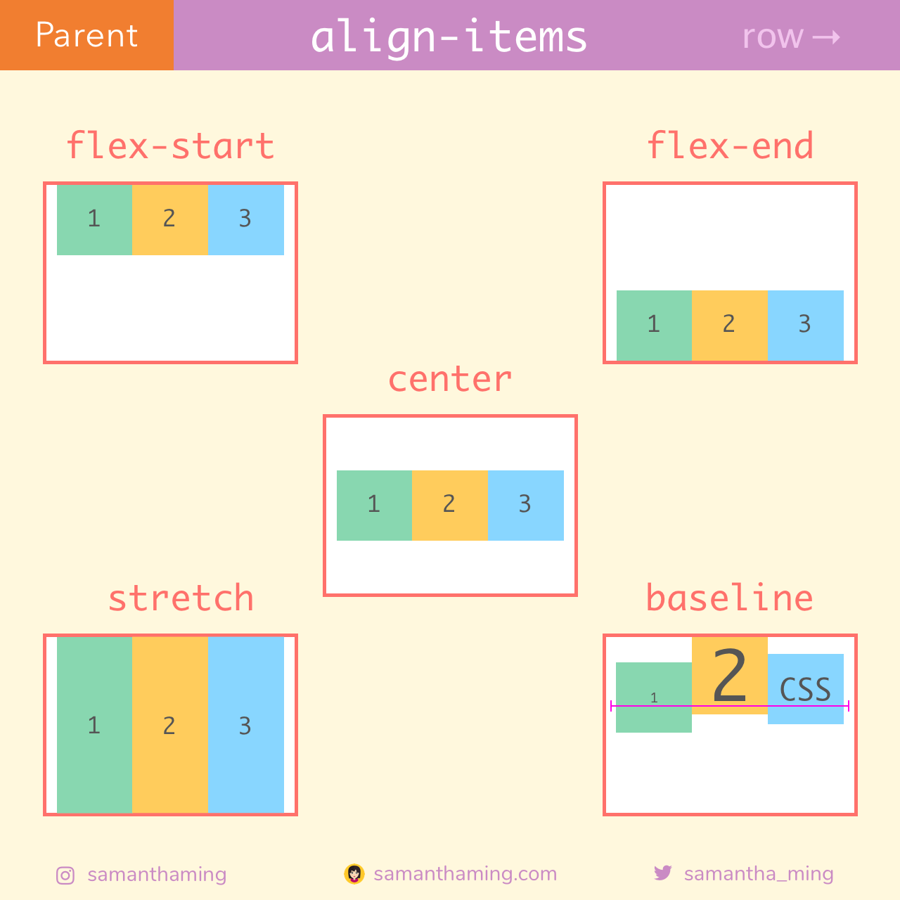
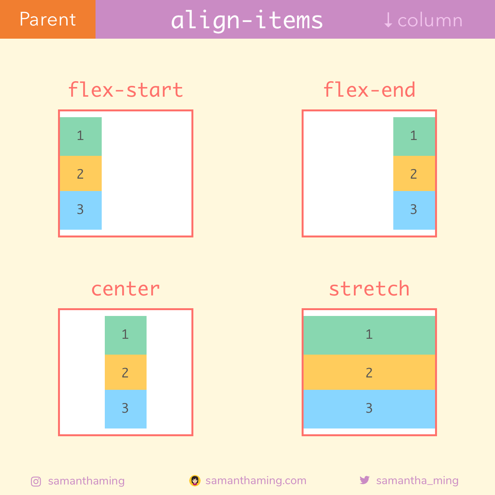
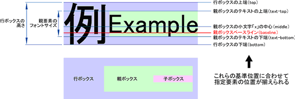
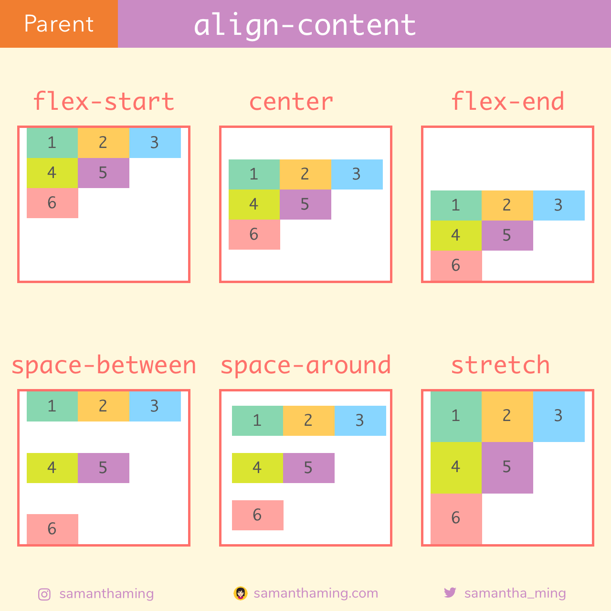

<link href="./styles/flexbox.css" rel="stylesheet"></link>

### flex itemの垂直方向のレイアウト(flex-directionがcolumnの時は水平方向)

- align-items
```css
.flex-item {
    /* (デフォルト) flex containerの高さいっぱい使う */
    align-items: stretch;
    /* アイテムをベースラインに沿って配置 */
    align-items: baseline;
    /* など */
}
```


<br>



[source: 独学の人でも大丈夫！CSS Flexboxの使い方を基礎から学べるチュートリアル](https://coliss.com/articles/build-websites/operation/css/learn-flexbox-in-30-days.html)

---

### baselineとは

- フォントの基準線



[source: ★スタイルシートリファレンス](https://www.htmq.com/style/vertical-align.shtml)

---

### Flexアイテムの行をクロス軸にどのように整列させるかの指定

- align-content

- flex item を折り返したときにflexアイテム全体の配置を決めるプロパティ

- *align-contentはラップされたアイテムにのみ適用されるため、Flexアイテムが1行しかない場合は無効になる

```css
.container {
    display: flex;
    /* (デフォルト) すべてのアイテムを等間隔に配置しサイズがautoであるアイテムはコンテナに合わせて引き延ばす */
    align-content: stretch;
    /* flexアイテムの全ての行の周りに等間隔のスペースができる */
    align-content: space-around;
    /* flexコンテナの始点と終点に合わせ、各行の間には等間隔のスペースができる */
    align-content: space-between;
}
```



[source: 独学の人でも大丈夫！CSS Flexboxの使い方を基礎から学べるチュートリアル](https://coliss.com/articles/build-websites/operation/css/learn-flexbox-in-30-days.html)

---

### flex itemの順番を変更する

- order プロパティ

```css
.flex-item1 {
    /* 値の昇順(小さい値から大きい値の順)に配置 */
    order: 0
}
.flex-item2 {
    /* 値の昇順(小さい値から大きい値の順)に配置 */
    order: 2
}
.flex-item3 {
    /* 値の昇順(小さい値から大きい値の順)に配置 */
    order: 1
}
```

<div class="container">
    <div class="on-the-left">item1</div>
    <div class="on-the-right">item2</div>
    <div class="in-the-middle">item3</div>
</div>