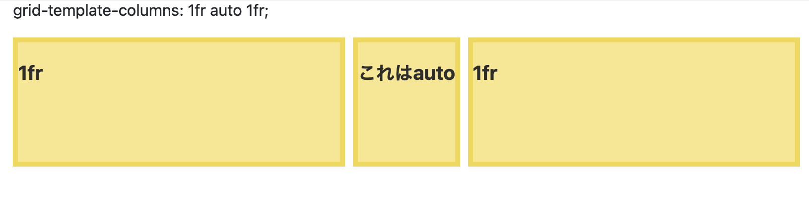

### Grid Layoutとは

- 格子状のマス目をベースとして、CSSでWebサイトのレイアウトを組む手法
 
 

 [Source: CSS Gridの使い方を丁寧に解説！爆速でレイアウトを完結させよう！](https://zero-plus.io/media/grid-layout/)

- 主要な要素はコンテナ(ラッパー)とアイテム

---

### その他の構成要素
[以下画像は CSS Gridの使い方を丁寧に解説！爆速でレイアウトを完結させよう！ から引用](https://zero-plus.io/media/grid-layout/)

- ライン: グリッドを分ける垂直および水平の線

*ラインの番号は1から開始する  
上記画像だと、右端からライン1,2,3,4となる

<br>

- トラック: グリッドの行および列のこと。隣接する2本にラインラインの間のこと


<br>

- セル: アイテムの配置できる最小単位。行トラックと列トラックのインターセクション


<br>

- エリア: 1つ以上のセルの集まった箇所

*エリアの形状は四角形でなければならないため、T字やL字のエリアは作れない

---

### 例

- display: gridを指定する

```html
<div class="wrapper">
    <div class="items">1</div>
    <div class="items">2</div>
    <div class="items">3</div>
    <div class="items">4</div>
    <div class="items">5</div>
</div>
```
```css
.wrapper {
    display: grid;
}
```


*二次元にするには、グリッドの列と行を定義する必要がある

- トラックの幅と高さを指定する
    - grid-template-columns：列トラックの幅を指定
    - grid-template-rows：行トラックの高さを指定  
    *指定方法はpx, auto, frがある

```css
.wrapper {
    display: grid;
    grid-template-columns: 100px 100px 100px;
    grid-template-rows: 50px 50px;
}
```
*grid-template-columnsで3つのカラムのサイズを定義  
*grid-template-rowsで2つのロウのサイズを定義


---

### frで指定するとは

- frとはfraction(比率)の略
- 親要素から見た子要素の大きさを割合で指定することができる　

```css
.wrapper {
    display: grid;
    grid-template-columns: 1fr 1fr 1fr;
    grid-template-rows: 1fr 1fr;
}
```


---

### autoとfrの違い

- fr: 親要素に対しての割合指定

- auto: 
    - frと一緒に指定されている場合:  
        コンテンツのサイズに合わせる
    - frが指定されていない場合:  
        他のコンテンツを除いて、親要素いっぱいに広がる


autoの仕様確認
frと一緒に指定されている場合
```css
.wrapper {
    grid-template-columns:  1fr auto 1fr;
}
```



[source: 【cssグリッドレイアウト】 frの使い方やautoとの違いを比較](https://kumonosublog.com/coding/css/grid_layout_fr_auto/)

<br>

frが指定されていない場合
```css
.wrapper {
    grid-template-columns:  auto auto 200px;
}
```


[source: 【cssグリッドレイアウト】 frの使い方やautoとの違いを比較](https://kumonosublog.com/coding/css/grid_layout_fr_auto/)

---

### grid itemにレイアウトを指定する方法

```html
<div class="wrapper">
    <div class="items item1">1</div>
    <div class="items item2">2</div>
    <div class="items">3</div>
    <div class="items">4</div>
    <div class="items">5</div>
</div>
```
```css
.wraper {
    display: grid;
    grid-template-columns: 100px 100px 100px;
    grid-template-rows: 50px 50px;
}
.item1 {
    grid-column-start: 1;
    grid-column-end: 4;
}
.item2 {
    grid-row-start: 2;
    grid-row-end: 4;
}
```
*item1はcolumnのライン1からライン4までに配置  
*item2はrowのライン2からライン4までに配置


<br>

ショートハンドラは以下の通り
```css
.item1 {
    grid-column: 1/4;
}
.item2 {
    grid-row: 2/4;
}
```