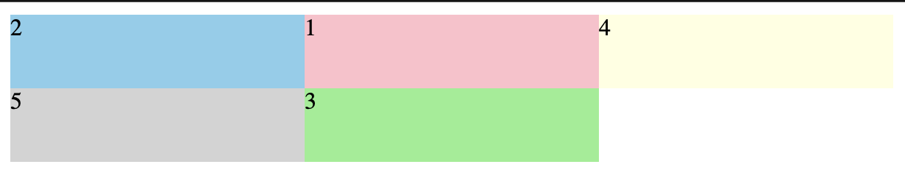
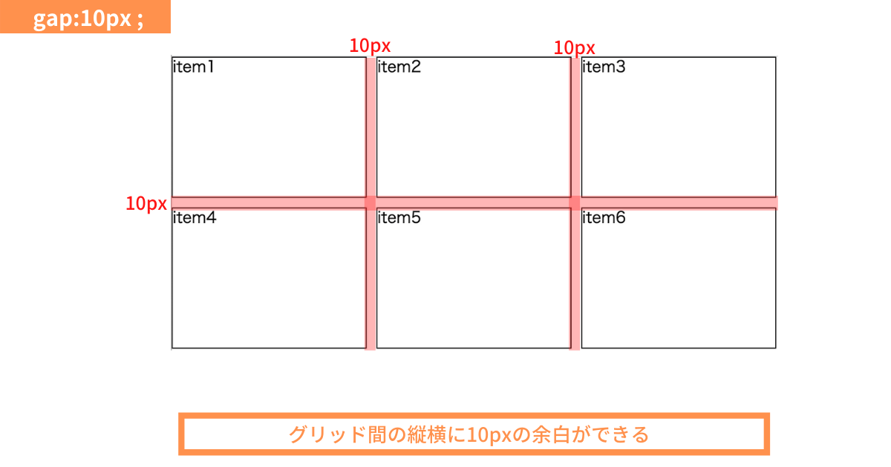
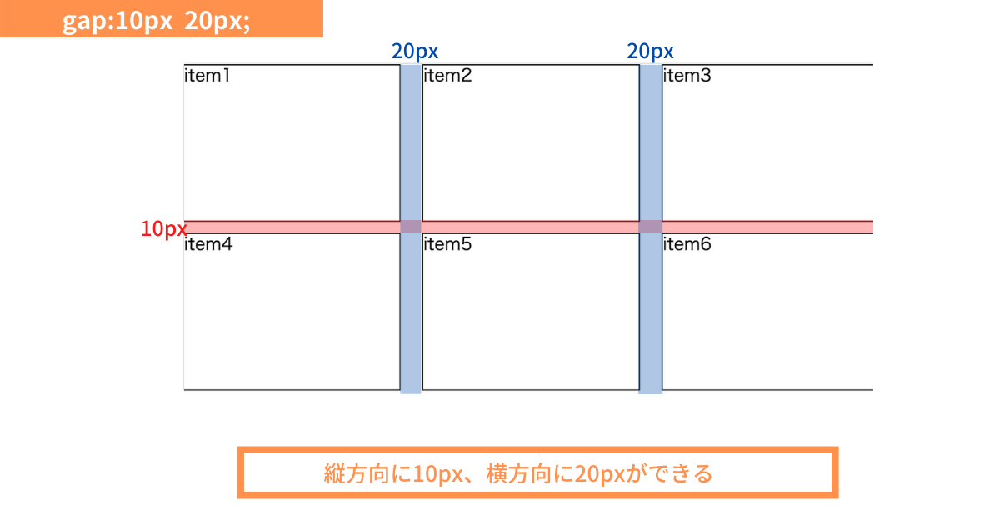

### grid containerに使うスタイル

- グリッド領域に名前をつける
    - grid container側で grid-template-areas を定義

- アイテムを名前の付いたエリアに配置する
    - grid item側で grid-area で配置エリア名を指定する

```html
<div class="wrapper">
    <div class="items item1">1</div>
    <div class="items item2">2</div>
    <div class="items item3">3</div>
    <div class="items">4</div>
    <div class="items">5</div>
</div>
```
```css
.wrapper {
    display: grid;
    grid-template-columns: 200px 200px 200px;
    grid-template-rows: 50px 50px;
    grid-template-areas: 
    "area1 area2 area3"
    "area4 area5 area6";
}
/* 各アイテムの配置場所をエリア名で指定する */
.item1 {
    grid-area: area2;
}
.item2 {
    grid-area: area1;
}
.item3 {
    grid-area: area5;
}
```



---

### grid間の余白

- 余白を設ける
    - grid container側で gap で余白を指定する

```css
.wrapper {
    diplay: grid;
    gap: 10px;
}
```



[source: CSS Gridの使い方を丁寧に解説！爆速でレイアウトを完結させよう！](https://zero-plus.io/media/grid-layout/)

<br>

- カラムとロウ間の余白は別々に設定できる
    - grp: row間の余白 column間の余白 で指定する
    - row-gap, column-gapで設定する

```css
.wrapper {
    display: grid;
    /* ロウ間は10px, カラム間は20pxの余白を設ける */
    gap: 10px 20px;
    /* 
    row-gap: 10px;
    column-gap: 20px
    */
}
```



[source: CSS Gridの使い方を丁寧に解説！爆速でレイアウトを完結させよう！](https://zero-plus.io/media/grid-layout/)

---

### タイルレイアウトを作る

参考サイト: [一番分かりやすいCSS Grid Layoutの使い方ガイド](https://webdesign-trends.net/entry/11086)

- タイルレイアウト: 要素がタイルのように並べられたレイアウト。要素がコンテナ幅以上ある場合は折り返される

- grid container　側に repeat を使ってタイルレイアウトを実現する

```css
.wrapper {
    display: grid;
    /* 180pxのグリッドを横に3つ並べる */
    grid-template-columns: repeat(3, 180px);
}
```
*grid itemｇ4つ以上ある場合は、自動的に折り返しされる

---

###　タイルレイアウト:　画面サイズに合わせて横に並べるグリッドの数を変化させたい

- auto-fillを利用する

```css
.wrapper {
  display: grid;
  grid-template: repeat(auto-fill, 200px);
}
```


