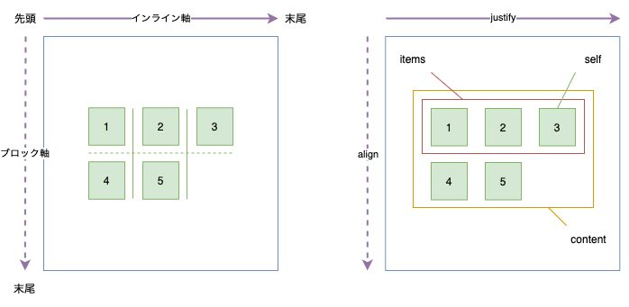
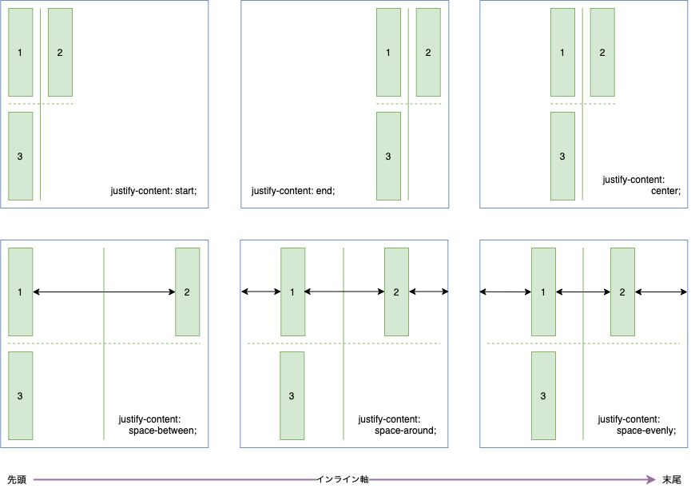
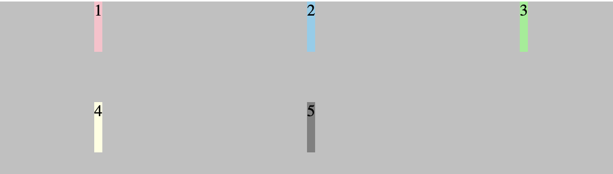
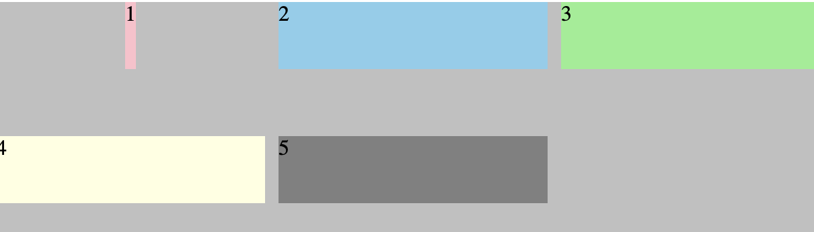
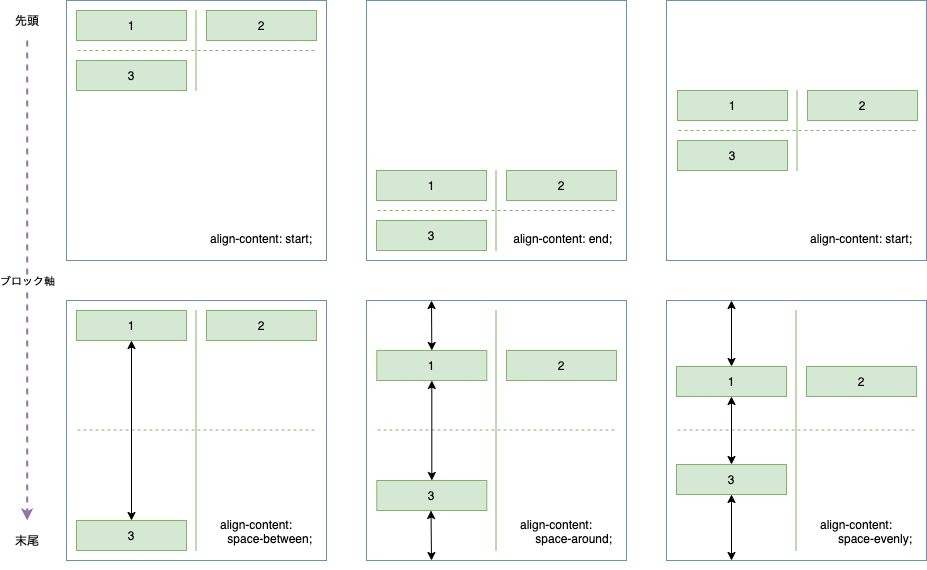
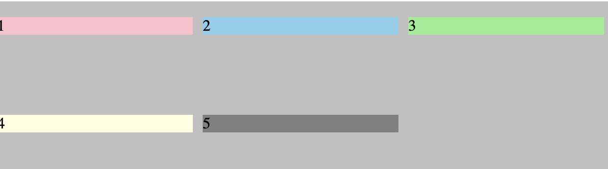
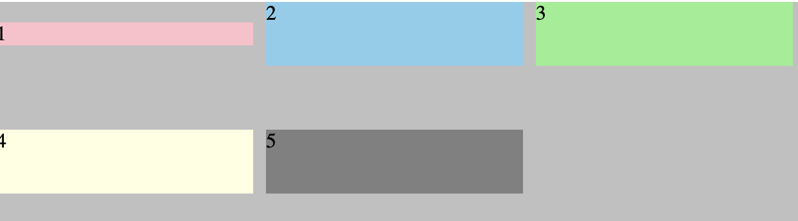

### 軸

grid container/itemsの水平方向の軸をインライン軸,垂直方向の軸をブロック軸と呼ぶ



[source: 図で理解する Grid Layout](https://zenn.dev/umatoma/articles/b970bdd3a148cd)

---

### Justify 系プロパティ

- justify-content: containerの水平方向の位置を決める。container側で定義する
　


[source: 図で理解する Grid Layout](https://zenn.dev/umatoma/articles/b970bdd3a148cd)

<br>

- justify-items: grid itemsのセル内での水平方向の位置を決める。 <font color="red">container側で定義する</font>

*このプロパティを指定すると、セル内でのアイテムの幅がコンテンツの幅になってしまう(詳しくは下記画像参照)

```css
.wrapper {
    display: grid;
    grid-template-columns: 200px 200px 200px;
    grid-template-rows: 50px 50px;
    justify-items: center;
}
```



<br>

- justify-self: grid itemsのセル内での水平方向の位置を決める。 <font color="red">item側で定義する</font>

*このプロパティを指定すると、セル内でのアイテムの幅がコンテンツの幅になってしまう(詳しくは下記画像参照)

```css
.wrapper {
    display: grid;
    grid-template-columns: 200px 200px 200px;
    grid-template-rows: 50px 50px;
}
.item1 {
    justify-self: center;
}
```



---

### Align 系プロパティ

- align-content: containerの垂直方向の位置を決める。container側で定義する



<br>

- align-items: grid itemsのセル内での垂直方向の位置を決める。 <font color="red">container側で定義する</font>

*このプロパティを指定すると、セル内でのアイテムの高さがコンテンツの高さになってしまう(詳しくは下記画像参照)

```css
.wrapper {
    display: grid;
    grid-template-columns: 200px 200px 200px;
    grid-template-rows: 50px 50px;
    align-items: center;
}
```



<br>

- align-self: grid itemsのセル内での垂直方向の位置を決める。 <font color="red">item側で定義する</font>

*このプロパティを指定すると、セル内でのアイテムの幅がコンテンツの幅になってしまう(詳しくは下記画像参照)

```css
.wrapper {
    display: grid;
    grid-template-columns: 200px 200px 200px;
    grid-template-rows: 50px 50px;
}
.item1 {
    align-self: center;
}
```

