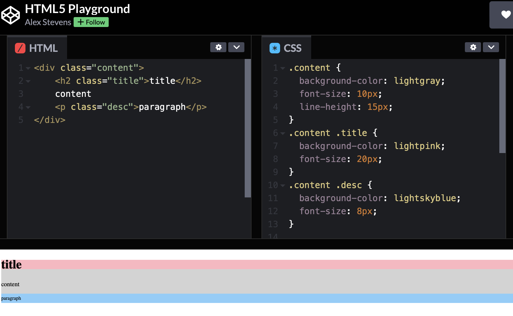
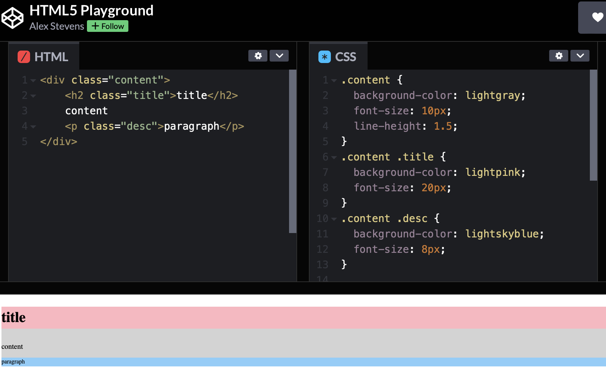

<link rel="stylesheet" href="./styles/line-height.css"></link>

### line-heightとは

- 行の高さを指定するプロパティ

- 指定する方法は以下の4種類
    - normal(デフォルト)
    - ~~px/~~rem/~~em
    - ~~%
        - font-size:10px で line-height: 150%; ならば、行の高さは15px
    - ~~
        - font-size:10px で line-height: 1.5; ならば、行の高さは15px

- 子要素にもline-heightが引き継がれる
    - 数値(1.5など)以外の方法で指定した場合: 子要素のline-heightは親要素のline-heightの値が引き継がれる
    - 数値で指定した場合、子要素にもline-heightは引き継がれるが、行の高さは、子要素のfont-sizeを基準にが計算される。

---

###　例　

line-heightをpxなどで指定した場合
```html
<div class="content">
    <h2 class="title">title</h2>
    content
    <p class="desc">paragraph<p>
</div>
```
```css
.content {
    font-size: 10px;
    line-height: 15px
}
.title {
    font-size: 15px;
    /* line-height = 15px */
}
.desc {
    font-size: 8px;
    /* line-height = 15px */
}
```


<br>

line-heightを数値で指定した場合
```css
.title {
    font-size 10px;
    line-height: 1.5;
}
.title {
    font-size: 15px;
    /* line-height = 15 * 1.5 = 22.5px */
}
.desc {
    font-size: 8px;
    /* line-height = 8 * 1.5 = 12px */
}
```

