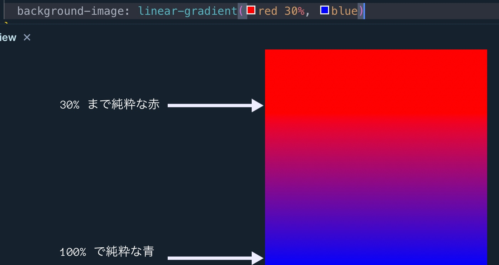
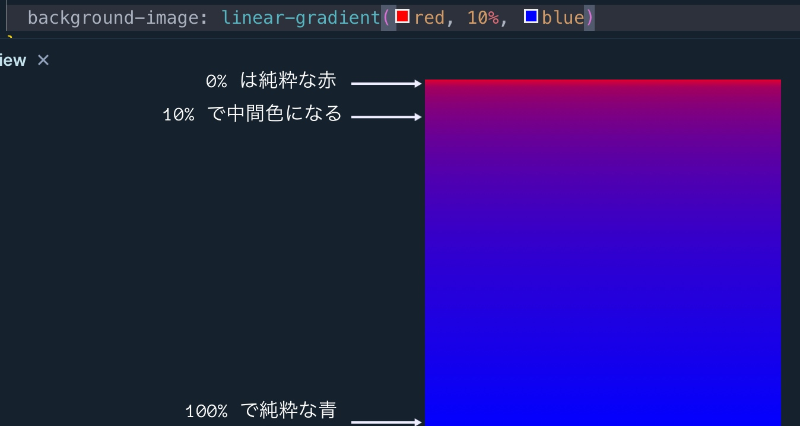
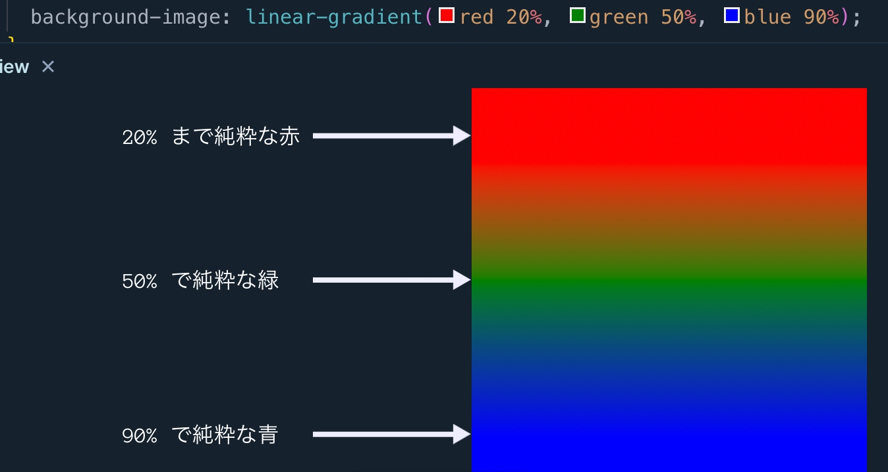

### linear-gradient の使い方

角度を指定する方法
```
linear-gradient(角度(deg), 開始する色, 終了する色)
```

<font color="red">角度を指定していない場合　180deg (上から下方向) になる</font>

---

### 向きを指定する方法
```
background: linear-gradient(to 方向, 開始する色, 終了する色);
```

top/bottom と left/right を組み合わせることもできる

- to top left で 右下から　左上に向かってグラデーションが伸びる

<font color="red">方向を指定していない場合　to bottom (上から下方向) になる</font>

<br>

---

### 複数の色を指定する方法

```
background: linear-gradient((角度か方向),開始の色, 中間の色, 終了の色)
```

---

### グラデーションの開始位置を指定する方法

```
background: linear-gradient((角度か方向), 開始の色 位置, 終了の色 位置);
```

<font color="red">位置を指定しない場合だと、それぞれの色が均等になるように自動で配置される (開始の色が0%、中間の色が約50%、終了の色が100%の位置になっているらしい) </font>


```css
/**
 0 ~ 30% までは純粋な赤
 残りの 70% をかけて最後に純粋な青になる
 */
background-image: linear-gradient(red 30%, blue);
```


<br>

中間に色を指定しないと、中間色をしたことになる

```css
/** 
 * 0% 純粋な赤
 * 10% で中間色になる
 * 残りをかけて純粋な青になる
 */
background-image: linear-gradient(red, 10%, blue);
```



<br>

以下は2色以上を使ったグラデーション

```css

/**
 * 0~20% までは純粋なあか
 * 50% で純粋な緑になる
 * 90%~100% は純粋な青
 */
background-image: linear-gradient(red 20%, green 50%, blue 90%);
```

