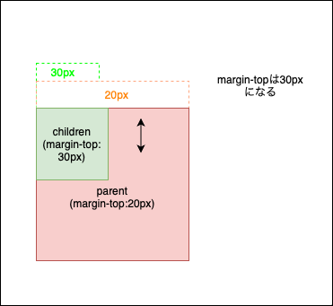
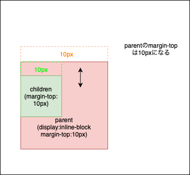
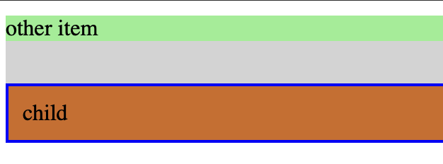

<link rel="stylesheet" href="./styles/mergincollapsing.css"></link>

### マージンの相殺

- ブロックレベルの要素の上下のマージンは各々の要素のマージンが適用されるのではなく、片方のマージンの設定値が大きい方に相殺される


[source: marginが効かない！？理由はマージンの相殺が起こっているかも](https://worker-training.com/webdesign/css/margin-collapsing/)

*マージンの値の大きい方に相殺される  
*マージンの相殺が起こるのはブロックレベルの要素の上下のマージンで起きる  
*左右のマージンにおいては相殺は起きない  
*また。インライン/インラインブロックレベルの要素やfloatがかかっている要素ではマージンの相殺は起きない  

---

### 入れ子になったマージンの相殺

- ブロックレベルの入れ子になった上下のマージンも相殺される

```css
.parent {
    margin-top: 30px;
}
.child {
    margin-top: 20px
}
```



- 重要な考え方
    - マージンは兄弟間の距離を広げることを目的としています。つまり、子と親間の距離を広げるためのものではありません。子と親間は、パディングです。  
    [source: CSSにおけるマージンの相殺を徹底解説](https://coliss.com/articles/build-websites/operation/css/rules-of-margin-collapse.html)

---

### 入れ子要素でのマージンの相殺への解決方法

- **親要素と子要素の間に余白を取りたい場合は親要素にpaddingを設ける**

それでも、マージンにこだわる場合  
- 親と子に境界があると認識させる
    - 親要素にborderかpaddingの指定をする(0pxではだめ)
    - もしくは親要素をinline-blockにする

*重要な考え方  
パディングとボーダーは一種の壁と考えることができます。2つのスペースの間にある場合、邪魔になる壁があるため、マージンは相殺されません。パディングやボーダーのサイズは関係ありません。
[source: CSSにおけるマージンの相殺を徹底解説](https://coliss.com/articles/build-websites/operation/css/rules-of-margin-collapse.html)

```css
.parent {
    margin-top: 10px;
    display: inline-block

}
.child {
    margin-top: 10px;
}
```



---

### 疑問

- 子要素にpadding/borderを設定したら入れ子でのマージンの相殺は解消されるのか?

```css
.parent {
    margin-top: 10px;
}
.child {
    border: 2px blue solid;
    padding: 10px;
    margin-top: 30px;
}
```

結果: マージンの相殺は解消されない


