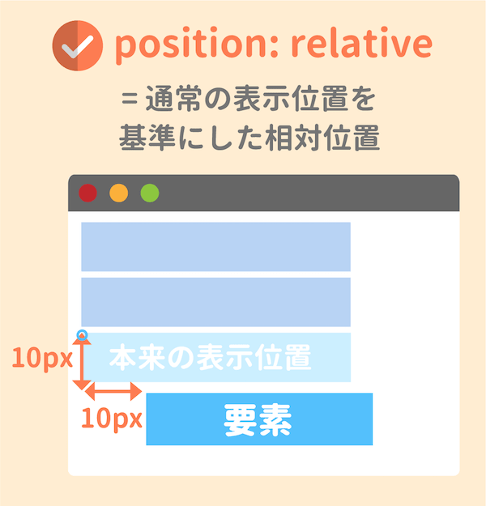
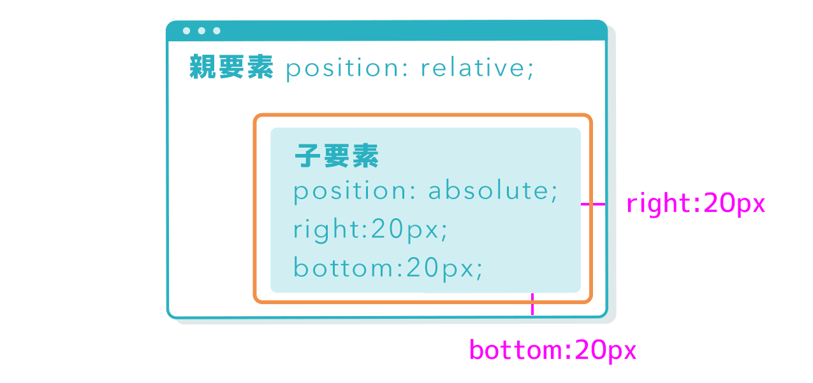
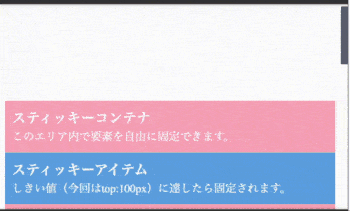

### positionプロパティとは

- 要素の配置位置を決める際に使用するプロパティ

- 親要素の位置を基準にしたり、画面上での位置を基準にできたりする

---

### positionプロパティの値の種類

- static (default): 通常の位置に配置される。 top/left/right/bottomが効かない。z-indexも効かない。(static以外の値を設定すると、top/right/left/bottomとz-indexが効く。)

 

- relative: 何も指定しなければ通常の位置に配置される。**topなどを指定した場合、通常配置される位置を基準として要素を移動する**

    

    [CSSのpositionを総まとめ！absoluteやfixedの使い方は？](https://saruwakakun.com/html-css/basic/relative-absolute-fixed#section3)

 

- absolute: 位置指定をしなければ通常の位置に配置される。  
    - **位置指定をした場合**、position: static 以外の値が設定された祖先要素を基準に位置がきまる。  
    - **position: static　以外の祖先要素がなければ、** body要素を基準に位置が決まる。

    

    [CSS】position使い方まとめ！種類一覧と注意点も解説](https://jajaaan.co.jp/web-production/frontend/position/)

 

- fixed: 画面に対しての位置で要素を固定する。スクロールしても要素は画面に固定されたまま。fixedよりもz-indexが大きい要素に対しては下に潜り込んでしまうので、z-indexに注意する。

 

- sticky: 親要素に対しての位置で固定する。スクロールしでも、要素は親要素が画面内にあるかぎり、指定された画面の位置で固定される。  
*親要素が無い場合、要素はうまく固定されないので注意

    