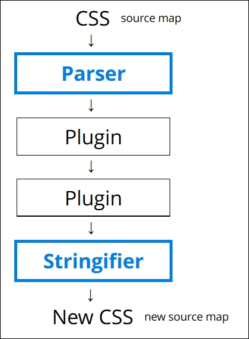

### PostCSSとは

- CSS変換ツール

- 処理の方法はBabelみたい
    1. 変換したいcssファイルを読み込む
    2. 読み込んだcssをASTに変換
    3. プラグインでそのASTをゴニョゴニョする
    4. ゴニョゴニョしたASTをCSSに出力する  

    *プラグインを何も使わないと、読み込んだcssがそのままで出力される。

 

Parser: 読み込んだcssをASTに変換  
Stringifier: ASTをcssに変換  

[Exploring how PostCSS works](https://subscription.packtpub.com/book/web-development/9781785885891/1/ch01lvl1sec13/exploring-how-postcss-works)

---

# 主なプラグイン

- autoprefixer
    - ベンダープレフィックスが必要な項目に自動で付与してくれるプラグイン
    - npm install -D autoprefixerを行う必要がある

- postcss-nested / postcss-nesting
    - cssの記法で入れ子が実現できる
    - 入れ子の記法で書いて、PostCSS&posts-nested(or posts-nesting)でcssの記法に変換する

- その他たくさんのプラグインがある。
