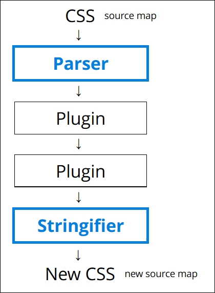

### PostCSSとは

- CSS変換ツール

- 処理の方法はBabelみたい
    1. 変換したいcssファイルを読み込む
    2. 読み込んだcssをASTに変換
    3. プラグインでそのASTをゴニョゴニョする
    4. ゴニョゴニョしたASTをCSSに出力する  

    *プラグインを何も使わないと、読み込んだcssがそのままで出力される。

<br>



Parser: 読み込んだcssをASTに変換  
Stringifier: ASTをcssに変換  

[Exploring how PostCSS works](https://subscription.packtpub.com/book/web-development/9781785885891/1/ch01lvl1sec13/exploring-how-postcss-works)

---

### PostCSS の利用の流れ

1. postcss および利用するプラグインのインストール

    - ★本番稼働時には PostCSS や PostCSS プラグイン は必要ないので `-D`オプションでインストールする

    - postcss-cli をインストールしないと、手順3の変換がコマンドラインから実行できないので注意

        ```bash
        #npm install -D postcss postcss-cli [プラグイン]
        npm install -D postcss postcss-cli autoprefixer
        ```

<br>

2. PostCSS の設定ファイル (postcss.config.js) の作成&設定

    - ★このファイルにて PostCSS で利用したいプラグインの指定を行う

    - CJS 形式で利用したい場合

        ```js
        module.export = {
            plugins: [ //pluginsは配列であることに注意
                require("autoprefixer"),
                //オプションを指定したい場合は以下のように設定すること
                require("autoprefixer")({
                    //オプションを指定
                })
            ]
        };
        ```

    <br>

    - ESM 形式で利用したい場合

        ```js
        export default {
            plugins: { //pluginsはオブジェクトであることに注意
                autoprefixer: {},
                //オプションを指定したい場合は以下のように設定すること
                autoprefixer: {
                    //オプションを指定
                }
            }
        }
        ```

<br>

3. PostCSS 実行 (= CSS → CSS 変換)

    ```bash
    #npx postcss <ターゲットファイル> [オプション]

    #-o オプションで出力ファイル名を指定可能
    npx pastcss style.css -o dist/out.css

    #-d オプションで出力先ディレクトリの指定可能 (ファイル名は元のまま)
    npx pastcss style.css -d dist
    ```

<br>
<br>

参考サイト

[PostCSSの概要と基本的な使い方のまとめ](https://toach.biz/blog/what-is-postcss/)

[【PostCSSの使い方】Web制作でCSSを拡張させる方法【autoprefixer・cssnano・postcss-combine-media-query】](https://fukulog.net/postcss/#設定ファイルの作成)

[【CSS_84】 PostCSSとは？](https://note.com/happy_avocet7237/n/n4f799cbb5585)

[postcss-cli](https://www.npmjs.com/package/postcss-cli)

---

# 主なプラグイン

- autoprefixer
    - ベンダープレフィックスが必要な項目に自動で付与してくれるプラグイン
    - npm install -D autoprefixerを行う必要がある

- postcss-nested / postcss-nesting
    - cssの記法で入れ子が実現できる
    - 入れ子の記法で書いて、PostCSS&posts-nested(or posts-nesting)でcssの記法に変換する

- その他たくさんのプラグインがある。
