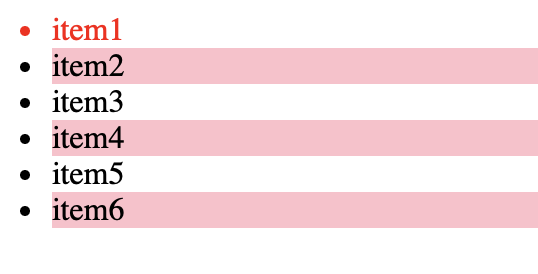
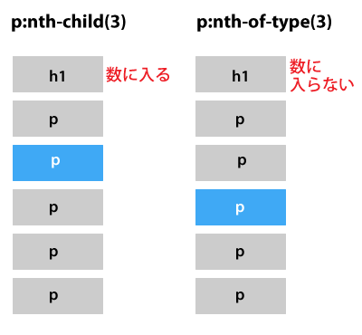
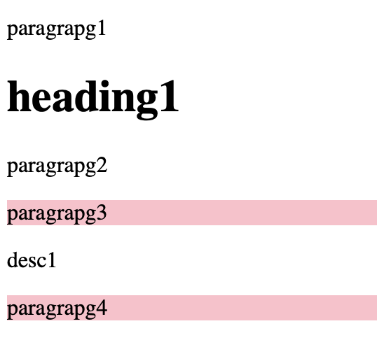

<link rel="stylesheet" href="./styles/pseudo-class.css"></link>

### 疑似クラス(Pseudo-Classes)とは

- セレクターに付与するキーワード

- selecter:Pseudo-class で指定する

- そのキーワードは付与したセレクターの<font color=red>特定の状態</font>を指定するもの

例  
selecter:hover  
selecter::nth-of-type(n)  
等

[さまざまな疑似クラス](https://developer.mozilla.org/ja/docs/Web/CSS/Pseudo-classes)

---

### nth-of-type(n)

- 同階層のn番目の要素を指定する

```html
<ul class="list">
    <li class="items">item1</li>
    <li class="items">item2</li>
    <li class="items">item3</li>
    <li class="items">item4</li>
    <li class="items">item5</li>
    <li class="items">item6</li>
</ul>
```

```css
.list .li:nth-of-type(1) {
    /* item1のみに適用される */
    color: red;
}

.list .li:nth-of-type(even) {
    /* item2, item4, item6 に適用される */
    background-color: pink;
}
```



他の指定方法として、3つおきにスタイルを適用するには :nth-of-type(3n) などがある

---

### nth-child(n)

- 同じ階層の<font color="red">全ての要素を通して数え、</font>n番目の要素を指定する　



```html
<p class="paragraphs">paragrapg1</p>
<h1 class="heading">heading1</h1>
<p class="paragraphs">paragrapg2</p>
<p class="paragraphs">paragrapg3</p>
<span class="desc">desc1</span>
<p class="paragraphs">paragrapg4</p>
```

```css
.paragraphs:nth-child(2n) {
    /* :nth-child(even)と同じ */
    background-color: pink;
}
```

