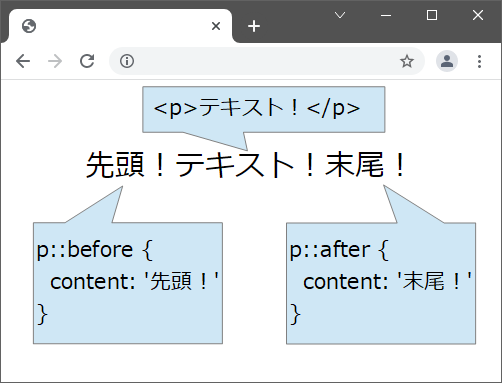

### 疑似要素(Pseudo-Elements)とは

- セレクターに付与するキーワード

- selecter:<font color=red>:</font>Pseudo-element で指定する　

- そのキーワードは付与したセレクターの<font color=red>一部</font>を指定するもの

例  
selecter::before  
selecter::first-line
など



[source: 【CSS】疑似要素beforeとafterが表示されないときの解決方法](https://miyattiblog.com/solution-when-the-pseudo-element-is-not-displayed/)

---

### 疑似クラスとの違い

- 疑似クラスは、指定した要素の状態のときは、その要素全体に影響を与える

- 疑似要素は、状態などは指定できず、あくまで指定した要素の一部に影響を与える

---

###　疑似要素、疑似クラスの両方を指定したい場合

```css
/* selecter:pseudo-class::pseudo-element {} で指定する*/

li:nth-of-type(even)::after {
    properties: value;
}
```