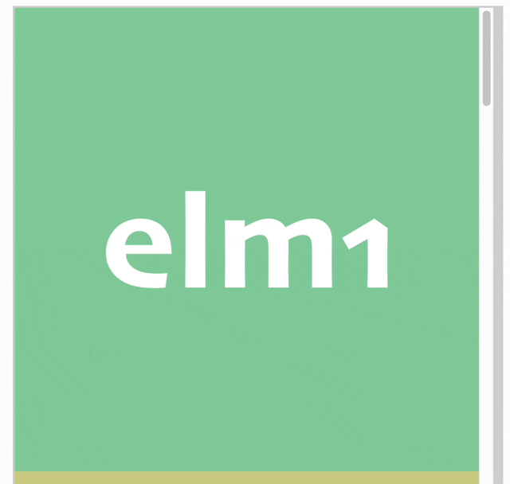
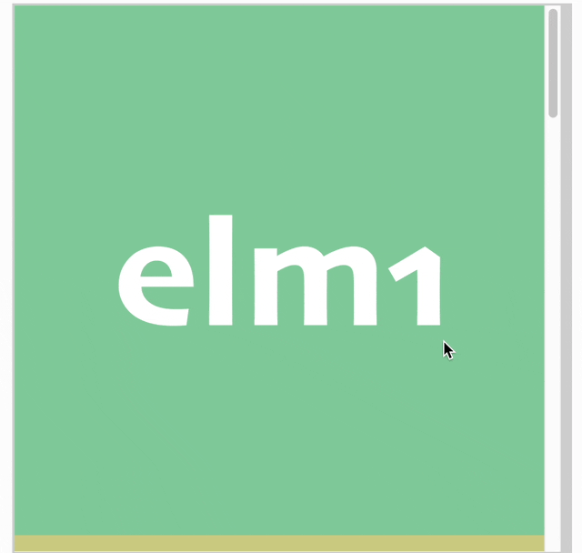
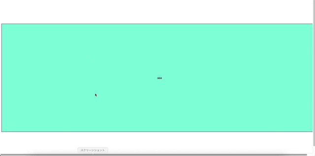
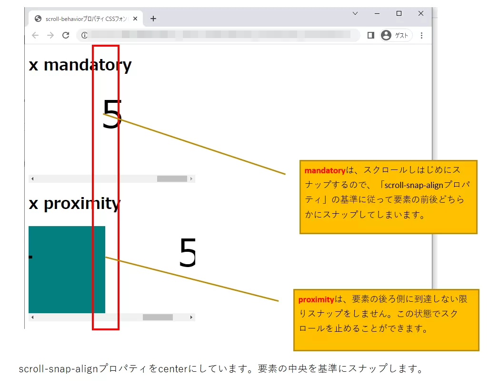
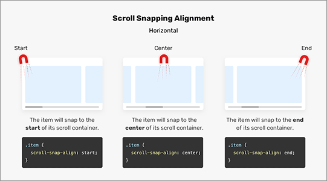
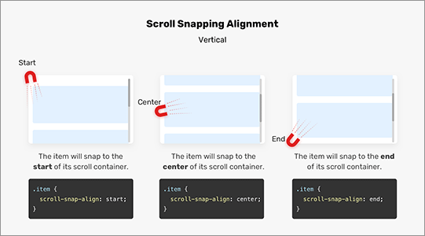
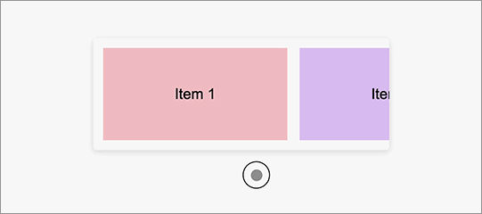
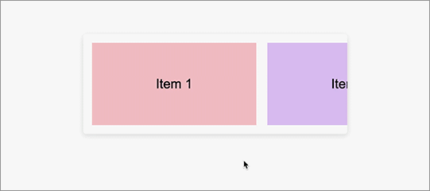

### Scroll Snap とは

- スクロールに応じて、セクションの遷移を一気に行う方法

<br>

以下は普通のスクロールの様子



引用:[CSS、決まった位置にスナップさせるスクロール。](https://fuuno.net/web/snap/snap.html)

<br>

以下はスクロールスナップを利用した様子



引用:[CSS、決まった位置にスナップさせるスクロール。](https://fuuno.net/web/snap/snap.html)

<br>
<br>

参考サイト

[CSS辞典 scroll-behaviorプロパティ、scroll-snap-typeプロパティ、scroll-snap-alignプロパティの解説](https://kcfran.com/2022/06/28/css-dictionary-scroll-behavior-snap-type-align/)

[打倒slick！ CSS Scroll Snap入門](https://qiita.com/boseki/items/edc882ac61f4d8132091)

---

### スクロールスナップの利用方法

CSS にてスクロールスナップを適用したい要素に対して以下の css プロパティを設定する

- scroll-snap-type
    - スクロールする要素の親要素 (スクロールコンテナ) に設定するプロパティ

    - どちらの方向に要素がスクロールされるか (x軸方向かy軸方向か) を設定する
    
    - どの程度厳密にスナップするか (どの程度ピッタリスクロールを止めるか) を設定する

<br>

- scroll-snap-align
    - スクロールする要素をスクロールコンテナのどの位置を基準にスナップするかを設定する


<br>

サンプルコード

```html
<!-- HTML -->
<div class="container">
    <div class="items">aaa</div>
    <div class="items">bbb</div>
    <div class="items">ccc</div>
    <div class="items">ddd</div>
    <div class="items">eee</div>
    <div class="items">fff</div>
</div>
```

```css
/* CSS */
.container {
    /* conatinerを画面いっぱいの大きに設定 */
    height: 100vh;
    width: 100vw;
    display:  flex;
    /* flex itemを中央に配置 */
    justify-content: center;
    align-items: center;
    /* Scroll Snapを有効にするために必要 */
    overflow-x: auto;

    /* Scroll方向 → x, スナップの厳密さ → からなずスナップする */
    scroll-snap-type: x mandatory;
}

.items {
    background-color: aquamarine;
    border: 1px black solid;
    height: 70%;
    /* flex itemの幅は画面いっぱいの大きさに設定 */
    flex-shrink: 0;
    width: 100vw;
    /* 文字をflex itemの中央に配置 */
    display: flex;
    justify-content: center;
    align-items: center;
    /* 親要素の右端を基準に要素をスナップする */
    scroll-snap-align: start;
}
```



---

### scroll-snap-type

スクロールコンテナに設定するプロパティ

スクロールの方向
- x: x方向にスクロールする
- y: y方向にスクロールする

<br>

スナップの厳密度
- mandatory: スクロールコンテナの要素を必ずスナップする
- proximity: 厳密にスナップしない。要素の後半に達したらスナップする

<br>

proximity を設定した場合


<br>

mandatory と proximity



引用: [CSS辞典 scroll-behaviorプロパティ、scroll-snap-typeプロパティ、scroll-snap-alignプロパティの解説](https://kcfran.com/2022/06/28/css-dictionary-scroll-behavior-snap-type-align/)

---

### scroll-snap-align

スクロール要素に設定するプロパティ

要素をコンテナのどこを基準にスナップするか
- start: 親要素の始めに要素をスナップする
- center: 親要素の中心に要素をスナップする
- end: 親要素の終わりに要素をスナップする



引用: [CSSのスクロールスナップの便利な使い方、実装の注意点を徹底解説](https://coliss.com/articles/build-websites/operation/css/usecase-of-css-scroll-snap.html)

<br>



引用: [CSSのスクロールスナップの便利な使い方、実装の注意点を徹底解説](https://coliss.com/articles/build-websites/operation/css/usecase-of-css-scroll-snap.html)

---

### scroll-snap-stop

スクロールコンテナに設定するプロパティ

- normal: デフォルト値。スクロールが早いと要素をスキップする可能性がある
- always: 可能な限りスナップする

<br>

normal を設定した場合



引用: [CSSのスクロールスナップの便利な使い方、実装の注意点を徹底解説](https://coliss.com/articles/build-websites/operation/css/usecase-of-css-scroll-snap.html)

<br>

always を設定した場合



引用: [CSSのスクロールスナップの便利な使い方、実装の注意点を徹底解説](https://coliss.com/articles/build-websites/operation/css/usecase-of-css-scroll-snap.html)