###　テーブル要素

テーブルのレイアウトを利用するには以下の方法がある

- HTML要素で作る方法
- CSSのdisplayで指定する方法
- (gridレイアウトを使う)

- <font color="red">htmlで作る方法とcssで作る方法の使い分け方:</font>  
    -> htmlで作成: 表を作りたい時  
    -> cssで作成: 表ではないが、表のようなレイアウトを作りたい時

---

### HTML要素で作る方法

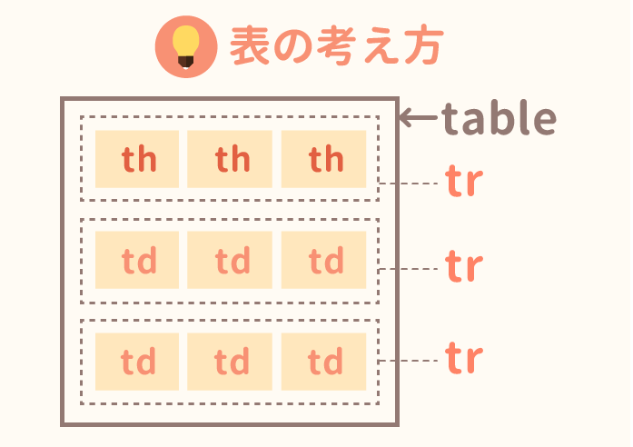

[Source: 表（table）の作り方と装飾の変え方【HTML＆CSS】 ](https://saruwakakun.com/html-css/basic/table)

```html
<table>
    <tr>
        <th>heading1</th>
        <th>heading2</th>
        <th>heading3</th>
    </tr>
    <tr>
        <td>cell1</td>
        <td>cell2</td>
        <td>cell3</td>
    </tr>
    <tr>
        <td>cell1</td>
        <td>cell2</td>
        <td>cell3</td>
    </tr>
</table>
```

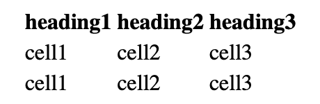

<br>

- 枠線をつけるにはborderをcssで指定する
```css
table {
    /* tableの外の大枠にしか枠線がつかない */
     border: 1px #333 solid;
}

th, td {
    /* それぞれのセルに枠線がつく */
     border: 1px #333 solid;
}
```

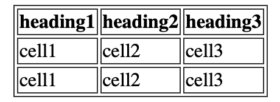

<br>

- 枠線は2重なのを1つにまとめたい場合、table要素にborder-collapseを指定する
```css
table {
    border-collapse: collapse;
}
th, td {
    border: 1px #333 solid;
}
```

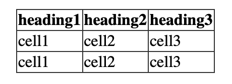

- rowspanで行の結合
```html
<table>
    <tr>
        <th>heading1</th>
        <th>heading2</th>
        <th>heading3</th>
    </tr>
    <tr>
        <td>cell1</td>
        <!-- このセルは2行分を占める -->
        <td rowspan="2">cell2</td>
        <td>cell3</td>
    </tr>
    <tr>
        <td>cell1</td>
        <td>cell3</td>
    </tr>
</table>
``````
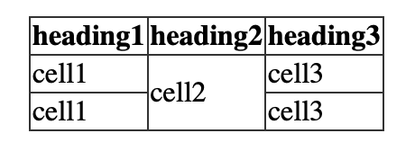


- columnspanで列の結合
```html
<table>
    <tr>
        <th>heading1</th>
        <th>heading2</th>
        <th>heading3</th>
    </tr>
    <tr>
        <td>cell1</td>
        <!-- このセルは2列分を占める -->
        <td colspan="2">colspan 2</td>
    </tr>
    <tr>
        <td>cell1</td>
        <td>cell2</td>
        <td>cell3</td>
    </tr>
</table>
```

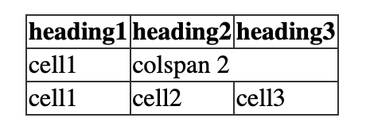

---

### CSSのdisplayで指定する方法

```html
<div class="table">
    <div class="table-heading-row">
        <div class="table-cells">heading1</div>
        <div class="table-cells">heading2</div>
        <div class="table-cells">heading3</div>
    </div>
    <div class="table-rows">
        <div class="table-cells">cell1</div>
        <div class="table-cells">cell2</div>
        <div class="table-cells">cell3</div>
    </div>
    <div class="table-rows">
        <div class="table-cells">cell1</div>
        <div class="table-cells">cell2</div>
        <div class="table-cells">cell3</div>
    </div>
</div>
```

```css
.table {
    display: table;
}

.table-heading-row {
    display: table-header-group
}

.table-rows {
    display: table-row;
}

.table-cells {
    display: table-cell;
}
```
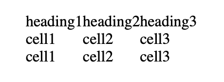

<br>

- 枠線をつけたい場合: borderを設定する
    - display: table  
        テーブルの外側の大枠のみに線が引かれる
    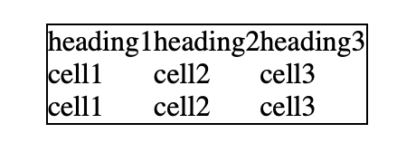
    
    - display: table-row  
        行の枠線のみに線が引かれる
    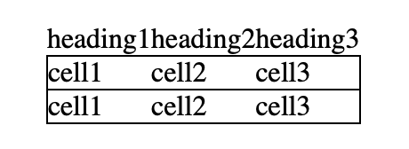

    - display: table-cell  
        セルの一つ一つに線が引かれる  
        *それぞれのセルの線同士が重なると、その枠線が太く見えるので、  
        border-collapse: collapse;  
        を親のdisplay: table;要素に指定しておく

    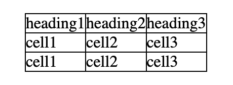

<br>

- 子要素(テーブルセル)同士の間隔を開けたい場合

    - ×: テーブルセルにマージンを指定する
    - ○: テーブルにborder-spacingとborder-collapseを指定する

```css
.table {
    border-spacing: <左右の間隔> <上下の間隔>;
    border-collapse: spacing;
}
```
*セルに枠線を設定している場合、意図した見え方にならない可能性がある

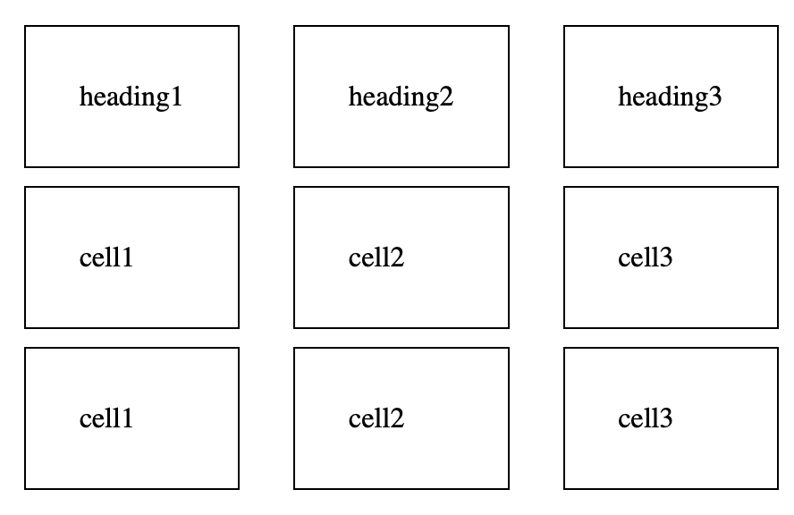

<br>

- セルを一つにまとめたい&セルの大きさをとりたい場合
    - テーブルセルにpaddingやheigt/widthを指定する

---

### display: tableの注意点

- htmlのようにセルの結合はcssでは指定できない  
    - テーブルを入れ子にするしかない

[Source: display: table-cell; には colspan, rowspan 的な指定ができない](https://qiita.com/yosukesannohe/items/b6eda6a7ce6cc9877266)

-> 無理せずgridかhtmlで対応する方が楽