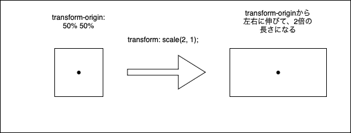

### transformプロパティとは

- 指定した要素を移動、回転、変形させることができるプロパティ

```css
selector {
    transform: function(value);
}
```
*functionにはscale(), skewX(),translate(),rotateなどがある

---

### transform-origin

- transformの基準点
    - デフォルトでは transform-origin: 50% 50%;

 

- transform-originを変更すると、変更されたtransform-originを基準に変形する


- transform-originの指定方法は \~~px/\~~%/topなどがある


[source: 【CSS】transform-originの使い方、中心点(位置)を指定する！](https://shu-naka-blog.com/css/transform-origin/)

---

### scale()

- 要素を拡大/縮小する

使い方
```css
selecter {
    transform: scale(x方向の倍率, y方向の倍率);
    transform: scaleX(倍率);
    transform: scaleY(倍率);
}
```

例
```html
<div class="container">
    scaled(2, 0.5);
</div>
```
```css
.container:hover {
    /* x方向に2倍拡大する */
    transform: scale(2, 1);
}
```

hover前  


<br>

hover後  


---

### skew()

- 要素を傾かせる

使い方
```css
selecter {
    /* 左右に傾ける */
    transform: skewX(~~deg);
    /* 上下に傾ける */
    transform: skewY(~~deg);
}
```

例
```css
.container:hover {
    /* x方向に45°傾かせる */
    transform: skewX(45deg);
}
```


---

### translate()

-　要素を移動させる

使い方
```css
selecter {
    transform: translate(x方向への移動, y方向への移動);
    transform: translateX(x方向への移動);
    transform: translateY(y方向への移動);

    /* *translate()へ渡している値が一つだけだとtranslateX()と同じになる */
    transform: transalate(40px);
    /* transalate(40px, 0) または translateX(40px) と同じ */
}
```

例
```css
.container:hover {
  transform: translate(30px, 30px);
}
```


<br>

hover後  


---

### rotate()

- 要素を回転させる

使い方
```css
selecter {
    transform: rotate(~~deg);
}
```
*degが正の値なら右に回転し、負の値なら左に回転する

例
```css
.container:hover {
  transform: rotate(45deg);
}
```

hover前  


<br>

hover後


---

### 複数のtransformプロパティを設定する　

- transformのプロパティを半角スペースで繋ぐと複数の効果をかけることができる
```css
selecter {
    /* x方向に0.5倍し、右へ90°回転させる */
    transform: scaleX(0.5) rotate(90deg);
}
```