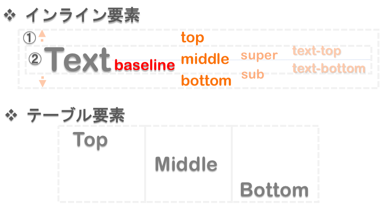

### vertical-alignとは

- コンテンツの垂直方向の位置を決めるプロパティ
    - 指定した要素を親要素のどこに合わせるかを指定する

- **インラインレベル(inline-block含む)の要素/テーブルのセル要素にしか効かない**

- 指定方法はtop/middle/bottomなどの他に、\~~px/\~~em/\~~rem/\~~%などがある

---

### 配置位置

- baseline(デフォルト): 

- middle: 親要素の垂直方向の中央に配置する

- top-text: 親要素の文字の最上部ラインに配置する(テーブルセルでは無効)　

- bottom-text: 親要素の文字の最下部ラインに配置する(テーブルセルでは無効)　

- top: 親要素の上端に配置する

- bottom: 親要素の下端に配置する