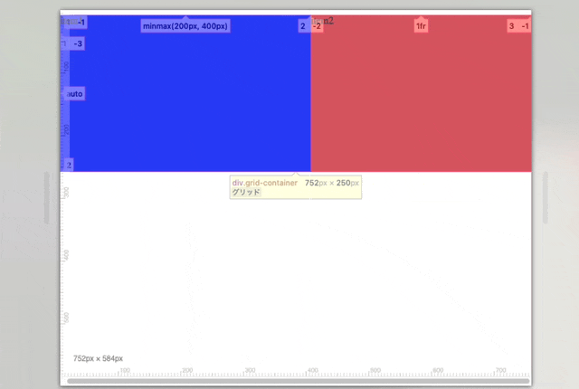
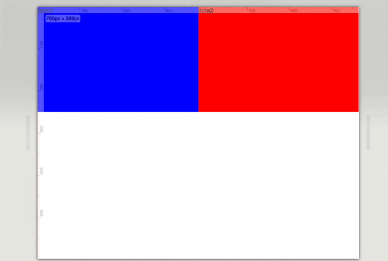
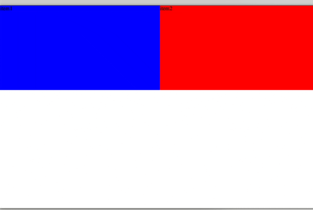
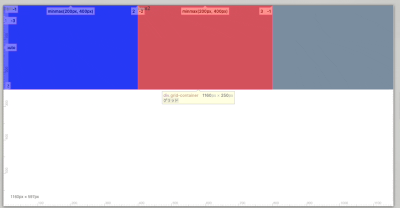
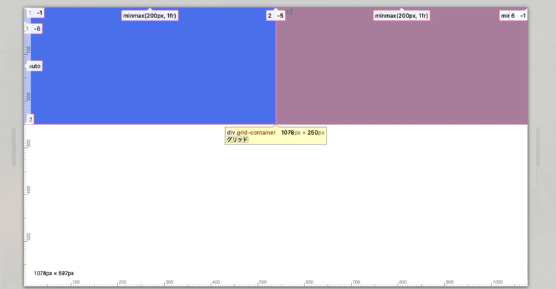
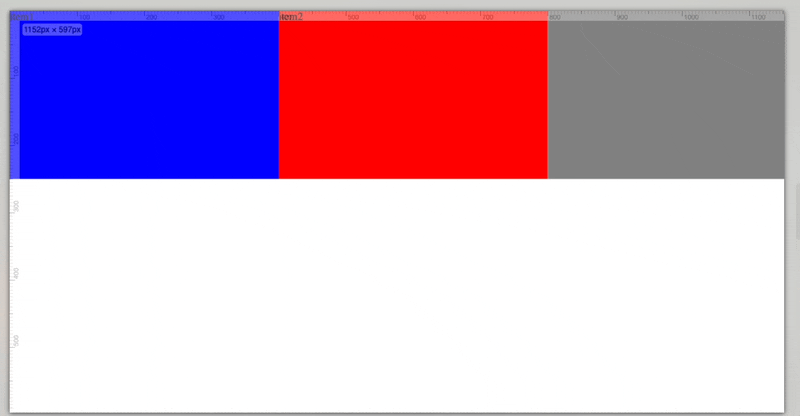
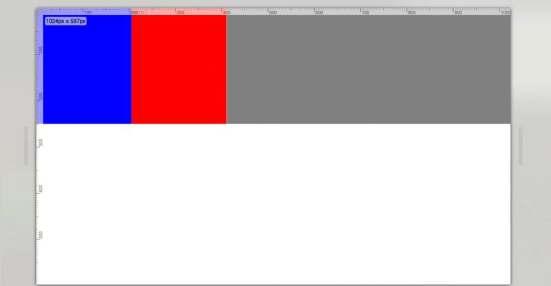
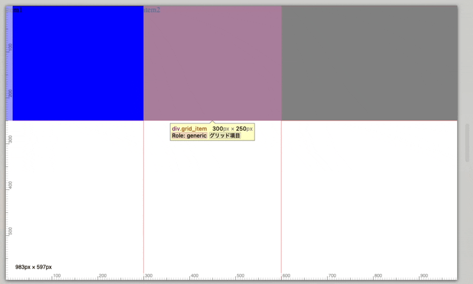
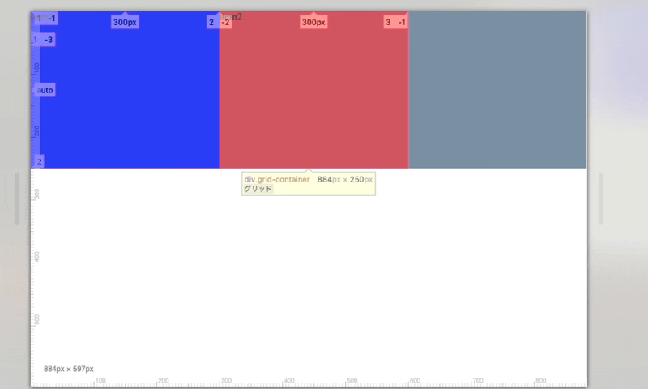

### minmax　関数とは

グリッドの列や行の値は minmax る使って以下のように定義できる

- minmax(min, max)
    - min: トラックの(幅/高さ)の最小値
    - max: トラックの(幅/高さ)の最大値

```css
.grid-container {
    display: grid;
    /* 1つ目のトラックの幅は 200~400px で可変になる */
    grid-template-columns: minmax(200px, 400px) 1fr;
}
```



---

### 注意点

minmax(min, max) の min \< max の場合 max は無視され min 値のみ適用される

<font color="red">min に 1fr を指定すると minmax 自体が無効になる</font>

```css
.grid-container {
    display: grid;
    /* 以下の minmax は無効になる*/
    grid-template-columns: minmax(1fr, ~~px) 1fr;
}
```

---

### repeat 関数を利用する　

以下のようなトラック幅の定義をrepeat関数を利用することで短く書ける

```html
<div class="grid-container">
    <div>cell1</div>
    <div>cell2</div>
</div>
```

```css
.grid-container {
    display: grid;
    grid-template-columns: minmax(200px, 1fr) minmax(200px, 1fr);
}
```

<br>

repeat関数を利用して、同じ定義を簡略化する
```css
.grid-container {
    display: grid;
    grid-template-columns: repeat(2, minmax(200px, 1fr));
}
```

---

### repeat 関数と auto-fill auto-fit でレスポンシブ対応

通常の grid レイアウトの場合、 画面幅がコンテンツ(トラック)幅よりも小さくなると水平スクロールバーが表示される

```css
.grid-container {
    display: grid;
    grid-template-columns: repeat(2, minmax(200px, 1fr));
}
```



<br>

```css
.grid-container {
    display: grid;
    grid-template-columns: repeat(auto-fit, minmax(200px, 1fr));
}
```



---

### auto-fill と auto-fit の違い

auto-fit:

- minmax() の max に px 指定をした場合
    - (カラムが画面落ちするまで)カラムが画面落ちするまで画面サイズが変更されても、max のトラック幅で固定される

    ```css
    .grid-container {
        display: grid;
        grid-teplate-columns: repeat(auto-fit, minmax(200px, 400px))
    }
    ```

    

<br>

- minmax()の max に fr を指定した場合
    - 画面サイズの変更に応じて、トラック幅も伸縮する
    - カラムが画面落ちしそうになると、カラムを次の段にずらす

    ```css
    .grid-container {
        display: grid;
        grid-teplate-columns: repeat(auto-fit, minmax(200px, 1fr))
    }
    ```

    

<br>
<br>

auto-fill:

- minmax() の max に px 指定をした場合
    - auto-fit と同様に画面サイズが変更されても、max のトラック幅で固定される

    ```css
    .grid-container {
        display: grid;
        grid-teplate-columns: repeat(auto-fill, minmax(200px, 400px))
    }
    ```

    

<br>

- minmax()の max に fr を指定した場合
    - 画面サイズの変更に関わらず、 余白スペースを保とする

    ```css
    .grid-container {
        display: grid;
        grid-teplate-columns: repeat(auto-fill, minmax(200px, 1fr))
    }
    ```

    

<br>

<font color="red">なお、 repeat(auto-(fit | fill), ~px) と固定トラック幅を指定した場合</font>
そのトラック幅で表示され、挙動はauto-fill auto-fit で同じになる

- auto-fit
```css
.grid-container {
    display: grid;
    grid-template-columns: repeat(auto-fit, 300px);
}
```



<br>
<br>

- auto-fill
```css
.grid-container {
    display: grid;
    grid-template-columns: repeat(auto-fill, 300px);
}
```

