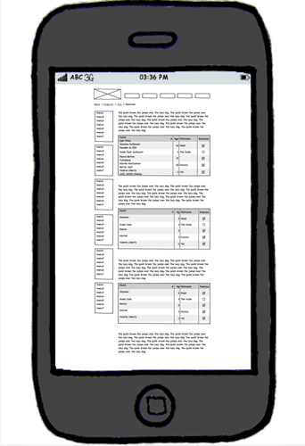
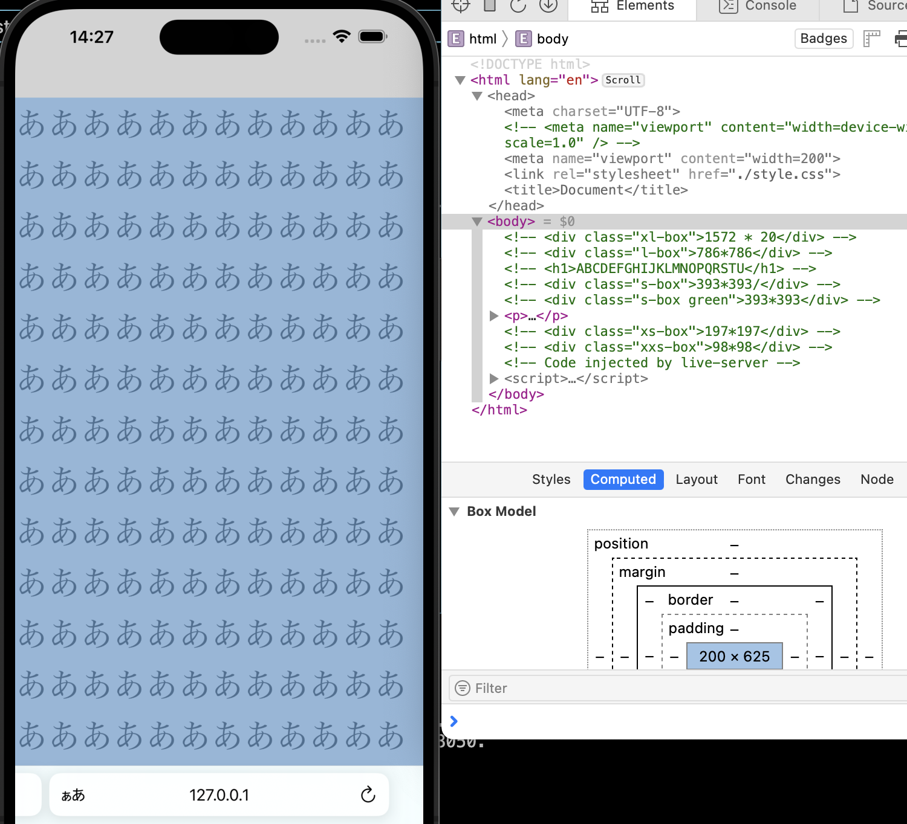

### PC向けサイトとスマホ向けサイト

- PCとスマホでは、画面のアスペクト比や画面サイズの違いで表示のされ方に違いが出る  
 ->どちらかのデバイスでは見にくくなってしまう可能性がある

---

### 両デバイスに対応する方法

1. デバイスごとに表示する専用html/css/jsファイルを用意する

2. レスポンシブデザインで実装する  
 ->閲覧するデバイスの**画面サイズ**によって適用するスタイルを切り替えること


---

### レスポンシブデザインのための重要な設定1

- viewport: (特にviewportのwidth)webページを表示するときにどの大きさで表示するか  
= webページの表示領域  
**<font color="red">\*viewportの設定はスマホ/タブレットのみに働く</font>**

    

[viewportとはなにか？](https://www.codegrid.net/articles/viewport-1/)

<br>

- viewportを設定しない場合  
    -> スマホ/タブレットはPCサイトの大きさのwebページを縮小して、画面全体に表示しようとする

    

    [viewportとはなにか？](https://www.codegrid.net/articles/viewport-1/)

<br>

- viewportを何も設定しないと、スマホ(iPhone)は多くの場合webページの幅を980pxで読み込もうとする。しかし、スマホのwidthはそれよりも狭いことが多いので、980pxのサイトを縮小して、スマホの画面に表示しようとする。  

    例: スマホ画面の横幅が490pxの場合、webページを980px幅とし、それを1/2に縮小してスマホ画面いっぱいに表示しようとする

<br>

- viewportの設定を(正しく)行った場合  
webサイトの幅をスマホの画面幅に合わせ、画面全体に表示しようとする

    

---

### レスポンシブデザインのための重要な設定2

- メディアクエリの設定  
    [メディアクエリに関してはこちらを参照](./MediaQuery.md)
---

### meta要素viewportの設定方法

```html
<html>
    <head>
        <meta name="viewport" content="設定" />
    </head>
</html>
```

---

### meta要素viewportの設定項目

- width: 表示するwebページの横幅

- height: 表示するwebページの縦幅(あまり指定しない)

- init-sacle: ページの初期拡大率

- minimum-scale: ページの最小拡大率(ユーザーがページをどこまで縮小(ズームアウト)できるか)

- maximum-scale: ページの最大拡大率(ユーザーがページをどこまで拡大(ズームイン)できるか)

- user-scalable: ユーザーによる拡大縮小の許可を制御

----

### viewportについての詳しい説明

[viewport設定メモおよび「width=device-width, initial-scale=1」とは何か](https://yudachi-shinko.blogspot.com/2022/12/viewportwidthdevice-width-initial-scale1.html)

- viewportとはスマホの仮想のpx幅  
    - 実際のスマホの画面の解像度は 1080 x 2400 だったりする

    - webページで画像を100px × 100pxで表示しており、それをそのままのピクセル数でスマホに表示しようとすると、画像は非常に小さく表示されてしまう。

    - そのため、仮想解像度「ビューポート」を設定し、スマホの解像度をあたかもそのように扱うことで、webサイトをうまくスマホでも表示させる。


- viewportを設定した時の見え方

    - device-width=430pxにて、viewportを200pxに設定した場合。

        - viewport幅(200px)よりも大きい幅の要素がある場合:
            - viewportを200pxに設定するが、それよりも大きい幅の要素も画面全体に収めようとする  
            結果、viewportが画面(device-width)よりも小さくなる。
            

        - viewport幅(200px)よりも大きい幅の要素がない場合:  
            - viewportを200pxに設定するが、initial-scaleも自動で設定され、viewportを画面いっぱいに拡大する  
            initial-scale = 430 / 200 = 2.15 
            つまり、画面を2.15倍ズームして表示している
            
---

### [device-widthについて](https://www.design-memo.com/coding/about-device-width)

- device-widthとは、  
実際のスマホの横幅の解像度(物理ピクセル) ÷ 各々のスマホで設定されているdevicePixelRatio

- devicePixelRatioとは、cssの1pxを実際何ピクセルで表すのかという比率  
    例: 実際のスマホの横のピクセル数が800pxでdevicePixelRatio=2の場合、このスマホのdevice-widthは 800 / 2 = 400pxとなる 

---

### initial-scaleについて

- initial-scaleとは(基本的な考え)
    - device-widthに対するviewportの幅の比率
        device-width/width = inital-scale

    - widthとinitial-scaleが両方設定されている場合<font color="red">initial-scaleの方が優先され、widthはinitial-scaleに対応した値に上書かれるっぽい</font>

        例: device-width=430pxに対して、width=200 initial-scale=0.5と設定した場合

        ->initial-scale=0.5を元に  
        width = 430 / 0.5 = 860px  
        が設定される。(width=200は無視される)
        

        <br>

        例: device-width=430pxに対して、width=960 initial-scale=2.0を設定した場合

        ->initial-scale=2.0を元に  
        width = 430 / 2 = 215px  
        が設定される(width=980は無視される)
        
