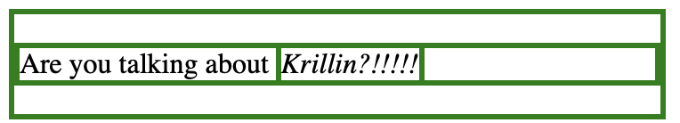

### プロパティ(スタイル)は子要素に継承される

以下のようなスタイルをp要素に当てたとする
```html
<p class="quote">Are you talking about <em>Krillin?!!!!!</em></p>
```
```css
.quote {
    color: red
};
```
↓結果


em要素もcolor: redを継承している。このようなプロパティを継承プロパティ(CSS inheritance)という。

---

### 継承されないプロパティもある

一方、継承されないプロパティもあり、borderなどが非継承プロパティとなる。
```html
<div class="container">
    <p>Are you talking about <em>Krillin?!!!!!</em><p>
</div>
```
```css
.container {
    border: solid
};
```
↓結果


pとemようにborderは適用されない

<br>

なお、非継承プロパティでも子要素のプロパティにinheritという値を設定すると、その子要素は親要素の設定値を継承する
```html
<div class="container">
    <p class="quote">Are you talking about <em class="krillin">Krillin?!!!!!</em><p>
</div>
```
```css
.container {
    border: solid
};
.quote {
    border: inherit
};
.krillin {
    border: inherit
};
```
↓結果
