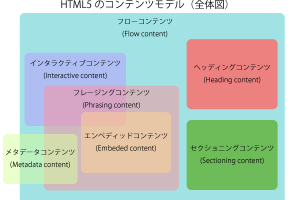

### HTML5で新しくなった要素の分類

[source: HTML5　フローコンテンツ](http://creator-index.com/2014/12/535/)

- メタデータコンテンツ: \<head\>\</head\>内に配置する。参照する外部ファイルや、HTMLの定義情報のタグなどがある
    - \<link\> \<script\> \<style\> \<title\> など

- フローコンテンツ: \<body\>\</body\>の中で使える要素(タグ)の大半がこのフローコンテンツに属する\(\<style\>や\<script\>もbody内で使えるのフローコンテンツ\)

- セクショニングコンテンツ: 文章のアウトライン(まとまった一区切り)を定義することのできるタグ
    - \<section\> \<article\> \<nav\> \<aside\> がこの定義に当てはまる

- ヘッディングコンテンツ: 主にセクションの見出しとなるタグ
    - \<h~\> タグがこの定義に当てはまる

- フレージングコンテンツ: 文章内のテキストをマークアップするタグ -> 従来のインライン要素がこの定義に当てはまる
    - \<span\> \ \<button\> など

- エンベッティドコンテンツ: 外部リソースを埋め込むためのタグ
    - \<canvas\> \<video\> \ など  
    *\<style\> \<script\>は属さない

- インタラクティブコンテンツ: ユーザーによって操作することができる要素
    - \<button\> \<input\> \<textarea\> など  
    *\<foam\>は属さない

