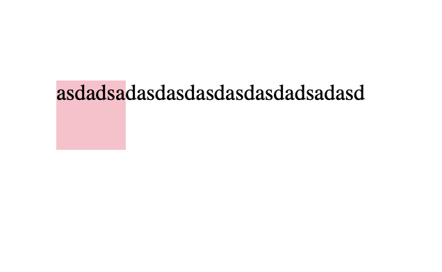

### 長い英語文字列が改行されない問題


```html
<!-- divはwidth/heightを適当に指定し、背景色をpinkにしている -->
<div>
asdadsadasdasdasdasdasdadsadasd
</div>
```


- 原因: スペースなしの長い英語文字列は、それ全部を一単語と認識されるから

- 解決策: 以下のスタイルどちらか一方を当てる

```css
selector {
    overflow-wrap: break-word,
    word-break: break-all,
}
```

---

### overflowとoverflow-wrapの違い

- overflow
    - コンテンツから文字列がはみ出たら
        - visibleでコンテンツの外にはみ出して表示したり
        - hiddenではみ出した分は隠したり
        - scrollではみ出した部分はスクロールで表示したり  
       
        する
*文字列だけじゃなく、他の要素についてもコンテンツからはみ出た時の表示をoverfowで設定できる  

[参考](https://www.w3schools.com/css/css_overflow.asp)

<br>

- overflow-wrap
    - コンテンツから文字列がはみ出たら
        - normalでコンテンツの外まではみ出して表示したり
        - break-wordで単語の途中でもコンテンツからはみ出ないように改行したり
    
        する

<br>

- ついでにwork-break
    - コンテンツから文字列がはみ出たら
        - normalでコンテンツの外まではみ出して表示したり
        - break-allで単語の途中でもコンテンツからはみ出ないように改行したり
        - keep-allでコンテンツからはみ出る時以下の条件でのみ改行したり
        条件： スペース/?/-

    する