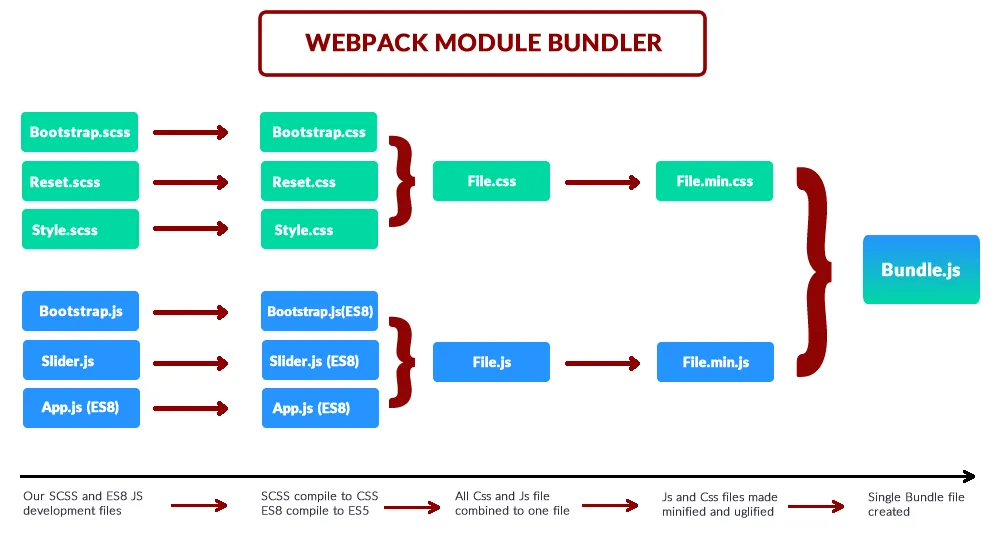

### プラグインとは

- webpackの機能を拡張するためのプロラグム

- ローダーよりも広義の拡張プログラムみたいなイメージ

---

### ローダーとプラグインの違い

- ローダー:  
    - ファイル単位でコンパイル/変換処理を行う
    - 出力するのはjsファイル


- プラグイン:  
    - (主に)下記画像の複数ファイルをまとめる段階/最終的なバンドルを出力する段階で動かすプログラムらしい  
    *しかし、プラグインによって処理が実行されるタイミングは様々らしい(webpack実践入門より)
    - 出力するのはjsだけではない
    (制限がない)

- プラグインはローダーよりも幅広い機能を提供するらしい



[What is Webpack & Why we need?](https://medium.com/@okantoper/what-is-webpack-why-we-need-aaec8afe4814)

---

### プラグインの利用方法

- module.export.pluginsプロパティ(配列)の中で<font color="red">プラグインのインスタンスを生成</font>して設定する

- 組み込まれているプラグインとサードパーティのプラグインでは設定方法が異なる

<br>

組み込まれているプラグイン(例: ResolverPlugin)
```js
// new webpack.propで使いたいプラグインをインスタンス化する
module.exports = {
    plugins: [
        new webpack.ResolverPlugin(
            /**
            * 必要な設定項目記述する
            */
        ),
    ],
};
```

<br>

サードパーティーのプラグイン(例: min-css-extract-plugin)  
*npmかyarnでインストールしておく必要がある
```js
//プラグインモジュールをインポートする
const minCss = require("min-css-extract-plugin");

module.exports = {
    plugins: [
        new minCss({
            /**
             * 必要項目を設定する
            */
        }),
    ],
};
```

---

### 主なプラグイン

- [webpack-merge](./webpack-merge.md)
    - webpackの設定ファイルに関するプラグイン
        複数の設定ファイル(開発用/本番用などに)分け、ビルド時に分割された設定ファイルをマージしたりすることができる

- [mini-css-extract-plugin](./mini-css-extract-plugin.md)
    - バンドルファイル(js)からスタイル部分をcssファイルに出力するプラグイン: [参考](https://zenn.dev/antez/articles/638382faa06bd7#mini-css-extract)
    - style-loaderのようなcssローダーはcssをjsファイルとして出力するので、そこが異なる点
    *バンドルファイルからcss部分を出力するので、cssをjsにバンドルするcss-loaderと一緒に使う

- [webpack-bundle-analyzer](./webpack-bundle-analyzer.md)  
    - バンドルされたファイルが使っている各ライブラリのサイズを可視化してくれる


